

  

## 
Universidad Peruana de Ciencias Aplicadas

Ingeniería de Software

<strong>Ciclo:</strong> 202620

1ASI0728 | Arquitecturas de Software Emergentes

<strong>NRC:</strong> 16365

<strong>Docente:</strong> Enrique Alejandro Valdivia Verde

# 
Informe del Trabajo Final

<strong>Startup:</strong> Tale Star

<strong>Producto:</strong> Tale Star

### Integrantes

| Código | Nombres y Apellidos |
| :--- | :--- |
| U202210167 | Diego Antonio Seijas Vasquez |
| U20231D534 | Jorge Luis Diaz Fiestas |
| U202310004 | Ricardo Fernando Cardenas Minaya |
| U202310222 | Mariano Moises Oblitas Davila |
| U201819645 | Ariana Huapaya Buitron |

<strong>Diciembre 2026</strong>

# Registro de Versiones del Informe

| Versión | Fecha | Autor | Descripción de modificación |
| :--- | :--- | :--- | :--- |
|  |  |  |  |

# Project Report Collaboration Insights

# Contenido

- [Registro de Versiones del Informe](#registro-de-versiones-del-informe)
- [Project Report Collaboration Insights](#project-report-collaboration-insights)
- [Contenido](#contenido)
- [Student Outcome](#student-outcome)
- [Capítulo I: Introducción](#capitulo-i-introduccion)
  - [1.1. Startup Profile](#11-startup-profile)
    - [1.1.1. Descripción de la Startup](#111-descripcion-de-la-startup)
    - [1.1.2. Perfiles de integrantes del equipo](#112-perfiles-de-integrantes-del-equipo)
  - [1.2. Solution Profile](#12-solution-profile)
    - [1.2.1. Antecedentes y problemática](#121-antecedentes-y-problematica)
    - [1.2.2. Lean UX Process](#122-lean-ux-process)
      - [1.2.2.1. Lean UX Problem Statements](#1221-lean-ux-problem-statements)
      - [1.2.2.2. Lean UX Assumptions](#1222-lean-ux-assumptions)
      - [1.2.2.3. Lean UX Hypothesis Statements](#1223-lean-ux-hypothesis-statements)
      - [1.2.2.4. Lean UX Canvas](#1224-lean-ux-canvas)
  - [1.3. Segmentos objetivo](#13-segmentos-objetivo)
- [Capítulo II: Requirements Elicitation & Analysis](#capitulo-ii-requirements-elicitation-analysis)
  - [2.1. Competidores](#21-competidores)
    - [2.1.1. Análisis competitivo](#211-analisis-competitivo)
    - [2.1.2. Estrategias y tácticas frente a competidores](#212-estrategias-y-tacticas-frente-a-competidores)
  - [2.2. Entrevistas](#22-entrevistas)
    - [2.2.1. Diseño de entrevistas](#221-diseno-de-entrevistas)
    - [2.2.2. Registro de entrevistas](#222-registro-de-entrevistas)
      - [Entrevista 1 — Sara Davila](#entrevista-1-segmento-2)
      - [Entrevista 2 — Roxana Alvarado](#entrevista-2-segmento-2)
      - [Entrevista 3 — Diandra Valle](#entrevista-3-segmento-2)
    - [2.2.3. Análisis de entrevistas](#223-analisis-de-entrevistas)
  - [2.3. Needfinding](#23-needfinding)
    - [2.3.1. User Personas](#231-user-personas)
    - [2.3.2. User Task Matrix](#232-user-task-matrix)
    - [2.3.3. Empathy Mapping](#233-empathy-mapping)
    - [2.3.4. As-is Scenario Mapping](#234-as-is-scenario-mapping)
  - [2.4. Ubiquitous Language](#24-ubiquitous-language)
- [Capítulo III: Requirements Specification](#capitulo-iii-requirements-specification)
  - [3.1. To-Be Scenario Mapping](#31-to-be-scenario-mapping)
  - [3.2. User Stories](#32-user-stories)
  - [3.3. Impact Mapping](#33-impact-mapping)
  - [3.4. Product Backlog](#34-product-backlog)
- [Capítulo IV: Strategic-Level Software Design](#capitulo-iv-strategic-level-software-design)
  - [4.1. Strategic-Level Attribute-Driven Design](#41-strategic-level-attribute-driven-design)
    - [4.1.1. Design Purpose](#411-design-purpose)
    - [4.1.2. Attribute-Driven Design Inputs](#412-attribute-driven-design-inputs)
      - [4.1.2.1. Primary Functionality (Primary User Stories)](#4121-primary-functionality-primary-user-stories)
      - [4.1.2.2. Quality Attribute Scenarios](#4122-quality-attribute-scenarios)
      - [4.1.2.3. Constraints](#4123-constraints)
    - [4.1.3. Architectural Drivers Backlog](#413-architectural-drivers-backlog)
    - [4.1.4. Architectural Design Decisions](#414-architectural-design-decisions)
    - [4.1.5. Quality Attribute Scenario Refinements](#415-quality-attribute-scenario-refinements)
  - [4.2. Strategic-Level Domain-Driven Design](#42-strategic-level-domain-driven-design)
    - [4.2.1. EventStorming](#421-eventstorming)
    - [4.2.2. Candidate Context Discovery](#422-candidate-context-discovery)
    - [4.2.3. Domain Message Flows Modeling](#423-domain-message-flows-modeling)
    - [4.2.4. Bounded Context Canvases](#424-bounded-context-canvases)
    - [4.2.5. Context Mapping](#425-context-mapping)
  - [4.3. Software Architecture](#43-software-architecture)
    - [4.3.1. Software Architecture System Landscape Diagram](#431-software-architecture-system-landscape-diagram)
    - [4.3.2. Software Architecture Context Level Diagram](#432-software-architecture-context-level-diagram)
    - [4.3.3. Software Architecture Container Level Diagram](#433-software-architecture-container-level-diagram)
    - [4.3.4. Software Architecture Deployment Diagram](#434-software-architecture-deployment-diagram)
- [Capítulo V: Tactical-Level Software Design](#capitulo-v-tactical-level-software-design)
  - [5.1. Bounded Context: Story Authoring](#51-bounded-context-story-authoring)
    - [5.1.1. Domain Layer](#511-domain-layer)
    - [5.1.2. Interface Layer](#512-interface-layer)
    - [5.1.3. Application Layer](#513-application-layer)
    - [5.1.4. Infrastructure Layer](#514-infrastructure-layer)
    - [5.1.5. Bounded Context Software Architecture Component Level Diagrams](#515-bounded-context-software-architecture-component-level-diagrams)
    - [5.1.6. Bounded Context Software Architecture Code Level Diagrams](#516-bounded-context-software-architecture-code-level-diagrams)
      - [5.1.6.1. Bounded Context Domain Layer Class Diagrams](#5161-bounded-context-domain-layer-class-diagrams)
      - [5.1.6.2. Bounded Context Database Design Diagram](#5162-bounded-context-database-design-diagram)
  - [5.2. Bounded Context: Generative Media](#52-bounded-context-generative-media)
    - [5.2.1. Domain Layer](#521-domain-layer)
    - [5.2.2. Interface Layer](#522-interface-layer)
    - [5.2.3. Application Layer](#523-application-layer)
    - [5.2.4. Infrastructure Layer](#524-infrastructure-layer)
    - [5.2.5. Bounded Context Software Architecture Component Level Diagrams](#525-bounded-context-software-architecture-component-level-diagrams)
    - [5.2.6. Bounded Context Software Architecture Code Level Diagrams](#526-bounded-context-software-architecture-code-level-diagrams)
      - [5.2.6.1. Bounded Context Domain Layer Class Diagrams](#5261-bounded-context-domain-layer-class-diagrams)
      - [5.2.6.2. Bounded Context Database Design Diagram](#5262-bounded-context-database-design-diagram)
  - [5.3. Bounded Context: Identity & Access](#53-bounded-context-identity-access)
    - [5.3.1. Domain Layer](#531-domain-layer)
    - [5.3.2. Interface Layer](#532-interface-layer)
    - [5.3.3. Application Layer](#533-application-layer)
    - [5.3.4. Infrastructure Layer](#534-infrastructure-layer)
    - [5.3.5. Bounded Context Software Architecture Component Level Diagrams](#535-bounded-context-software-architecture-component-level-diagrams)
    - [5.3.6. Bounded Context Software Architecture Code Level Diagrams](#536-bounded-context-software-architecture-code-level-diagrams)
      - [5.3.6.1. Bounded Context Domain Layer Class Diagrams](#5361-bounded-context-domain-layer-class-diagrams)
      - [5.3.6.2. Bounded Context Database Design Diagram](#5362-bounded-context-database-design-diagram)
  - [5.4. Bounded Context: Content Library](#54-bounded-context-content-library)
    - [5.4.1. Domain Layer](#541-domain-layer)
    - [5.4.2. Interface Layer](#542-interface-layer)
    - [5.4.3. Application Layer](#543-application-layer)
    - [5.4.4. Infrastructure Layer](#544-infrastructure-layer)
    - [5.4.5. Bounded Context Software Architecture Component Level Diagrams](#545-bounded-context-software-architecture-component-level-diagrams)
    - [5.4.6. Bounded Context Software Architecture Code Level Diagrams](#546-bounded-context-software-architecture-code-level-diagrams)
      - [5.4.6.1. Bounded Context Domain Layer Class Diagrams](#5461-bounded-context-domain-layer-class-diagrams)
      - [5.4.6.2. Bounded Context Database Design Diagram](#5462-bounded-context-database-design-diagram)
- [Capítulo VI: Solution UX Design](#capitulo-vi-solution-ux-design)
  - [6.1. Style Guidelines](#61-style-guidelines)
    - [6.1.1. General Style Guidelines](#611-general-style-guidelines)
    - [6.1.2. Web, Mobile & Devices Style Guidelines](#612-web-mobile-devices-style-guidelines)
  - [6.2. Information Architecture](#62-information-architecture)
    - [6.2.1. Organization Systems](#621-organization-systems)
    - [6.2.2. Labeling Systems](#622-labeling-systems)
    - [6.2.3. Searching Systems](#623-searching-systems)
    - [6.2.4. SEO Tags and Meta Tags](#624-seo-tags-and-meta-tags)
    - [6.2.5. Navigation Systems](#625-navigation-systems)
  - [6.3. Landing Page UI Design](#63-landing-page-ui-design)
    - [6.3.1. Landing Page Wireframe](#631-landing-page-wireframe)
    - [6.3.2. Landing Page Mock-up](#632-landing-page-mock-up)
  - [6.4. Applications UX/UI Design](#64-applications-uxui-design)
    - [6.4.1. Applications Wireframes](#641-applications-wireframes)
    - [6.4.2. Applications Wireflow Diagrams](#642-applications-wireflow-diagrams)
    - [6.4.3. Applications Mock-ups](#643-applications-mock-ups)
    - [6.4.4. Applications User Flow Diagrams](#644-applications-user-flow-diagrams)
  - [6.5. Applications Prototyping](#65-applications-prototyping)
- [Capítulo VII: Product Implementation, Validation & Deployment](#capitulo-vii-product-implementation-validation-deployment)
  - [7.1. Software Configuration Management](#71-software-configuration-management)
    - [7.1.1. Software Development Environment Configuration](#711-software-development-environment-configuration)
    - [7.1.2. Source Code Management](#712-source-code-management)
    - [7.1.3. Source Code Style Guide & Conventions](#713-source-code-style-guide-conventions)
    - [7.1.4. Software Deployment Configuration](#714-software-deployment-configuration)
  - [7.2. Solution Implementation](#72-solution-implementation)
    - [7.2.1. Sprint 1](#721-sprint-1)
      - [7.2.1.1. Sprint Planning 1](#7211-sprint-planning-1)
      - [7.2.1.2. Sprint Backlog 1](#7212-sprint-backlog-1)
      - [7.2.1.3. Development Evidence for Sprint Review](#7213-development-evidence-for-sprint-review)
      - [7.2.1.4. Testing Suite Evidence for Sprint Review](#7214-testing-suite-evidence-for-sprint-review)
      - [7.2.1.5. Execution Evidence for Sprint Review](#7215-execution-evidence-for-sprint-review)
      - [7.2.1.6. Services Documentation Evidence for Sprint Review](#7216-services-documentation-evidence-for-sprint-review)
      - [7.2.1.7. Software Deployment Evidence for Sprint Review](#7217-software-deployment-evidence-for-sprint-review)
      - [7.2.1.8. Team Collaboration Insights during Sprint](#7218-team-collaboration-insights-during-sprint)
    - [7.2.2. Sprint 2](#722-sprint-2)
      - [7.2.2.1. Sprint Planning 2](#7221-sprint-planning-2)
      - [7.2.2.2. Sprint Backlog 2](#7222-sprint-backlog-2)
      - [7.2.2.3. Development Evidence for Sprint Review](#7223-development-evidence-for-sprint-review)
      - [7.2.2.4. Testing Suite Evidence for Sprint Review](#7224-testing-suite-evidence-for-sprint-review)
      - [7.2.2.5. Execution Evidence for Sprint Review](#7225-execution-evidence-for-sprint-review)
      - [7.2.2.6. Services Documentation Evidence for Sprint Review](#7226-services-documentation-evidence-for-sprint-review)
      - [7.2.2.7. Software Deployment Evidence for Sprint Review](#7227-software-deployment-evidence-for-sprint-review)
      - [7.2.2.8. Team Collaboration Insights during Sprint](#7228-team-collaboration-insights-during-sprint)
  - [7.3. Validation Interviews](#73-validation-interviews)
    - [7.3.1. Diseño de Entrevistas](#731-diseno-de-entrevistas)
    - [7.3.2. Registro de Entrevistas](#732-registro-de-entrevistas)
    - [7.3.3. Evaluaciones según heurísticas](#733-evaluaciones-segun-heuristicas)
  - [7.4. Video About-the-Product](#74-video-about-the-product)
- [Conclusiones](#conclusiones)
  - [Conclusiones y recomendaciones](#conclusiones-y-recomendaciones)
  - [Video About-the-Team](#video-about-the-team)
- [Bibliografía](#bibliografia)
- [Anexos](#anexos)
  - [Anexo A. Repositorios del proyecto](#anexo-a-repositorios-del-proyecto)
  - [Anexo B. Entrevistas](#anexo-b-entrevistas)
  - [Anexo C. Desplegables](#anexo-c-desplegables)
  - [Anexo D. Documentación de servicios](#anexo-d-documentacion-de-servicios)
  - [Anexo E. Videos de exposiciones](#anexo-e-videos-de-exposiciones)

# Student Outcome

El curso contribuye al cumplimiento del Student Outcome ABET:

**ABET – EAC - Student Outcome 3**
**Criterio:** Capacidad de comunicarse efectivamente con un rango de audiencias.

| Criterio específico | Acciones realizadas | Conclusiones |
| :--- | :--- | :--- |
| Comunica oralmente sus ideas y/o resultados con objetividad a público de diferentes especialidades y niveles jerárquicos, en el marco del desarrollo de un proyecto en ingeniería. |  |  |
| Comunica en forma escrita ideas y/o resultados con objetividad a público de diferentes especialidades y niveles jerárquicos, en el marco del desarrollo de un proyecto en ingeniería. |  |  |

# Capítulo I: Introducción

## 1.1. Startup Profile

### 1.1.1. Descripción de la Startup

Tale Star es una startup tecnológica orientada a mejorar la forma en que padres y docentes crean y utilizan contenido educativo digital para niños. La propuesta surge frente a un entorno donde existe una gran cantidad de contenido infantil disponible en plataformas digitales, pero donde la disponibilidad de contenido no garantiza que este posea una intención pedagógica clara, sea apropiado para la edad o responda al tema específico que un adulto desea enseñar.

La startup desarrolla una plataforma que utiliza inteligencia artificial generativa para ayudar a transformar objetivos de aprendizaje en contenido infantil personalizado. La solución permite crear principalmente cuentos ilustrados, además de imágenes y canciones cortas, manteniendo al padre o docente como responsable de definir, revisar y aprobar el contenido antes de utilizarlo con el niño.

El componente principal de Tale Star es su creador de cuentos. El usuario puede construir una historia página por página, escribir el texto, establecer los personajes que participan, describir sus acciones, añadir objetos relevantes y definir el contexto de la escena. A partir de estos elementos, el sistema genera mediante inteligencia artificial una ilustración correspondiente a cada página y posteriormente organiza las páginas para obtener el cuento completo.

Tale Star incluye adicionalmente generación independiente de imágenes mediante instrucciones en lenguaje natural y generación de canciones o piezas musicales breves que pueden utilizarse como recursos complementarios para explicar o reforzar conceptos.

Finalmente, la solución incorpora una experiencia móvil de realidad aumentada mediante la cual el usuario puede detectar una superficie plana, colocar virtualmente un cuento y navegar entre sus páginas dentro del entorno físico. Esta funcionalidad se plantea como un mecanismo complementario de visualización y no como sustituto del acompañamiento del padre o docente.

La propuesta de Tale Star no pretende sustituir el criterio pedagógico del adulto ni afirmar que el uso de tecnología garantiza por sí mismo mejores resultados de aprendizaje. La plataforma busca proporcionar herramientas para que padres y docentes puedan producir contenido con una intención educativa explícita, manteniendo supervisión humana sobre el resultado generado.

**Misión**

Facilitar a padres y docentes la creación de contenido educativo infantil personalizado mediante inteligencia artificial y tecnologías inmersivas, permitiéndoles transformar objetivos de aprendizaje en cuentos, imágenes y canciones adaptables a diferentes contextos y necesidades.

**Visión**

Convertirse en una plataforma de referencia en Latinoamérica para la creación responsable de contenido educativo infantil personalizado, promoviendo experiencias digitales diseñadas alrededor del aprendizaje y de la participación activa de padres y docentes.

**Innovación y tecnología**

Tale Star combina inteligencia artificial generativa y realidad aumentada dentro de una solución multicomponente. La inteligencia artificial permite producir contenido textual, visual y musical a partir de las indicaciones del usuario, mientras que la realidad aumentada proporciona un nuevo medio para visualizar los cuentos generados.

La innovación no reside únicamente en utilizar modelos generativos, sino en estructurar estas capacidades alrededor de un proceso orientado a la educación: el adulto define qué desea enseñar, determina las características del contenido, supervisa los resultados y decide cuándo y cómo utilizarlos.

**Propuesta de valor**

Tale Star permite que padres y docentes transformen rápidamente un objetivo educativo en contenido infantil personalizado sin requerir conocimientos especializados de ilustración, diseño, producción musical o prompting avanzado.

A diferencia de herramientas generales de inteligencia artificial, Tale Star organiza el proceso de creación alrededor de conceptos propios del contenido educativo infantil, como edad objetivo, tema de aprendizaje, personajes, acciones, objetos, páginas y contexto de la historia.

### 1.1.2. Perfiles de integrantes del equipo

| Nombre: Seijas Vasquez, Diego Antonio |  |
| :------------------------------------------------------------------------------------------------------------------------------------------------------------------------------------------- | :---------------------------- |
| **Código:** U202210167  |                               |
| **Carrera:** Ingeniería de Software |                               |
| **Perfil:** Estudiante de Ingeniería de Software en la UPC, con experiencia desarrollando sistemas de gestión, inventario y facturación para negocios reales. Interesado en arquitectura de software, desarrollo backend y en construir soluciones prácticas orientadas a resolver problemas concretos de negocio. | |

| Nombre: Diaz Fiestas, Jorge Luis |  |
| :------------------------------------------------------------------------------------------------------------------------------------------------------------------------------------------- | :---------------------------- |
| **Código:** U20231D534  |                               |
| **Carrera:** Ingeniería de Software |                               |
| **Perfil:** Pendiente de completar por el integrante. | |

| Nombre: Cardenas Minaya, Ricardo Fernando |  |
| :------------------------------------------------------------------------------------------------------------------------------------------------------------------------------------------- | :---------------------------- |
| **Código:** U202310004  |                               |
| **Carrera:** Ingeniería de Software |                               |
| **Perfil:** Estudiante de Ingeniería de Software en la UPC. Me considero una persona entusiasta, creativa y comprometida con cada actividad que realizo. Estoy decidido a dar lo mejor de mí en este proyecto para lograr resultados de calidad. | |

| Nombre: Oblitas Davila, Mariano Moises |  |
| :------------------------------------------------------------------------------------------------------------------------------------------------------------------------------------------- | :---------------------------- |
| **Código:** U202310222  |                               |
| **Carrera:** Ingeniería de Software |                               |
| **Perfil:** Estudiante de 20 años de Ingeniería de Software en la UPC. Me caracterizo por mi creatividad, eficacia y capacidad para resolver problemas de manera racional. Apasionado por la programación y el desarrollo de software, busco constantemente innovar y aprender nuevas tecnologías. | |

| Nombre: Huapaya Buitron, Ariana  |  |
| :------------------------------------------------------------------------------------------------------------------------------------------------------------------------------------------- | :---------------------------- |
| **Código:** U201819645  |                               |
| **Carrera:** Ingeniería de Software |                               |
| **Perfil:** Pendiente de completar por la integrante. | |

## 1.2. Solution Profile

Tale Star propone una solución digital multicomponente para padres y docentes que necesitan crear recursos educativos infantiles adaptados a objetivos específicos de aprendizaje.

La solución integra una aplicación web orientada a la creación y administración de contenido, servicios de inteligencia artificial para generación textual, visual y musical, una RESTful API desarrollada por el equipo y una aplicación móvil que incorpora una experiencia de realidad aumentada para visualizar los cuentos generados.

El producto busca disminuir el esfuerzo necesario para pasar de una necesidad educativa concreta a un recurso que pueda ser utilizado y supervisado por el adulto.

### 1.2.1. Antecedentes y problemática

La presencia de medios digitales durante la infancia es actualmente significativa. El estudio *The Common Sense Census: Media Use by Kids Zero to Eight* reportó que los niños estadounidenses de 0 a 8 años utilizan aproximadamente 2 horas y 27 minutos diarios de medios de pantalla. Entre los niños de 5 a 8 años, el promedio alcanza 3 horas y 28 minutos diarios. El estudio también encontró un crecimiento del consumo de videos cortos en plataformas como TikTok, Instagram Reels y YouTube Shorts (Mann et al., 2025). Estas cifras corresponden a Estados Unidos y no representan directamente al contexto peruano, pero permiten observar la importancia adquirida por los medios digitales durante la infancia.

La cantidad de contenido disponible tampoco equivale necesariamente a calidad educativa. Radesky et al. (2020), en un estudio desarrollado por investigadores de University of Michigan y Common Sense Media, analizaron 1,639 videos de YouTube consumidos por niños de 0 a 8 años. El 75 % de los videos analizados presentó un valor educativo inexistente o débil, mientras que aproximadamente el 5 % presentó un alto valor educativo, definido como contenido que enseñaba conceptos de forma apropiada para el desarrollo del niño y que iba más allá de conceptos superficiales.

Estos resultados no permiten concluir que todo contenido infantil digital sea perjudicial ni que las plataformas carezcan de contenido educativo. Por el contrario, evidencian un ecosistema de contenido heterogéneo donde materiales con diferentes niveles de calidad, objetivos y adecuación compiten por la atención del niño.

La investigación científica reciente también indica que evaluar únicamente el tiempo frente a pantallas resulta insuficiente. Mallawaarachchi et al. (2024) realizaron una revisión sistemática y metaanálisis de 100 estudios que comprendieron 176,742 participantes durante la primera infancia. Los autores encontraron asociaciones negativas entre la exposición a contenido no apropiado para la edad y determinados resultados psicosociales, mientras que el uso compartido de las pantallas entre niños y cuidadores se asoció positivamente con resultados cognitivos. Los autores concluyen que deben considerarse el contenido, el contexto, el propósito y el acompañamiento, además del tiempo de exposición. ([JAMA Network][1])

Paralelamente, determinadas características de diseño utilizadas en plataformas digitales pueden contribuir a extender el tiempo de uso. Ofcom (2026) realizó una investigación cualitativa con 40 niños de entre 8 y 16 años que declararon permanecer conectados durante más tiempo del que habían planificado, además de 37 padres que compartían esta preocupación. La investigación identificó diferentes categorías de persuasive design vinculadas con una mayor permanencia en plataformas, incluyendo mecanismos como infinite scroll, autoplay y contenido personalizado. Estas características pueden eliminar puntos naturales de interrupción y favorecer un consumo más pasivo y continuo. ([www.ofcom.org.uk][2])

Por ello, Tale Star no parte de la afirmación de que todo entretenimiento digital sea negativo. La diferencia que busca establecer está entre consumir contenido seleccionado principalmente por sistemas de recomendación y crear deliberadamente un recurso porque un adulto posee previamente un objetivo de aprendizaje.

En Perú, el acceso digital también resulta relevante. Según el Instituto Nacional de Estadística e Informática, durante el segundo trimestre de 2025 el 76.0 % de la población entre 6 y 17 años utilizó Internet. En el grupo de 6 a 11 años, la cifra fue de 61.9 %, mientras que entre los 12 y 17 años alcanzó 89.4 % (INEI, 2025). ([INEI][3])

Desde la perspectiva docente, Perú ya dispone de plataformas y materiales educativos digitales. La OECD identifica que PerúEduca y SIFODS ofrecen cursos, recursos educativos abiertos, guías de planificación y ejemplos de sesiones. Sin embargo, stakeholders consultados por la OECD identificaron la necesidad de hacer estos materiales más accesibles y relevantes y señalaron que los docentes requieren mayor apoyo práctico para seleccionar y utilizar los recursos dentro del aula (OECD, 2026). ([OECD][4])

A ello se añade el esfuerzo asociado con la preparación educativa. Los resultados de TALIS 2024 indican que el 35 % de los docentes de los sistemas educativos de la OECD considera que una carga excesiva de preparación de clases constituye una fuente de estrés (OECD, 2025). Este indicador no demuestra por sí mismo una demanda por Tale Star, pero respalda que la preparación y adaptación de materiales constituye una actividad que consume recursos y tiempo profesional. ([OECD][5])

En este contexto, la brecha identificada por Tale Star no consiste en una inexistencia absoluta de contenido educativo infantil. La problemática se encuentra entre la enorme disponibilidad de contenido digital y la capacidad de padres y docentes para disponer rápidamente de un recurso que simultáneamente responda a un objetivo educativo, resulte apropiado para la edad, pueda adaptarse al contexto del niño y mantenga al adulto en control de su creación.

La necesidad de utilizar contenido relacionado con acontecimientos recientes o temas altamente específicos se considera inicialmente una hipótesis del proyecto y deberá validarse mediante las entrevistas de Needfinding. No existe todavía evidencia suficiente para afirmar que esta necesidad tenga una frecuencia significativa dentro de nuestros segmentos.

**Enunciado del problema**

Padres y docentes enfrentan dificultades para encontrar, adaptar y producir de manera rápida contenido digital infantil que sea educativo, apropiado para la edad y relevante para un objetivo específico de aprendizaje. Aunque existe una amplia oferta de contenido infantil en plataformas digitales, su disponibilidad no garantiza una intención pedagógica clara ni una adecuación al contexto particular del niño. Al mismo tiempo, determinados entornos digitales utilizan mecanismos de diseño y recomendación que favorecen la continuidad del consumo, objetivos que no necesariamente coinciden con las necesidades educativas definidas por padres y docentes.

A partir de esta problemática, se desarrolla el análisis mediante la técnica 5W2H requerida para el proyecto.

##### **¿Qué ocurre? (What)**

Existe una amplia oferta de contenido infantil digital, pero los materiales presentan diferentes niveles de calidad educativa y no necesariamente responden al tema, edad, contexto o finalidad que un padre o docente desea trabajar.

Cuando el recurso existente no responde a la necesidad, el adulto debe continuar buscando, combinar recursos de diferentes fuentes, modificarlos o producir nuevos materiales.

Esta situación genera una brecha entre disponer de una gran cantidad de contenido y disponer del contenido adecuado para una necesidad educativa concreta.

##### **¿Cuándo ocurre? (When)**

La problemática aparece cuando un padre o docente necesita introducir, explicar o reforzar un determinado concepto mediante cuentos, imágenes, canciones u otros recursos.

Puede ser especialmente relevante cuando el contenido debe adaptarse a características particulares, como la edad del niño, sus intereses, personajes que reconoce, una situación específica o un tema poco cubierto por recursos existentes.

La frecuencia real con que padres y docentes experimentan esta situación será evaluada mediante las entrevistas del proyecto.

##### **¿Dónde ocurre? (Where)**

La problemática puede presentarse tanto dentro del hogar como en contextos educativos.

En el hogar, padres y cuidadores recurren a plataformas de video, aplicaciones, buscadores, cuentos digitales y otros medios para encontrar recursos que puedan utilizar con los niños.

En el ámbito educativo, docentes utilizan materiales proporcionados por instituciones, plataformas educativas, recursos web y herramientas propias para complementar sus actividades.

El proyecto delimitará inicialmente su investigación al contexto peruano.

##### **¿A quién afecta? (Who)**

La problemática afecta directamente a dos segmentos.

El primero está formado por padres y cuidadores responsables de acompañar el aprendizaje de niños pequeños y seleccionar los contenidos digitales que utilizan.

El segundo está compuesto por docentes de educación inicial y primeros años de educación primaria que requieren preparar, seleccionar o adaptar diferentes recursos para desarrollar actividades educativas.

Los niños constituyen los beneficiarios finales del contenido, pero no serán considerados inicialmente como responsables directos de configurar las generaciones dentro de Tale Star.

##### **¿Por qué sucede? (Why)**

La problemática surge por una combinación de factores.

Existe un volumen elevado y heterogéneo de contenido digital infantil.

La calidad educativa y la adecuación a la edad pueden variar considerablemente entre los recursos.

Un recurso existente puede ser educativo pero no responder al objetivo específico, contexto o intereses del niño.

La creación manual de cuentos, ilustraciones y contenido audiovisual puede requerir tiempo y conocimientos especializados.

Los recursos utilizados por docentes pueden requerir selección y adaptación antes de ser incorporados a determinadas actividades.

Finalmente, diversas plataformas digitales incorporan características como infinite scroll, autoplay y recomendaciones personalizadas que pueden favorecer la continuidad del consumo y reducir puntos naturales de interrupción (Ofcom, 2026). ([www.ofcom.org.uk][2])

##### **¿Cómo sucede? (How)**

Actualmente, padres y docentes pueden recurrir a buscadores, plataformas de video, recursos educativos institucionales, bancos de imágenes, aplicaciones musicales y herramientas generales de inteligencia artificial.

Cuando ninguna fuente responde completamente a la necesidad, el adulto debe combinar diferentes recursos o realizar modificaciones manuales.

Tale Star parte del supuesto de que centralizar este proceso y permitir generar diferentes formatos desde una misma plataforma puede reducir ese esfuerzo. Sin embargo, este supuesto deberá ser contrastado mediante las entrevistas y actividades de validación del proyecto.

##### **¿Cuán grande es el impacto? (How Much)**

Existen diferentes indicadores que permiten dimensionar el entorno en el que aparece la problemática.

En Estados Unidos, los niños de 0 a 8 años utilizan en promedio 2 horas y 27 minutos diarios de medios de pantalla (Mann et al., 2025).

En el estudio de Radesky et al. (2020), el 75 % de los 1,639 videos de YouTube analizados y consumidos por niños de 0 a 8 años presentó un valor educativo inexistente o débil, y solo aproximadamente 5 % fue clasificado con alto valor educativo.

En Perú, el 76.0 % de la población de 6 a 17 años utilizó Internet durante el segundo trimestre de 2025 (INEI, 2025). ([INEI][3])

Desde la perspectiva docente, el 35 % de los profesores incluidos en los sistemas participantes de TALIS 2024 declaró que un exceso de preparación de clases representa una fuente de estrés (OECD, 2025). ([OECD][5])

Estas cifras no representan directamente la cantidad de usuarios potenciales de Tale Star ni demuestran por sí mismas intención de compra. Su función es sustentar la existencia del contexto digital, educativo y operativo dentro del cual se plantea la problemática.

**Objetivo preliminar de la solución**

Facilitar a padres y docentes la creación de contenido educativo infantil personalizado mediante inteligencia artificial, reduciendo el esfuerzo requerido para transformar un objetivo de aprendizaje en cuentos ilustrados, imágenes y canciones adaptables al contexto del niño.

**Restricciones iniciales del alcance**

Tale Star estará dirigida principalmente a usuarios adultos responsables de crear y supervisar el contenido.

El contenido generado mediante inteligencia artificial deberá poder ser revisado antes de utilizarse con un niño.

Tale Star no sustituirá al docente ni garantizará resultados de aprendizaje.

El MVP se concentrará en cuentos ilustrados, generación independiente de imágenes, canciones cortas y una experiencia básica de lectura mediante realidad aumentada.

La experiencia AR estará limitada inicialmente a detectar una superficie plana, colocar el cuento virtualmente y permitir la navegación entre páginas.

No se desarrollarán inicialmente personajes tridimensionales animados ni experiencias AR complejas.

El producto deberá mantener una experiencia inclusiva, accesible e internacionalizable de acuerdo con las restricciones generales establecidas por el proyecto del curso.

### 1.2.2. Lean UX Process

El Lean UX Process de Tale Star permitirá transformar la problemática identificada en supuestos e hipótesis comprobables.

Las afirmaciones relacionadas con las necesidades, comportamientos y preferencias de padres y docentes que todavía no hayan sido confirmadas mediante entrevistas se considerarán assumptions y no hechos demostrados.

El proceso permitirá determinar qué necesidades presentan mayor relevancia para los segmentos objetivo, qué funcionalidades generan mayor valor y cuáles deben priorizarse durante la construcción del producto.

#### 1.2.2.1. Lean UX Problem Statements

**Problem Statement 1 – Padres y cuidadores**

Nuestro entorno evidencia que padres y cuidadores que desean utilizar recursos digitales para enseñar, explicar o reforzar determinados temas con niños enfrentan dificultades para encontrar contenido que combine una intención educativa clara, adecuación a la edad y relación con el contexto particular del niño.

Hemos observado que, aunque existe una amplia cantidad de contenido infantil disponible digitalmente, esta disponibilidad no garantiza que el material responda al objetivo específico que el adulto desea trabajar. Esto puede obligar al padre o cuidador a buscar entre diferentes fuentes, evaluar manualmente los recursos disponibles o adaptarlos antes de utilizarlos.

¿Cómo podríamos permitir que padres y cuidadores transformen rápidamente un objetivo educativo en contenido infantil personalizado, apropiado para la edad y supervisado por el adulto, sin requerir conocimientos especializados de diseño, ilustración o producción multimedia?

**Problem Statement 2 – Docentes**

Nuestro entorno evidencia que docentes de educación inicial y primeros años de primaria necesitan seleccionar, adaptar y crear materiales complementarios para abordar diferentes temas, grupos y contextos educativos.

Hemos observado que, aunque existen recursos educativos digitales y materiales curriculares disponibles, estos no siempre responden exactamente a las características del grupo, contexto o tema particular que el docente desea trabajar. Preparar cuentos, ilustraciones, canciones y otros recursos puede requerir tiempo y la utilización de distintas herramientas.

¿Cómo podríamos permitir que los docentes generen y adapten rápidamente contenido educativo infantil en diferentes formatos a partir de un objetivo específico de aprendizaje, manteniendo control y supervisión sobre el resultado?

#### 1.2.2.2. Lean UX Assumptions

**Business Assumptions:**

1. Creemos que padres y docentes necesitan crear o adaptar contenido educativo para abordar temas específicos con niños.

2. Creemos que actualmente parte de este proceso requiere buscar recursos en distintas fuentes, revisar su pertinencia y adaptarlos cuando no corresponden exactamente con la necesidad.

3. Creemos que estas necesidades pueden ser abordadas mediante una plataforma que permita generar cuentos ilustrados, imágenes y canciones a partir de las indicaciones proporcionadas por el adulto.

4. Nuestros clientes iniciales serán padres y cuidadores responsables de niños pequeños y docentes de educación inicial o primeros años de educación primaria.

5. El principal valor que nuestros usuarios esperan obtener de Tale Star será reducir el esfuerzo necesario para transformar un objetivo de aprendizaje en un recurso educativo personalizado.

6. Los usuarios también podrán obtener valor mediante la reutilización de personajes, historias y otros contenidos previamente creados.

7. Creemos que padres y docentes valorarán especialmente poder definir la edad, tema, personajes y contexto del contenido antes de realizar una generación.

8. Creemos que algunos usuarios necesitarán crear material sobre temas específicos o recientes para los cuales no encuentran fácilmente un recurso adaptado a la edad del niño. Esta suposición deberá validarse mediante entrevistas.

9. Planeamos adquirir inicialmente usuarios mediante comunidades educativas, redes sociales orientadas a padres y docentes, contenido demostrativo y posibles alianzas con instituciones o profesionales relacionados con educación infantil.

10. El modelo de negocio podrá evolucionar hacia un esquema freemium o de suscripción donde determinadas cantidades de generaciones y funciones básicas sean gratuitas y capacidades adicionales requieran un plan pagado.

11. Nuestra competencia estará formada tanto por herramientas generales de inteligencia artificial como por plataformas especializadas en generación de cuentos, recursos educativos digitales y servicios individuales de generación de imágenes o música.

12. Nuestra diferenciación estará basada en la integración de personalización educativa, creación multimodal y una experiencia de lectura mediante realidad aumentada dentro de un mismo ecosistema.

13. Nuestro principal riesgo de negocio es que los usuarios perciban que las herramientas generales de inteligencia artificial ya resuelven suficientemente esta necesidad.

14. Otro riesgo importante es que la frecuencia con la que padres y docentes necesitan contenido altamente personalizado sea menor a la esperada.

15. Reduciremos estos riesgos mediante entrevistas de Needfinding, validación temprana de prototipos, supervisión humana del contenido y priorización de las funcionalidades que demuestren mayor valor para los segmentos.

**User Assumptions:**

1. **¿Quién es el usuario?** Padres y cuidadores responsables de acompañar el aprendizaje de niños pequeños, así como docentes de educación inicial y primeros años de educación primaria.

2. **¿Dónde encaja nuestro producto en su vida?** Para padres y cuidadores, Tale Star se utilizará cuando deseen introducir, explicar o reforzar un tema mediante contenido adaptado al niño. Para docentes, se utilizará principalmente durante la preparación y adaptación de materiales complementarios para actividades educativas.

3. **¿Qué problemas resuelve nuestro producto?** Reduce el esfuerzo necesario para encontrar contenido específico, facilita la personalización del material, permite producir recursos multimedia sin conocimientos especializados y centraliza diferentes mecanismos de creación dentro de una sola experiencia.

4. **¿Cuándo y cómo se usa nuestro producto?** El adulto utiliza principalmente la aplicación web para definir el contenido que necesita, configurar personajes y otros elementos, generar recursos, revisar resultados y administrar sus creaciones. La aplicación móvil permitirá posteriormente consumir determinados recursos y visualizar cuentos mediante realidad aumentada.

5. **¿Qué características son importantes?** Creación de cuentos página por página, definición y reutilización de personajes, definición de acciones y objetos, generación automática de ilustraciones, generación independiente de imágenes, creación de canciones cortas, biblioteca de contenido, edición, regeneración y lectura de cuentos mediante realidad aumentada.

6. **¿Cómo debe verse y comportarse nuestro producto?** Tale Star debe ofrecer una experiencia sencilla, guiada y comprensible para usuarios que no posean conocimientos técnicos de inteligencia artificial. El adulto debe comprender qué información está proporcionando, mantener control sobre la generación, poder revisar los resultados y modificarlos antes de utilizarlos.

#### 1.2.2.3. Lean UX Hypothesis Statements

**Hypothesis Statement 1:**

Creemos que reduciremos el esfuerzo necesario para crear contenido educativo personalizado si padres y docentes pueden transformar un objetivo de aprendizaje en contenido infantil mediante un flujo guiado asistido por inteligencia artificial.

Sabremos que hemos tenido éxito cuando al menos el 70 % de los participantes en las pruebas considere que Tale Star reduce el esfuerzo requerido en comparación con el procedimiento que utiliza actualmente.

**Hypothesis Statement 2:**

Creemos que aumentaremos la relevancia percibida del contenido si padres y docentes pueden definir características como edad, tema, personajes, acciones, objetos y contexto antes de realizar la generación.

Sabremos que hemos tenido éxito cuando al menos el 80 % de los participantes califique con 4 o 5, en una escala de 1 a 5, la adecuación del contenido generado respecto de la solicitud realizada.

**Hypothesis Statement 3:**

Creemos que el creador de cuentos constituirá la funcionalidad de mayor valor de Tale Star si los usuarios pueden construir historias página por página combinando texto, personajes e ilustraciones generadas automáticamente.

Sabremos que hemos tenido éxito cuando al menos el 70 % de los usuarios evaluados identifique el creador de cuentos como una de las dos funcionalidades que proporcionan mayor valor dentro de la plataforma.

**Hypothesis Statement 4:**

Creemos que aumentaremos la confianza de padres y docentes en el contenido generado mediante inteligencia artificial si los usuarios pueden revisar, modificar y regenerar los resultados antes de utilizarlos.

Sabremos que hemos tenido éxito cuando al menos el 80 % de los participantes complete satisfactoriamente una tarea de revisión, edición o regeneración sin asistencia.

**Hypothesis Statement 5:**

Creemos que integraremos mayor valor dentro de una sola experiencia si los usuarios pueden crear cuentos ilustrados, imágenes y canciones sin recurrir a herramientas independientes para cada formato.

Sabremos que hemos tenido éxito cuando al menos el 60 % de los participantes manifieste interés en utilizar dos o más tipos de contenido disponibles en Tale Star.

**Hypothesis Statement 6:**

Creemos que la realidad aumentada proporcionará una experiencia diferenciada para consumir los cuentos generados si padres o docentes pueden colocar virtualmente el cuento sobre una superficie física y navegar entre sus páginas.

Sabremos que hemos tenido éxito cuando al menos el 80 % de los participantes consiga colocar y navegar un cuento mediante la experiencia AR sin asistencia.

#### 1.2.2.4. Lean UX Canvas

El Lean UX Canvas v2 integra en una sola representación el problema de negocio de Tale Star, los resultados esperados, los segmentos objetivo, los beneficios esperados por los usuarios, las soluciones consideradas, las principales hipótesis y el experimento inicial necesario para evaluar la suposición de mayor riesgo.

El canvas se construye a partir de los Business Assumptions, User Assumptions e Hypothesis Statements desarrollados previamente.

**Box 1 – Business Problem**

Padres y docentes disponen de una gran cantidad de contenido infantil digital, pero encontrar, adaptar o producir materiales que simultáneamente sean educativos, apropiados para la edad, personalizados y relevantes para un objetivo específico puede requerir tiempo, evaluación manual y la utilización de diferentes herramientas.

**Box 2 – Business Outcomes**

Reducir el esfuerzo percibido para crear contenido educativo personalizado.

Conseguir que al menos el 70 % de los usuarios considere que Tale Star facilita el proceso frente a sus alternativas actuales.

Alcanzar una tasa de finalización de al menos 80 % en el flujo principal de creación de cuentos.

Conseguir una intención de reutilización de al menos 70 % entre los participantes evaluados.

Identificar durante la validación cuál de los segmentos presenta mayor frecuencia del problema e intención de uso.

**Box 3 – Users**

Segmento 1: Padres y cuidadores responsables del aprendizaje de niños pequeños.

Segmento 2: Docentes de educación inicial y primeros años de educación primaria.

Beneficiarios finales: niños que consumen los contenidos generados bajo supervisión del adulto.

**Box 4 – User Outcomes & Benefits**

Obtener contenido adaptado a una necesidad educativa concreta.

Reducir el tiempo destinado a búsqueda y preparación.

Personalizar personajes, situaciones, temas y contexto.

Mantener control sobre los resultados generados por IA.

Crear diferentes formatos sin conocimientos técnicos especializados.

Reutilizar y modificar materiales previamente creados.

**Box 5 – Solutions**

Creador de cuentos ilustrados página por página.

Gestión y reutilización de personajes.

Definición estructurada de acciones, objetos y escenas.

Generación de ilustraciones mediante inteligencia artificial.

Generación independiente de imágenes.

Generación de canciones cortas.

Biblioteca personal de contenido.

Edición y regeneración de resultados.

Visualización de cuentos mediante realidad aumentada.

**Box 6 – Hypotheses**

La generación guiada reducirá el esfuerzo de creación.

La personalización aumentará la relevancia percibida del contenido.

El creador de cuentos será la funcionalidad de mayor valor.

La posibilidad de revisar y modificar resultados aumentará la confianza en la IA.

La integración multimodal disminuirá la necesidad de utilizar diferentes herramientas.

La realidad aumentada aportará valor complementario a la experiencia de lectura.

**Box 7 – What is the most important thing we need to learn first?**

¿Padres y docentes experimentan con suficiente frecuencia e intensidad la necesidad de crear o adaptar contenido educativo infantil personalizado como para adoptar de manera recurrente una plataforma como Tale Star?

Esta constituye la principal suposición de riesgo porque la viabilidad del producto depende de que el problema sea recurrente y relevante. La capacidad técnica para generar texto o imágenes ya puede comprobarse con tecnologías existentes; lo que todavía necesita demostrarse es que existe una necesidad de usuario suficientemente fuerte.

**Box 8 – What is the least amount of work we need to do to learn the next most important thing?**

Realizar entre 3 y 5 entrevistas de Needfinding por cada segmento objetivo y posteriormente presentar un prototipo interactivo simplificado del creador de cuentos.

El prototipo permitirá que el participante defina un objetivo educativo, la edad del niño, uno o más personajes y un contexto, y observe una simulación del cuento resultante.

El experimento se considerará favorable inicialmente cuando al menos el 70 % de los participantes identifique la personalización de contenido como una necesidad relevante y manifieste intención de utilizar una herramienta similar ante una futura necesidad educativa.

  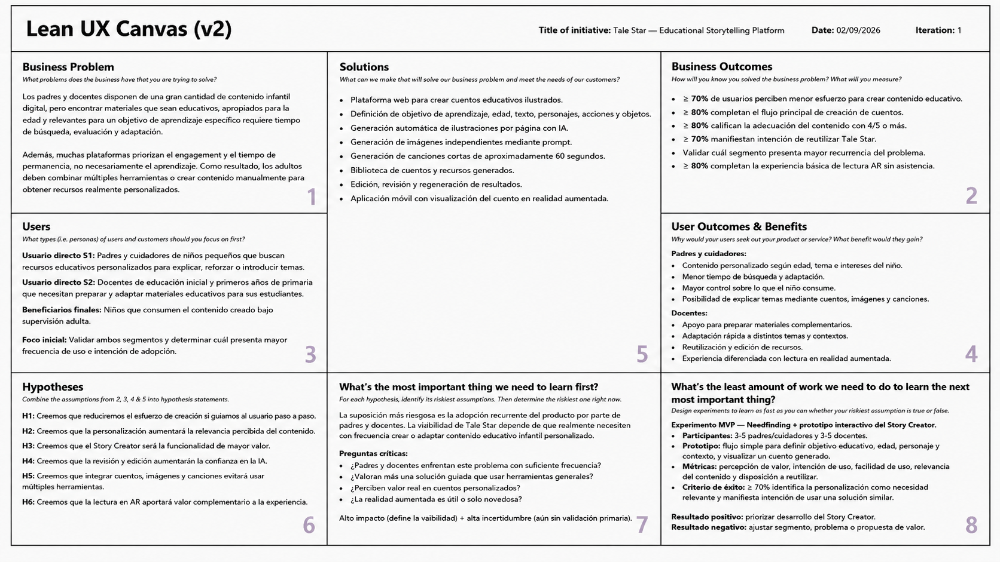

**Interpretación del canvas:**

* **Problema de negocio (Box 1):** La brecha identificada no corresponde a una inexistencia de contenido infantil digital, sino a la dificultad de obtener rápidamente contenido que combine intención educativa, adecuación a la edad, personalización y relevancia para una necesidad concreta.

* **Resultados esperados (Box 2):** Las métricas iniciales buscan comprobar reducción del esfuerzo, finalización satisfactoria del flujo principal e intención de reutilización. Estos valores constituyen criterios de éxito preliminares y deberán contrastarse durante la validación.

* **Usuarios (Box 3):** Tale Star considera dos segmentos directos: padres o cuidadores y docentes. Los niños constituyen los beneficiarios del contenido, mientras que la configuración y supervisión de las generaciones permanece bajo responsabilidad del adulto.

* **Beneficios de usuario (Box 4):** Los beneficios se concentran en reducir el esfuerzo necesario para preparar contenido, proporcionar capacidad de personalización, mantener control sobre el resultado generado y centralizar diferentes formatos dentro de una misma experiencia.

* **Soluciones (Box 5):** Las funcionalidades propuestas incluyen el creador de cuentos como capability principal, acompañado por generación de imágenes, canciones, administración de contenido y visualización mediante realidad aumentada.

* **Hipótesis (Box 6):** Las hipótesis relacionan las funcionalidades propuestas con resultados medibles en términos de reducción de esfuerzo, relevancia, confianza, valor multimodal y experiencia de consumo.

* **Aprendizaje prioritario (Box 7):** La incertidumbre de mayor riesgo para Tale Star consiste en comprobar si la necesidad de contenido educativo personalizado ocurre con suficiente frecuencia e intensidad para justificar la adopción recurrente del producto. Esta pregunta debe resolverse antes de incrementar significativamente la complejidad técnica.

* **Experimento de validación (Box 8):** El primer mecanismo de aprendizaje será la realización de entrevistas de Needfinding a ambos segmentos. Posteriormente, un prototipo simplificado del Story Creator permitirá evaluar personalización, facilidad de uso y percepción de valor antes de implementar la solución completa.

## 1.3. Segmentos objetivo

Tale Star considera dos segmentos objetivo principales: padres o cuidadores y docentes. Los usuarios directos de la plataforma serán adultos responsables de crear, seleccionar y supervisar el contenido, mientras que los niños constituirán sus beneficiarios finales.

Como delimitación preliminar del MVP, se plantea trabajar principalmente con contenido dirigido a niños entre aproximadamente 4 y 8 años. Este rango no constituye todavía un resultado de investigación; será validado mediante las entrevistas con ambos segmentos.

#### Segmento 1: Padres y cuidadores de niños pequeños

Este segmento está compuesto por adultos responsables que participan activamente en el aprendizaje, desarrollo y selección de contenido para niños pequeños.

Los padres y cuidadores pueden recurrir a cuentos, videos, imágenes, canciones, aplicaciones y otros recursos digitales para explicar conceptos, responder preguntas o reforzar aprendizajes. Tale Star busca apoyar especialmente aquellas situaciones en las que necesitan un contenido adaptado al contexto particular del niño y no encuentran fácilmente un recurso que responda exactamente a su necesidad.

**Características:**

* Mayores de 18 años.
* Padres, madres, tutores o cuidadores responsables de niños.
* Utilizan smartphones, navegadores y diferentes servicios digitales.
* Participan en la selección o supervisión del contenido que consume el niño.
* Pueden utilizar recursos digitales con fines educativos y de entretenimiento.
* Valoran disponer de mayor control sobre el contenido presentado al menor.
* Pueden necesitar contenidos relacionados con intereses o situaciones particulares del niño.
* No necesariamente poseen conocimientos de diseño, ilustración, producción musical o inteligencia artificial.

Como referencia del contexto de este segmento, el Common Sense Census 2025 muestra que los niños estadounidenses de 0 a 8 años utilizan aproximadamente 2 horas y 27 minutos diarios de medios de pantalla, mientras que entre los 5 y 8 años el promedio asciende a 3 horas y 28 minutos (Mann et al., 2025). Además, entre los padres encuestados, entre 75 % y 80 % expresó preocupaciones relacionadas con el uso excesivo, la salud mental y la exposición a contenido inapropiado. Estos valores no deben extrapolarse directamente a padres peruanos, pero demuestran la relevancia que la gestión del contenido digital ha adquirido dentro de familias con niños pequeños.

En el contexto peruano, el INEI reportó que el 61.9 % de los niños de 6 a 11 años utilizó Internet durante el segundo trimestre de 2025, lo que confirma una presencia significativa del entorno digital desde edades tempranas (INEI, 2025). ([INEI][3])

#### Segmento 2: Docentes de educación inicial y primeros años de primaria

Este segmento comprende docentes que trabajan con niños pequeños y que necesitan seleccionar, preparar o adaptar diferentes materiales para desarrollar actividades educativas.

Tale Star no busca reemplazar el currículo, las plataformas institucionales ni el criterio profesional docente. Su propuesta consiste en proporcionar una herramienta complementaria que permita convertir rápidamente una necesidad concreta en un cuento, ilustración o recurso musical modificable por el docente.

**Características:**

* Docentes de educación inicial y primeros grados de educación primaria.
* Trabajan con estudiantes que presentan diferentes edades, intereses y necesidades.
* Preparan o seleccionan materiales para desarrollar sus actividades.
* Utilizan recursos digitales institucionales o externos como complemento educativo.
* Necesitan adaptar explicaciones y materiales a diferentes contextos.
* Valoran herramientas que reduzcan actividades repetitivas de preparación.
* Requieren mantener control pedagógico sobre el material que utilizan.
* Pueden reutilizar contenidos y modificarlos para diferentes grupos o situaciones.

La OECD señala que los docentes peruanos ya tienen acceso a contenidos curriculares y pedagógicos actualizados mediante PerúEduca y SIFODS. No obstante, las consultas realizadas para su revisión de políticas educativas identificaron necesidades de mayor accesibilidad, relevancia y soporte práctico para que los docentes puedan seleccionar y utilizar esos recursos eficazmente dentro del aula (OECD, 2026). ([OECD][4])

Adicionalmente, TALIS 2024 encontró que el 35 % de los docentes de los sistemas educativos de la OECD considera que una cantidad excesiva de preparación de clases representa una fuente de estrés. La OECD señala que esta situación puede relacionarse con la cantidad de clases, las necesidades particulares de los estudiantes y el volumen de contenido que debe prepararse (OECD, 2025). ([OECD][5])

**Datos cuantitativos asociados a los segmentos y problemática**

| Indicador                                                                        |  Resultado | Fuente                |
| -------------------------------------------------------------------------------- | ---------: | --------------------- |
| Uso diario promedio de pantallas en niños de 0-8 años de EE. UU.                 | 2 h 27 min | Mann et al. (2025)    |
| Uso diario promedio en niños de 5-8 años de EE. UU.                              | 3 h 28 min | Mann et al. (2025)    |
| Videos de YouTube analizados con valor educativo inexistente o débil             |       75 % | Radesky et al. (2020) |
| Videos analizados con alto valor educativo                                       |       ≈5 % | Radesky et al. (2020) |
| Niños y adolescentes peruanos de 6-17 años que utilizaron Internet               |     76.0 % | INEI (2025)           |
| Niños peruanos de 6-11 años que utilizaron Internet                              |     61.9 % | INEI (2025)           |
| Docentes OECD que consideran excesiva preparación de clases una fuente de estrés |       35 % | OECD (2025)           |

Los datos estadounidenses se utilizan únicamente como antecedentes sobre consumo y características del ecosistema digital infantil y no como estimaciones del comportamiento de los segmentos peruanos. Los datos específicos sobre necesidades, frecuencia del problema, métodos actuales y disposición a utilizar Tale Star serán obtenidos posteriormente mediante las entrevistas establecidas en el Capítulo II.

# Capítulo II: Requirements Elicitation & Analysis

El presente capítulo desarrolla el proceso de investigación y análisis necesario para comprender el entorno competitivo de Tale Star y las necesidades de sus dos segmentos objetivo: padres o cuidadores y docentes que trabajan con niños.

En primer lugar, se analiza la oferta de productos digitales que actualmente cubren parcialmente la problemática identificada, considerando plataformas orientadas a la creación de cuentos mediante inteligencia artificial, personalización de historias infantiles y elaboración de libros digitales en contextos educativos. Posteriormente, se establece el diseño de entrevistas que permitirá contrastar las hipótesis formuladas durante el Lean UX Process con experiencias y comportamientos de representantes reales de ambos segmentos.

Finalmente, la información obtenida mediante las entrevistas servirá como entrada para el proceso de Needfinding. A partir de los patrones identificados se construirán los User Personas, User Task Matrix, Empathy Maps y As-Is Scenario Maps correspondientes. Estos artefactos permitirán representar de manera estructurada quiénes son los usuarios, qué tareas realizan actualmente, qué problemas experimentan y cómo se desarrolla su experiencia antes de la existencia de Tale Star.

## 2.1. Competidores

Para el análisis competitivo de Tale Star se seleccionaron tres productos digitales que cubren diferentes partes de la propuesta planteada: Storywizard.ai, Oscar Stories y StoryJumper.

Storywizard.ai representa el competidor más cercano desde la perspectiva educativa. La plataforma utiliza inteligencia artificial para generar historias ilustradas y dispone de ofertas dirigidas tanto a familias como a docentes y centros educativos. Entre sus capacidades se encuentran historias generadas mediante IA, ilustraciones, narración, ejercicios educativos, descarga de historias y herramientas específicas para profesores. La propia plataforma indica que está orientada a estudiantes de entre 5 y 18 años y soporta múltiples idiomas, incluido español. ([Storywizard.ai][14])

Oscar Stories representa un competidor especialmente relevante para el segmento de padres y cuidadores. Su propuesta consiste en generar cuentos infantiles personalizados mediante inteligencia artificial, permitiendo que el niño sea protagonista de las historias y que el adulto seleccione elementos como personajes, escenarios y moralejas. La aplicación incorpora ilustraciones generadas mediante IA y narración, y está dirigida oficialmente a niños entre 2 y 12 años y sus familias. Está disponible en web, iOS y Android. ([Oscar Stories][9])

StoryJumper representa una alternativa especialmente importante para docentes. La plataforma permite crear libros de forma estructurada utilizando páginas, texto, imágenes, personajes, escenas y sonido. Asimismo, dispone de herramientas dirigidas al trabajo en clases, creación colaborativa de libros, plantillas, Google Classroom y generación de imágenes mediante IA cuando los usuarios no encuentran elementos adecuados dentro de su biblioteca gráfica. ([StoryJumper][12])

La selección de estos competidores permite analizar tres aproximaciones distintas al problema: generación educativa de historias mediante IA, personalización de cuentos infantiles para familias y construcción estructurada de libros digitales en contextos educativos.

### 2.1.1. Análisis competitivo

El objetivo del Competitive Analysis Landscape es determinar cómo Tale Star se diferencia de soluciones existentes sin ampliar innecesariamente su alcance. El análisis se concentra exclusivamente en las capacidades definidas para el producto: generación de imágenes mediante prompts, generación de canciones cortas, creación de cuentos página por página mediante texto, personajes, acciones y objetos, generación de ilustraciones para las páginas y visualización de los cuentos mediante realidad aumentada.

**Competitive Analysis Landscape**

| Perfil / Aspecto | Tale Star  | Storywizard.ai  | Oscar Stories  | StoryJumper  |
| --- | --- | --- | --- | --- |
| **Overview** | Plataforma orientada a padres y docentes para crear contenido educativo infantil. Permite generar imágenes, canciones cortas y cuentos ilustrados construidos página por página, además de visualizar los cuentos mediante AR. | Plataforma basada en IA orientada a crear historias y experiencias educativas para familias, estudiantes y docentes. | Aplicación de cuentos infantiles personalizados generados mediante IA, principalmente orientada a familias. | Plataforma online para crear, compartir y publicar libros digitales, con fuerte presencia en contextos escolares. |
| **Ventaja competitiva / valor ofrecido** | Integra generación de imágenes, canciones, creación controlada de cuentos página por página y lectura mediante AR en una misma propuesta. | Fuerte orientación educativa, herramientas para docentes, actividades de aprendizaje y capacidades de seguimiento. | Personalización del cuento alrededor del niño como protagonista y experiencia especializada en historias infantiles familiares. | Editor de libros maduro, creación por páginas, personalización de personajes, multimedia y herramientas de aula. |
| **Mercado objetivo** | Padres/cuidadores y docentes que trabajan con niños. | Familias, profesores, instituciones educativas y estudiantes K-12 de aproximadamente 5 a 18 años. | Niños de 2 a 12 años y sus familias. | Estudiantes, profesores, familias y personas interesadas en crear libros digitales. |
| **Estrategias de marketing observables** | Posicionamiento inicial basado en creación de contenido educativo personalizado y supervisado por un adulto. | Segmenta explícitamente familias y docentes; ofrece pruebas gratuitas para profesores y planes específicos según cantidad de estudiantes. | Modelo gratuito con suscripción Premium y presencia en web, iOS y Android. | Creación online gratuita, herramientas y proyectos para profesores, integración con Google Classroom y monetización mediante productos publicados. |
| **Productos y servicios** | Imágenes generadas mediante prompt; canciones cortas; cuentos construidos por páginas definiendo texto, personajes, acciones y objetos; ilustraciones por página; cuento completo; lectura AR sobre superficie plana. | Historias generadas mediante IA, ilustraciones, narración, ejercicios educativos, herramientas para profesores, PDF y múltiples idiomas. | Cuentos personalizados mediante IA, ilustraciones, narración y personalización de protagonistas, personajes, escenarios y moralejas. | Libros creados por páginas, texto, personajes, escenas, imágenes, IA para imágenes, voz, música, efectos de sonido y herramientas de aula. |
| **Precios y costos** | Por definir posteriormente como parte del modelo de negocio. | 3 historias por USD 10; 6 historias por USD 18; 30 historias por USD 21 mensuales. Teacher Basic: USD 10/mes hasta 10 estudiantes. Teacher Ultimate: USD 29/mes hasta 40 estudiantes. | Oscar Premium: USD 49 por año, equivalente a USD 4.08 mensuales con facturación anual. Ofrece prueba gratuita y también paquetes de historias. | Creación online gratuita. PDF desde USD 2.99; Video Book desde USD 7.99; paperback desde USD 14.99; hardcover desde USD 27.99. |
| **Canales de distribución** | Web Application y Mobile Application para lectura mediante AR. | Principalmente aplicación web. | Web, iOS y Android. | Aplicación web para computadora/iPad y productos digitales o físicos publicados. |
| **Fortalezas** | Integra formatos diferentes y una experiencia AR sin abandonar la creación estructurada del cuento. | Producto ya especializado en educación y con herramientas dirigidas específicamente a docentes e instituciones. | Alto grado de personalización de historias infantiles y experiencia centrada claramente en familias. | Editor de libros consolidado, creación estructurada, multimedia y ecosistema educativo. |
| **Debilidades** | Tale Star es una propuesta nueva, todavía sin usuarios reales ni validación de mercado. La calidad de las generaciones dependerá de servicios externos de IA. | Su amplitud funcional puede resultar mayor de la necesaria para usuarios que únicamente desean crear un recurso concreto. | Su foco principal es la generación de bedtime stories para familias y no la creación estructurada de recursos por parte de docentes. | El proceso de construcción del libro requiere mayor participación manual del usuario que una generación automática de historias completas. |
| **Oportunidades** | Posicionarse mediante la combinación concreta de cuentos controlados por página, imágenes, canciones y lectura AR sin convertirse en un LMS o plataforma educativa integral. | Continuar ampliando adopción educativa e institucional. | Expandir el uso de historias personalizadas hacia más contextos educativos. | Incorporar progresivamente capacidades generativas a su editor existente. |
| **Amenazas** | Competidores establecidos pueden incorporar funcionalidades similares; las herramientas generales de IA pueden reducir la percepción de diferenciación; los costos de servicios generativos pueden afectar el modelo de negocio. | Crecimiento continuo de herramientas EdTech generativas. | Aparición de nuevas herramientas de generación de historias personalizadas. | Herramientas de IA capaces de producir cuentos completos con menor intervención manual. |

Los precios y características de Storywizard.ai han sido obtenidos directamente de su plataforma oficial, que actualmente publica planes separados para Families y Schools & Teachers. ([Storywizard.ai][14]) Oscar Stories publica oficialmente su enfoque para familias, público de 2 a 12 años y precio anual Premium. ([Oscar Stories][9]) StoryJumper señala que su uso online para crear y compartir libros es gratuito y publica precios diferenciados para PDF, Video Book, paperback y hardcover. ([StoryJumper][11])

Las filas correspondientes al análisis SWOT representan una interpretación estratégica del equipo basada en las características observadas y no declaraciones realizadas por las empresas analizadas.

A partir de la comparación se observa que Tale Star no puede considerar como diferenciación suficiente la simple “generación de cuentos mediante inteligencia artificial”. Storywizard.ai y Oscar Stories ya ofrecen generación de historias infantiles mediante IA, y StoryJumper posee un editor estructurado por páginas y herramientas especialmente maduras para docentes. ([Storywizard.ai][14])

La oportunidad de diferenciación de Tale Star se encuentra, por tanto, en combinar dentro del alcance ya establecido cuatro capacidades: creación estructurada de cuentos página por página, generación independiente de imágenes, generación de canciones cortas y una experiencia sencilla de visualización de cuentos mediante realidad aumentada.

### 2.1.2. Estrategias y tácticas frente a competidores

A partir de los resultados obtenidos en el Competitive Analysis Landscape, Tale Star adoptará una estrategia de diferenciación enfocada. Las decisiones competitivas se establecen considerando las fortalezas y debilidades identificadas en Storywizard.ai, Oscar Stories y StoryJumper, así como las oportunidades y amenazas observadas dentro del mercado.

Tale Star no buscará competir con estas plataformas mediante una mayor cantidad de funcionalidades ni convertirse en un Learning Management System. La estrategia se concentrará en diferenciar la propuesta mediante la creación estructurada de cuentos, la integración de distintos formatos de contenido educativo y una experiencia complementaria de realidad aumentada, manteniendo un alcance dirigido específicamente a padres, cuidadores y docentes.

**Estrategia general**

Tale Star buscará posicionarse como una plataforma de creación de contenido educativo infantil que permita a padres, cuidadores y docentes generar y controlar cuentos ilustrados, imágenes y canciones desde una misma solución, incorporando adicionalmente una experiencia de lectura mediante realidad aumentada.

La estrategia busca aprovechar la oportunidad identificada en el Competitive Analysis Landscape de combinar estas capacidades dentro de una propuesta especializada, evitando que la diferenciación dependa únicamente de la generación de contenido mediante inteligencia artificial, debido a que competidores como Storywizard.ai y Oscar Stories ya ofrecen generación de historias mediante IA y StoryJumper dispone de un editor estructurado para la creación de libros.

**Tácticas principales**

**Táctica 1 — Combinar control del usuario y generación automática en la construcción de cuentos**

StoryJumper presenta como fortaleza un editor consolidado que permite construir libros de manera estructurada utilizando páginas, texto, personajes, escenas, imágenes y elementos multimedia. Sin embargo, su proceso requiere una participación manual considerable por parte del usuario.

Tale Star afrontará esta fortaleza mediante una experiencia de creación igualmente estructurada, pero apoyada por inteligencia artificial. El usuario podrá construir el cuento página por página y definir en cada una de ellas:

- texto;
- personajes;
- acciones;
- objetos.

A partir de esta información, el sistema generará la ilustración correspondiente y permitirá posteriormente componer el cuento completo.

De esta manera, Tale Star aprovechará la debilidad identificada en StoryJumper relacionada con la mayor intervención manual requerida durante la creación, manteniendo al mismo tiempo el control del contenido en manos del padre o docente.

**Táctica 2 — Diferenciarse de la generación automática mediante control página por página**

Storywizard.ai y Oscar Stories ya permiten generar historias mediante inteligencia artificial, por lo que la simple capacidad de producir cuentos automáticamente no constituye una diferenciación suficiente para Tale Star.

Frente a estas propuestas, Tale Star se enfocará en permitir que el adulto intervenga directamente en la construcción del contenido de cada página antes de obtener el cuento completo. La inteligencia artificial funcionará como apoyo para generar los recursos solicitados, pero el usuario conservará el control sobre los principales elementos narrativos y visuales.

Esta táctica busca reducir la amenaza generada por la creciente disponibilidad de herramientas generales de inteligencia artificial, ya que la propuesta de Tale Star no se basará exclusivamente en generar contenido, sino en ofrecer un proceso de creación estructurado y orientado específicamente al contenido educativo infantil.

**Táctica 3 — Integrar cuentos, imágenes y canciones dentro de una misma propuesta**

Los competidores analizados presentan especializaciones diferentes. Storywizard.ai se concentra principalmente en historias y experiencias educativas; Oscar Stories se especializa en cuentos infantiles personalizados; y StoryJumper se enfoca en la creación y publicación de libros digitales.

Tale Star aprovechará esta fragmentación mediante la integración de los tres formatos de generación establecidos para el producto:

- generación de imágenes;
- generación de canciones cortas;
- creación de cuentos ilustrados.

La diferenciación no consistirá en incorporar una cantidad creciente de tipos de contenido, sino en reunir estos tres formatos dentro de una misma plataforma orientada a padres, cuidadores y docentes.

Esta táctica aprovecha directamente la oportunidad identificada en el Competitive Analysis Landscape de posicionar Tale Star mediante una combinación concreta de cuentos controlados por página, imágenes y canciones, sin convertir el producto en una plataforma educativa integral.

**Táctica 4 — Mantener un alcance especializado frente a ecosistemas educativos amplios**

Storywizard.ai y StoryJumper presentan como fortaleza una mayor amplitud de funcionalidades relacionadas con entornos educativos. Estas plataformas incluyen capacidades orientadas a docentes, aulas, actividades, colaboración u otros procesos asociados al contexto educativo.

Tale Star no buscará afrontar esta fortaleza intentando reproducir todas estas funcionalidades. En su lugar, utilizará una estrategia de especialización centrada exclusivamente en el problema identificado: facilitar a padres, cuidadores y docentes la creación de contenido educativo infantil adaptado a sus necesidades.

Asimismo, esta decisión permite aprovechar una posible debilidad de las plataformas con mayor amplitud funcional: para usuarios que únicamente necesitan crear un recurso educativo concreto, un ecosistema más amplio puede incorporar funciones que no son necesarias para dicha tarea.

Por ello, Tale Star no incorporará funcionalidades propias de un Learning Management System, como gestión de aulas, assignments, seguimiento académico o administración educativa. Esto permite mantener un alcance delimitado y evitar complejidad innecesaria.

**Táctica 5 — Atender conjuntamente a padres y docentes**

Oscar Stories presenta como fortaleza una experiencia especializada en historias infantiles personalizadas para familias. Sin embargo, el Competitive Analysis Landscape identifica como debilidad que su propuesta está principalmente orientada a bedtime stories y al contexto familiar, en lugar de a la creación estructurada de recursos por parte de docentes.

Tale Star aprovechará esta diferencia manteniendo dos segmentos objetivo claramente definidos:

- padres y cuidadores;
- docentes.

La plataforma buscará que las mismas capacidades centrales de generación puedan utilizarse en ambos contextos, sin crear productos independientes ni roles funcionalmente distintos para cada segmento.

De esta manera, Tale Star podrá atender tanto la creación de contenido para el entorno familiar como la preparación de recursos educativos por parte de docentes, manteniendo una propuesta común basada en la creación y supervisión del contenido por parte de un adulto.

**Táctica 6 — Mantener la supervisión del adulto durante la creación del contenido**

La participación del adulto será un componente central de la propuesta de Tale Star. Los padres, cuidadores y docentes serán quienes configuren y revisen el contenido generado, mientras que los niños serán los beneficiarios finales del material.

Esta decisión complementa la estrategia de control página por página y permite que Tale Star se diferencie de una experiencia basada únicamente en solicitar contenido a una inteligencia artificial y utilizar directamente el resultado obtenido.

El usuario adulto podrá definir los elementos principales del contenido y revisar el resultado antes de utilizarlo con el niño. Con ello, Tale Star mantendrá su posicionamiento como una herramienta de apoyo para la creación de contenido educativo y no como un sistema de generación autónoma dirigido directamente a menores.

**Táctica 7 — Utilizar la realidad aumentada como experiencia complementaria de lectura**

Los productos analizados concentran principalmente sus propuestas en la creación, personalización o lectura convencional de historias y libros digitales. Tale Star aprovechará la oportunidad identificada en el Landscape incorporando una experiencia complementaria de realidad aumentada para los cuentos creados.

La aplicación móvil permitirá detectar una superficie plana y colocar virtualmente el cuento para que el usuario pueda visualizar sus páginas mediante realidad aumentada.

La AR no reemplazará al creador de cuentos ni será considerada el único elemento diferenciador de Tale Star. Funcionará como una extensión de la experiencia de lectura y como parte de la combinación de capacidades que conforman la propuesta del producto.

Para mantener el alcance delimitado, esta experiencia no incorporará animaciones 3D, personajes interactivos ni funcionalidades adicionales que no formen parte de la propuesta establecida.

**Táctica 8 — Competir mediante una combinación específica de capacidades y no por amplitud funcional**

Una de las principales amenazas identificadas es que los competidores establecidos puedan incorporar progresivamente funcionalidades similares y que las herramientas generales de inteligencia artificial reduzcan la diferenciación de las funciones generativas individuales.

Por ello, Tale Star no basará su posicionamiento en una única capacidad que pueda ser replicada fácilmente. La propuesta competitiva se sustentará en la combinación dentro de un mismo producto de:

1. generación de imágenes;
2. generación de canciones cortas;
3. construcción de cuentos página por página;
4. definición de texto, personajes, acciones y objetos para cada página;
5. generación de ilustraciones para las páginas;
6. composición y lectura del cuento completo;
7. visualización complementaria mediante realidad aumentada.

Esta delimitación también permite controlar la dependencia de servicios externos de inteligencia artificial, identificada como una debilidad de Tale Star y como una posible amenaza debido a los costos asociados a servicios generativos.

En consecuencia, las estrategias y tácticas planteadas buscan afrontar las fortalezas de los competidores sin intentar reproducir sus ecosistemas completos, aprovechar las debilidades detectadas en sus propuestas y utilizar las oportunidades identificadas para construir una diferenciación coherente con el alcance de Tale Star.

## 2.2. Entrevistas

Las entrevistas constituyen la principal fuente de información primaria para validar la problemática planteada en Tale Star y comprender cómo padres, cuidadores y docentes buscan, seleccionan, adaptan y utilizan actualmente contenido educativo infantil.

El diseño de las entrevistas se orienta específicamente a validar los supuestos ya definidos para Tale Star y no a realizar una sesión de ideación de nuevas funcionalidades.

Por ello, se evitarán preguntas como “¿qué funciones te gustaría que tuviera una aplicación?” o “¿qué más debería hacer Tale Star?”. En su lugar, se investigarán comportamientos reales, frecuencia del problema, tiempo invertido, recursos utilizados y percepción de valor sobre los formatos que ya forman parte del alcance.

El Final Project Statement exige preguntas principales y complementarias diferenciadas por segmento y señala que la investigación debe permitir posteriormente construir arquetipos considerando información demográfica, personalidad, habilidades, marcas e influencias, dispositivos, canales digitales, objetivos, frustraciones y background.

### 2.2.1. Diseño de entrevistas

Las entrevistas semiestructuradas se realizarán de manera individual a padres, cuidadores y docentes. El guion prioriza experiencias recientes y comportamientos observables; el contraste con la propuesta de Tale Star se presenta únicamente al cierre para reducir el sesgo de confirmación.

Cada entrevista comprende hasta tres preguntas de introducción y diez preguntas principales. La información recabada permitirá identificar patrones de búsqueda, selección, adaptación y creación de recursos educativos infantiles.

### Segmento 1: Padres y cuidadores

#### Preguntas de introducción

1. ¿Cuál es tu nombre, edad y ocupación actual?
2. ¿Eres madre, padre o cuidador? ¿Qué edad tiene el niño o los niños a tu cargo?
3. ¿Cómo participas habitualmente en sus actividades de aprendizaje y en la selección de contenido digital?

#### Preguntas principales

1. Cuéntame sobre la última ocasión en que necesitaste explicar o reforzar un tema mediante un cuento, imagen, canción u otro recurso.
2. ¿Dónde comenzaste a buscar ese contenido y cuánto tiempo te tomó encontrar algo utilizable?
3. ¿Qué dificultades encontraste al evaluar si el material era adecuado para la edad, el tema y el contexto del niño?
4. Cuando el recurso no se ajusta por completo a lo que necesitas, ¿qué haces normalmente?
5. ¿Qué formatos te resultan más útiles para enseñar o reforzar un tema: cuentos, imágenes o canciones? ¿Por qué?
6. ¿Con qué frecuencia terminas adaptando, combinando o creando material por tu cuenta?
7. ¿Qué parte del proceso de buscar, revisar, adaptar y utilizar contenido te demanda mayor esfuerzo?
8. ¿Has utilizado alguna vez herramientas de inteligencia artificial para crear contenido? ¿Qué resultado obtuviste y qué te preocupó?
9. Pensando en una herramienta que permita crear cuentos ilustrados, imágenes y canciones para un objetivo educativo, ¿qué tan útil sería para ti y en qué situación concreta la usarías?
10. ¿Qué tan importante sería poder revisar y definir personajes, acciones, objetos y texto antes de utilizar el contenido con el niño?

### Segmento 2: Docentes

#### Preguntas de introducción

1. ¿Cuál es tu nombre, edad, profesión y años de experiencia docente?
2. ¿En qué nivel, grado e institución trabajas actualmente?
3. ¿Qué rol cumplen los recursos digitales en la preparación de tus clases?

#### Preguntas principales

1. Cuéntame sobre la última clase para la que necesitaste buscar o preparar un cuento, imagen, canción u otro recurso digital.
2. ¿Qué fuentes consultaste y cuánto tiempo dedicaste a encontrar o adaptar el material?
3. ¿Qué criterios utilizas para decidir que un recurso es adecuado para tus estudiantes y tu objetivo de aprendizaje?
4. ¿Con qué frecuencia encuentras recursos que abordan el tema general, pero requieren modificaciones antes de utilizarlos?
5. Cuando necesitas adaptar o crear material, ¿qué actividades te consumen más tiempo?
6. ¿En qué situaciones utilizas cuentos, imágenes o canciones dentro de tus actividades educativas?
7. ¿Has utilizado inteligencia artificial para preparar materiales? ¿Qué ventajas, limitaciones o preocupaciones encontraste?
8. ¿Qué tan importante es para ti controlar el texto, personajes, acciones y objetos de una historia antes de usarla en clase?
9. Pensando en una plataforma que reúna creación de cuentos ilustrados, imágenes y canciones cortas, ¿qué utilidad tendría para tu preparación de clases?
10. ¿Qué valor tendría para ti visualizar un cuento en realidad aumentada como recurso complementario y en qué actividad lo aplicarías?

### 2.2.2. Registro de entrevistas

Las entrevistas fueron registradas con autorización de las participantes. Los siguientes registros documentan la experiencia de tres docentes de educación inicial respecto a la búsqueda, adaptación y creación de recursos digitales para sus actividades pedagógicas.

**Segmento objetivo 2: Docentes**

#### Entrevista 1 — Sara Davila

| Dato | Información |
| :--- | :--- |
| Edad | 48 años |
| Experiencia docente | 20 años |
| Nivel | Educación inicial |
| Entrevistador | Mariano Oblitas |
| Registro | [Video de la entrevista](https://youtu.be/cABX9cd1hTY) |

Sara utiliza recursos digitales diariamente y suele crear o adaptar cuentos, imágenes y canciones para vincularlos con las actividades de sus estudiantes. El proceso puede tomar entre dos y tres horas debido a la búsqueda, generación y corrección del material. Señaló dificultades con imágenes generadas por inteligencia artificial, especialmente cuando los personajes son repetitivos o no representan las características solicitadas. Considera necesario revisar el contenido antes de utilizarlo y valora una herramienta que simplifique la configuración mediante elementos reutilizables. También reconoce el potencial de la realidad aumentada para hacer las actividades más interactivas.

  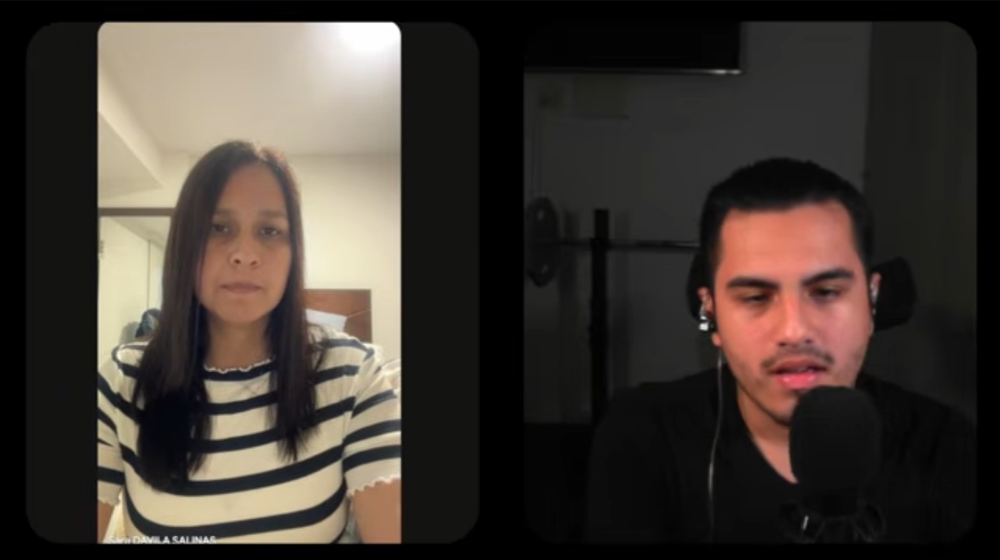

#### Entrevista 2 — Roxana Alvarado

| Dato | Información |
| :--- | :--- |
| Edad | 49 años |
| Experiencia docente | 25 años |
| Nivel | Educación inicial |
| Entrevistador | Mariano Oblitas |
| Registro | [Video de la entrevista](https://youtu.be/qM7wqQPLy8w) |

Roxana emplea recursos digitales de forma continua para motivar y complementar sus clases. Utiliza principalmente PowerPoint y Canva para elaborar cuentos, fichas y otros materiales; sin embargo, la búsqueda de imágenes adecuadas, la eliminación de fondos y la edición incrementan el tiempo de preparación. Al usar inteligencia artificial para generar recursos visuales, tuvo que modificar varias veces sus indicaciones antes de obtener un resultado apropiado. Por ello, considera útil una interfaz guiada que permita definir características sin depender de prompts complejos. Asimismo, percibe la realidad aumentada como un recurso complementario capaz de captar la atención de los niños.

  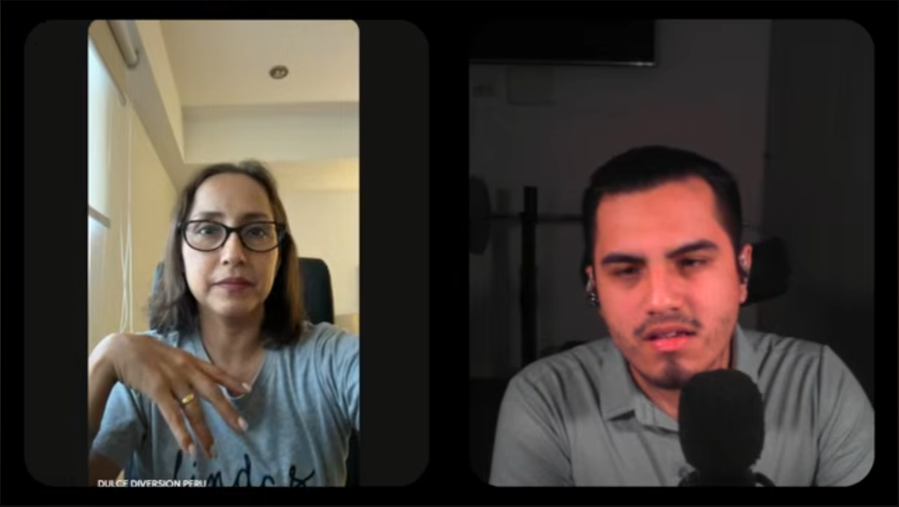

#### Entrevista 3 — Diandra Valle

| Dato | Información |
| :--- | :--- |
| Edad | 41 años |
| Experiencia docente | 18 años |
| Nivel | Educación inicial, aula de 5 años |
| Entrevistador | Mariano Oblitas |
| Registro | [Video de la entrevista](https://youtu.be/VIJUaUCygm4) |

Diandra utiliza recursos digitales en distintas áreas curriculares y ha empleado Gemini para crear cuentos personalizados. Para buscar imágenes recurre principalmente a Pinterest y estima que seleccionar recursos claros, nítidos y adecuados puede tomar entre 50 y 60 minutos. Aunque reconoce el potencial de la inteligencia artificial, identifica problemas de precisión y consistencia: al corregir un elemento de una imagen pueden aparecer errores en otros. Considera importante controlar personajes, escenarios, objetos y calidad visual, y valora una interfaz organizada por categorías que ayude a formular instrucciones más precisas. También considera la realidad aumentada útil como actividad complementaria para sus estudiantes.

  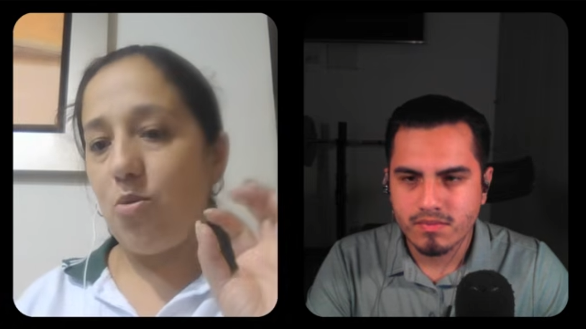

### 2.2.3. Análisis de entrevistas

Las tres docentes entrevistadas confirman que los recursos digitales son parte habitual de la preparación y el desarrollo de sus clases. Cuentos, imágenes, canciones, fichas y presentaciones se utilizan para contextualizar contenidos, captar la atención de los estudiantes y reforzar actividades de aprendizaje.

El patrón más consistente es el tiempo invertido en localizar, adaptar o elaborar materiales adecuados. Sara indicó que el proceso puede demandar entre dos y tres horas; Diandra señaló que la búsqueda de imágenes apropiadas puede requerir entre 50 y 60 minutos; y Roxana describió actividades adicionales, como retirar fondos y editar recursos, que prolongan la preparación. La disponibilidad de contenido no elimina el trabajo docente: los recursos deben corresponder al objetivo de la actividad, al nivel de los estudiantes y a los criterios de calidad visual de cada caso.

También se identificó una necesidad clara de control sobre el contenido generado. Las participantes reportaron personajes poco consistentes, características incorrectas y cambios no deseados al iterar imágenes generadas con inteligencia artificial. Estas experiencias refuerzan que la generación automática, por sí sola, no resulta suficiente para un contexto educativo: el docente necesita revisar el resultado y conservar la posibilidad de ajustar personajes, escenarios, objetos y otros elementos relevantes antes de incorporarlo a clase.

Las entrevistas muestran además que redactar instrucciones eficaces para herramientas de inteligencia artificial puede convertirse en una barrera. Roxana tuvo que ajustar varias veces sus indicaciones para obtener el resultado esperado, mientras que Diandra destacó el valor de estructurar mejor la descripción. Este hallazgo respalda el enfoque de Tale Star basado en configuraciones guiadas, donde el docente puede definir elementos concretos de una escena o cuento sin depender exclusivamente de la elaboración de prompts técnicos.

Finalmente, las participantes valoraron la realidad aumentada como una experiencia complementaria para incrementar la interacción y la atención durante actividades con niños. Su utilidad se entiende como un recurso de apoyo a cuentos ya preparados, no como sustituto de la planificación pedagógica ni de la revisión del adulto.

En conjunto, los hallazgos se alinean con la propuesta de Tale Star: centralizar la creación de cuentos, imágenes y recursos musicales; facilitar la reutilización de personajes y escenarios; y mantener al adulto en control de la revisión y ajuste del contenido. Estos resultados aportan evidencia para priorizar el Story Creator, la generación guiada y la Biblioteca como capacidades centrales del producto, mientras que la realidad aumentada se mantiene como una funcionalidad complementaria con potencial para enriquecer el uso del cuento en el aula.

## 2.3. Needfinding

El proceso de Needfinding se desarrollará después de completar el registro y análisis de las entrevistas de ambos segmentos.

El objetivo será transformar los patrones identificados en las entrevistas en representaciones estructuradas de los usuarios y de su experiencia actual. De esta manera, cada característica incluida en los artefactos deberá poder relacionarse con los resultados obtenidos durante la investigación y no con supuestos arbitrarios del equipo.

El Project Statement exige específicamente User Personas, User Task Matrix, Empathy Mapping y As-is Scenario Mapping.  Los User Personas y Empathy Maps deben elaborarse con UXPressia, mientras que los As-Is Scenario Maps pueden elaborarse en LucidChart o Miro.

En esta versión del informe se establece la estructura que deberán seguir los artefactos. El contenido específico de los perfiles, frecuencias, pensamientos, emociones, pains y gains se completará únicamente después del análisis de entrevistas.

### 2.3.1. User Personas

A partir de los resultados de las entrevistas se elaborará un User Persona para cada segmento objetivo. Cada arquetipo representará los patrones predominantes encontrados entre los participantes y no corresponderá a una copia directa de una persona entrevistada.

El Project Statement exige una ficha por segmento y señala que sus características deben derivarse del análisis previo.

Cada User Persona deberá incluir como mínimo:

* nombre ficticio;
* fotografía representativa;
* segmento;
* edad representativa;
* ocupación;
* ubicación;
* composición familiar cuando corresponda;
* biografía o background;
* personalidad;
* habilidades;
* nivel de adopción tecnológica;
* dispositivos utilizados;
* plataformas o canales digitales;
* marcas e influencias;
* necesidades;
* objetivos;
* motivaciones;
* frustraciones;
* pains;
* comportamientos relevantes;
* una frase o quote representativa.

#### **User Persona 1 — Padre o Cuidador**

Este arquetipo representará los patrones predominantes identificados entre los padres o cuidadores entrevistados. La ficha deberá concentrarse en su participación en la selección de contenido infantil, métodos actuales de búsqueda, formatos utilizados, grado de personalización que requiere, relación con herramientas digitales y principales frustraciones durante el proceso.

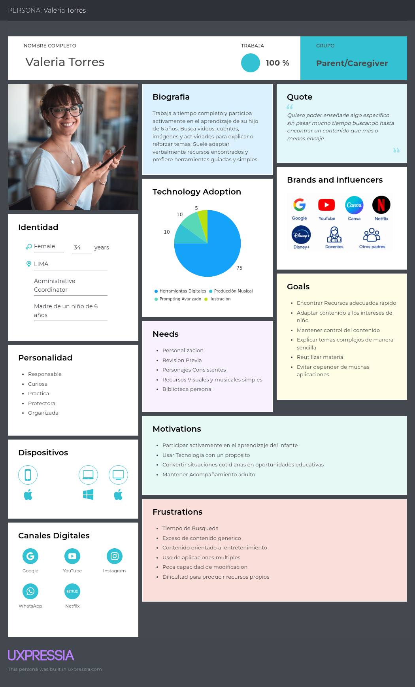

**Interpretación del User Persona**

Una vez finalizado el análisis de entrevistas, debajo de la imagen se deberá redactar un párrafo similar al siguiente, reemplazando los campos indicados por resultados reales:

[Nombre del arquetipo] representa al segmento de padres y cuidadores. Los resultados de las entrevistas muestran que sus principales objetivos se concentran en [objetivos predominantes], mientras que sus mayores frustraciones se relacionan con [pains encontrados]. Utiliza principalmente [dispositivos/plataformas predominantes] y recurre con mayor frecuencia a [formatos encontrados]. Estos hallazgos permitirán evaluar en qué medida la creación de imágenes, canciones y cuentos personalizados de Tale Star responde a necesidades observadas en el segmento.

No se debe afirmar en este párrafo que una funcionalidad “fue validada” si esa conclusión no está respaldada por las entrevistas.

#### **User Persona 2 — Docente**

Este arquetipo representará los patrones predominantes identificados entre los docentes entrevistados. Deberá reflejar su proceso de preparación de materiales, recursos digitales utilizados, tiempo destinado a búsqueda o adaptación, formatos que emplea y objetivos relacionados con la utilización de cuentos, imágenes y canciones en sus actividades.

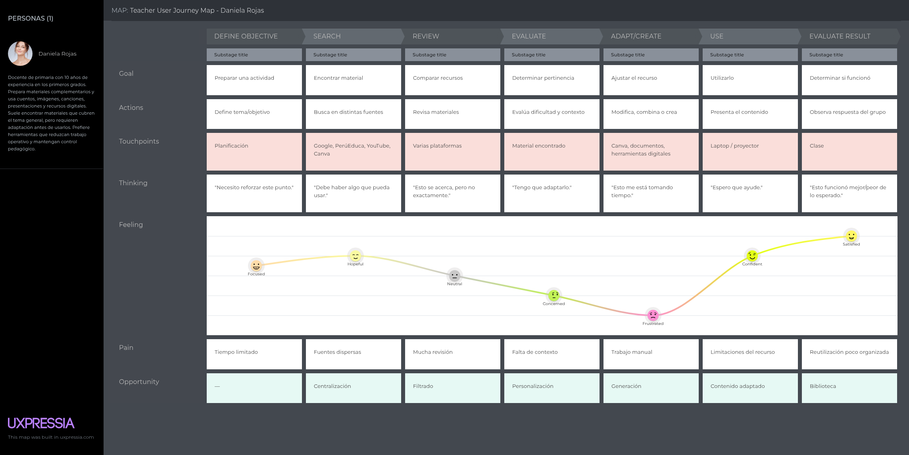

**Interpretación del User Persona**

Daniela Rojas representa al segmento de docentes de educación inicial y
primeros años de primaria. Su comportamiento se caracteriza por preparar
materiales complementarios de forma recurrente y por adaptar recursos
existentes que cubren el tema general pero no el contexto específico de su
grupo. Sus principales objetivos son preparar materiales apropiados para
cada actividad, reducir el tiempo destinado a búsqueda y adaptación, y
mantener control pedagógico sobre lo que utiliza en clase. Las principales
dificultades corresponden al tiempo limitado, la dispersión de fuentes, la
adaptación manual y la dificultad para producir ilustraciones y recursos
musicales propios. Se observa un uso predominante de cuentos, imágenes y
canciones como formatos, apoyado en plataformas como Google, YouTube,
PerúEduca y Canva desde laptop, smartphone y proyector de aula. Esta
información permitirá posteriormente priorizar los requisitos de Tale Star
relacionados con los procesos que representen mayor valor para este segmento.

### 2.3.2. User Task Matrix

La User Task Matrix concentrará las tareas que los User Personas realizan actualmente para alcanzar sus objetivos, independientemente de la existencia de Tale Star.

El Project Statement advierte explícitamente que las tasks no deben confundirse con funcionalidades del producto.  Por tanto, no se incluirán tareas como “generar una imagen con Tale Star”, “crear cuento en Tale Star” o “usar AR”.

Las tareas candidatas deberán validarse mediante las entrevistas antes de completar la matriz. Entre ellas se pueden analizar:

* buscar contenido para explicar un tema;
* evaluar si un contenido es adecuado para el niño o grupo;
* comparar diferentes recursos;
* adaptar contenido encontrado;
* explicar un tema utilizando un cuento;
* buscar o preparar imágenes;
* buscar o utilizar canciones;
* crear material cuando no encuentra uno adecuado;
* combinar diferentes recursos para una misma explicación;
* revisar contenido antes de presentarlo al niño;
* reutilizar materiales previamente preparados.

La tabla final debe contener una columna por User Persona y, para cada uno, las subcolumnas Frequency e Importance, exactamente como exige el statement.

| User Task                                           | Padre/Cuidador Frequency | Padre/Cuidador Importance | Docente Frequency | Docente Importance |
| --------------------------------------------------- | ------------------------ | ------------------------- | ----------------- | ------------------ |
| Buscar contenido para explicar o reforzar un tema   | Por definir              | Por definir               | Por definir       | Por definir        |
| Evaluar si un contenido es apropiado                | Por definir              | Por definir               | Por definir       | Por definir        |
| Comparar recursos encontrados en diferentes fuentes | Por definir              | Por definir               | Por definir       | Por definir        |
| Adaptar un recurso que no encaja completamente      | Por definir              | Por definir               | Por definir       | Por definir        |
| Utilizar cuentos para explicar un tema              | Por definir              | Por definir               | Por definir       | Por definir        |
| Buscar o preparar imágenes                          | Por definir              | Por definir               | Por definir       | Por definir        |
| Buscar o utilizar canciones                         | Por definir              | Por definir               | Por definir       | Por definir        |
| Crear material cuando no existe uno adecuado        | Por definir              | Por definir               | Por definir       | Por definir        |
| Combinar distintos recursos                         | Por definir              | Por definir               | Por definir       | Por definir        |
| Revisar el material antes de utilizarlo             | Por definir              | Por definir               | Por definir       | Por definir        |

Las categorías finales de Frequency e Importance se asignarán después del análisis de entrevistas, utilizando una escala homogénea como High, Medium y Low.

**Interpretación de la User Task Matrix**

Después de completar la matriz se deberá incluir una explicación de:

* las tareas con mayor frecuencia e importancia para ambos segmentos;
* las tareas especialmente relevantes para padres;
* las tareas especialmente relevantes para docentes;
* coincidencias entre los dos User Personas;
* principales diferencias.

No se debe convertir directamente una tarea en una funcionalidad sin realizar posteriormente el proceso de Requirements Specification.

### Artefacto auxiliar: User Journey Mapping

El Final Project Statement actual no exige formalmente un User Journey Map general dentro del Capítulo II; el artefacto obligatorio es el As-Is Scenario Mapping. No obstante, siguiendo el formato de referencia de Dosys, puede mantenerse un User Journey Map general como artefacto auxiliar para resumir visualmente el recorrido de cada segmento. Dosys utiliza este recurso antes del AS-IS para proporcionar una visión global de la experiencia.

Este mapa no reemplaza el As-Is Scenario Map requerido por el curso.

#### **User Journey Map — Padre o Cuidador**

El mapa general deberá representar el recorrido relacionado con la necesidad de encontrar o preparar contenido educativo, mostrando fases, objetivos, acciones, canales, dificultades y emociones.

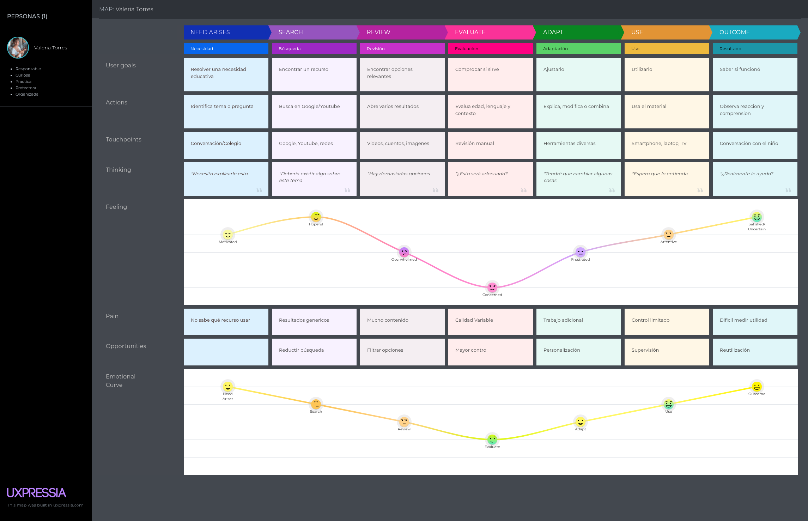

**Interpretación**

El texto posterior deberá resumir dónde aparecen las principales fricciones dentro del recorrido del padre o cuidador y cuáles de esas fricciones fueron observadas reiteradamente durante las entrevistas.

#### **User Journey Map — Docente**

El mapa deberá representar el recorrido habitual del docente desde que identifica una necesidad de material hasta que utiliza el recurso con sus estudiantes y evalúa si resultó adecuado.

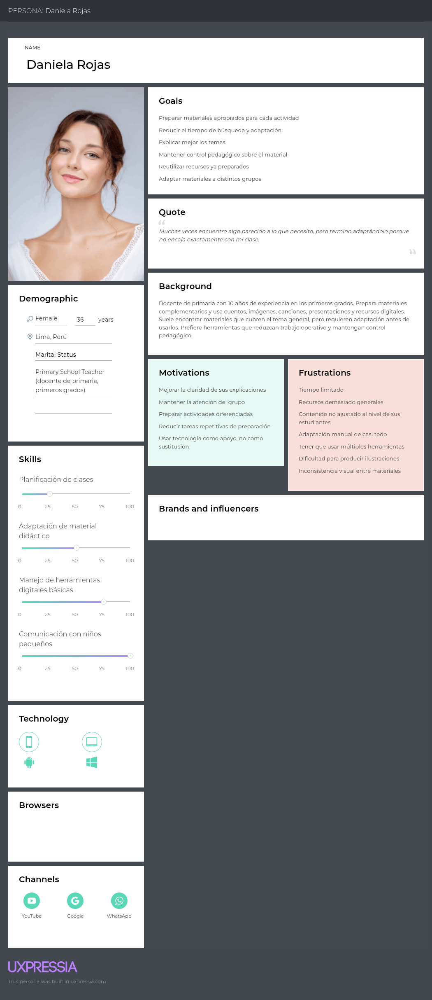

**Interpretación**

El párrafo posterior deberá destacar las etapas de mayor esfuerzo, canales utilizados y puntos en los que el docente necesita buscar, adaptar o crear material.

### 2.3.3. Empathy Mapping

Los Empathy Maps permitirán profundizar en la perspectiva de cada User Persona utilizando la información obtenida durante las entrevistas.

El Project Statement establece que cada mapa debe representar qué necesita hacer el usuario, qué dice, qué ve, qué hace, qué escucha, qué siente y piensa, además de sus Pains y Gains.

Se elaborará un Empathy Map para cada segmento en UXPressia.

#### **Empathy Map — Padre o Cuidador**

El mapa deberá construirse a partir de observaciones y respuestas recurrentes de los padres o cuidadores entrevistados.

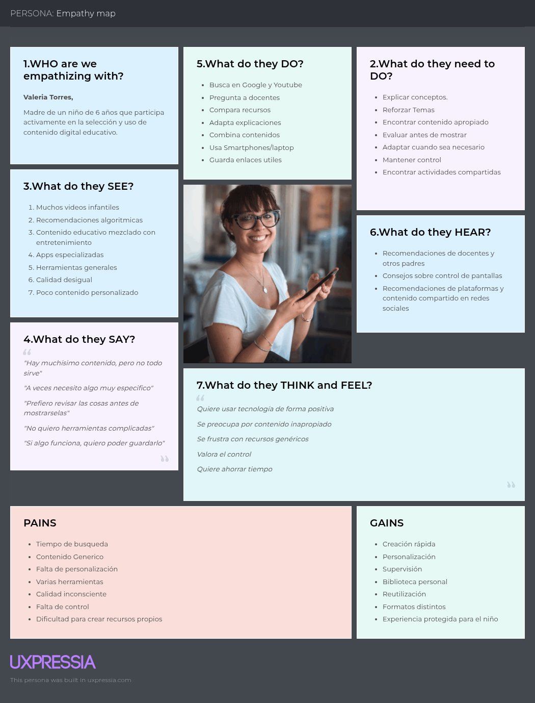

El artefacto deberá contener:

**Who are we empathizing with?**

Descripción resumida del User Persona y de su contexto familiar.

**What do they need to do?**

Tareas u objetivos que intenta cumplir cuando necesita explicar o reforzar un tema con el niño.

**What do they see?**

Plataformas, contenidos, recomendaciones, recursos y alternativas que encuentra actualmente.

**What do they say?**

Frases o comentarios recurrentes obtenidos durante las entrevistas.

**What do they do?**

Acciones observadas o declaradas: buscar, comparar, revisar, adaptar, combinar o crear contenido.

**What do they hear?**

Influencias provenientes de familiares, docentes, otros padres, redes sociales, instituciones o especialistas.

**What do they think and feel?**

Preocupaciones, percepciones y emociones relacionadas con la calidad del contenido, el tiempo requerido y el uso de herramientas digitales.

**Pains**

Problemas recurrentes demostrados mediante entrevistas.

**Gains**

Resultados que el usuario busca obtener al encontrar o producir un contenido adecuado.

**Interpretación**

Después de la imagen debe añadirse un párrafo que explique los pains y gains predominantes y cómo estos se relacionan con la problemática planteada en Tale Star, sin inventar funcionalidades nuevas.

#### **Empathy Map — Docente**

El segundo mapa reflejará la experiencia, pensamientos y comportamientos predominantes del docente durante el proceso de preparación y utilización de materiales.

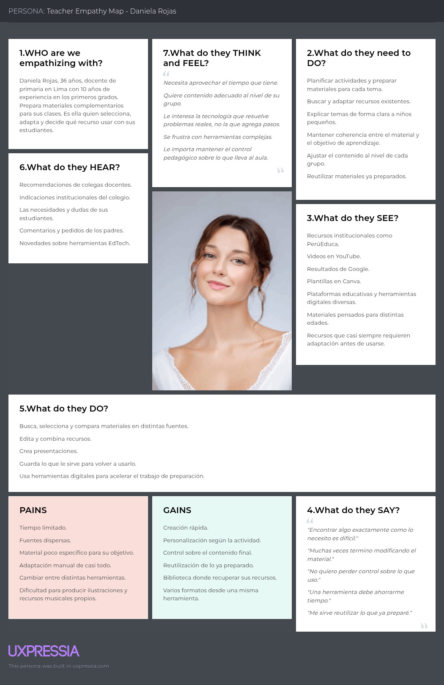

Debe incluir las mismas dimensiones:

* quién es;
* qué necesita hacer;
* qué ve;
* qué dice;
* qué hace;
* qué escucha;
* qué piensa y siente;
* pains;
* gains.

**Interpretación**

El texto posterior deberá identificar las preocupaciones, frustraciones y resultados esperados que aparecen de manera reiterada en el segmento docente y explicar qué diferencias existen frente al mapa de padres o cuidadores.

### 2.3.4. As-is Scenario Mapping

El As-Is Scenario Mapping representa la experiencia actual de los User Personas antes de disponer de Tale Star.

Este punto es obligatorio en el Project Statement y debe contener para cada persona las filas Phases, Doing, Thinking y Feeling. También deben identificarse áreas positivas, negativas y blank areas donde todavía existe información insuficiente.

Los mapas se elaborarán en LucidChart o Miro, de acuerdo con las herramientas establecidas por el curso.

**Proceso de elaboración**

Para cada segmento, el equipo preparó la sesión revisando los patrones identificados en el análisis de entrevistas correspondiente. A partir de esa preparación se realizó una lluvia de ideas individual sobre los pasos que sigue actualmente cada User Persona para resolver su necesidad, seguida de una revisión conjunta en la que se identificaron y nombraron las fases resultantes como columnas del mapa. Finalmente, para cada fase se completaron las filas Doing, Thinking y Feeling, y se identificaron y etiquetaron las áreas positivas, negativas y blank areas del recorrido.

#### **AS-IS Scenario Map — Padre o Cuidador**

El mapa deberá representar únicamente la situación actual. No deberá incluir Tale Star ni ninguna funcionalidad futura.

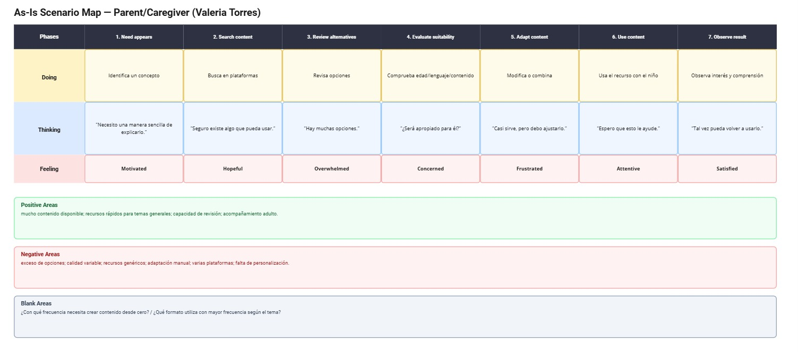

Las fases exactas se determinarán después de las entrevistas. Como estructura inicial de análisis pueden considerarse, únicamente para validar:

1. aparece una necesidad de explicar o reforzar un tema;
2. busca recursos;
3. revisa alternativas;
4. determina si son adecuadas;
5. adapta o combina material cuando es necesario;
6. utiliza el contenido con el niño;
7. observa si el recurso cumplió su propósito.

Cada fase debe contener:

**Doing**

Qué hace actualmente el usuario.

**Thinking**

Qué piensa mientras realiza la tarea.

**Feeling**

Qué emoción o nivel de satisfacción experimenta.

**Positive Areas**

Momentos del recorrido que funcionan adecuadamente.

**Negative Areas**

Momentos de mayor frustración, esfuerzo o incertidumbre.

**Blank Areas**

Aspectos que todavía no pueden responderse con suficiente evidencia.

**Interpretación**

El texto posterior deberá identificar dónde se concentra la mayor fricción del recorrido y cuáles son los puntos que posteriormente deberán compararse con el To-Be Scenario Mapping del Capítulo III.

#### **AS-IS Scenario Map — Docente**

El segundo mapa representará el proceso actual del docente para preparar y utilizar materiales sin Tale Star.

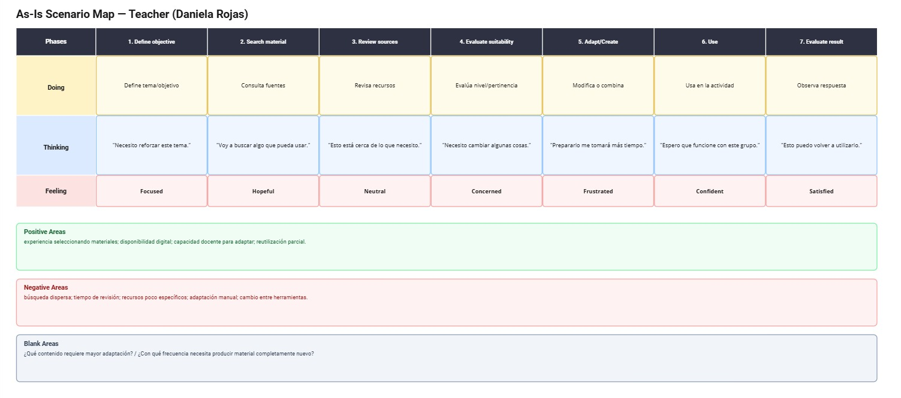

Como estructura preliminar a validar pueden considerarse las siguientes fases:

1. identifica un objetivo o tema de clase;
2. busca materiales;
3. revisa diferentes fuentes;
4. evalúa su pertinencia;
5. adapta o crea material;
6. utiliza el recurso;
7. observa el resultado obtenido.

Las fases definitivas deberán surgir de las entrevistas.

Cada columna debe contener Doing, Thinking y Feeling, además de la identificación visual de áreas positivas, negativas y blank areas.

**Interpretación**

Después de la imagen se explicarán las etapas que concentran mayor tiempo, dificultad o frustración y las diferencias encontradas respecto al recorrido de padres o cuidadores.

## 2.4. Ubiquitous Language

El Ubiquitous Language establece los términos utilizados de manera consistente por el equipo para describir el dominio de Tale Star.

El glosario debe contener exclusivamente términos del business domain y no conceptos técnicos de Ingeniería de Software. El Project Statement establece además que los términos deben escribirse en inglés, pudiendo incluirse su equivalente en español, mientras que la definición puede mantenerse en español.

| Term                     | Equivalent in Spanish   | Definition                                                                                                                       |
| ------------------------ | ----------------------- | -------------------------------------------------------------------------------------------------------------------------------- |
| **Educational Content**  | Contenido educativo     | Recurso que un padre, cuidador o docente utiliza con la intención de explicar, presentar o reforzar un tema con un niño.         |
| **Story**                | Cuento                  | Narrativa compuesta por una secuencia ordenada de Story Pages.                                                                   |
| **Story Page**           | Página del cuento       | Unidad individual de un cuento que contiene texto y una ilustración asociada.                                                    |
| **Story Text**           | Texto del cuento        | Contenido escrito correspondiente a una Story Page.                                                                              |
| **Character**            | Personaje               | Persona, animal o entidad que participa dentro de una historia.                                                                  |
| **Action**               | Acción                  | Actividad realizada por uno o más Characters dentro de una Story Page.                                                           |
| **Object**               | Objeto                  | Elemento presente en la escena correspondiente a una Story Page.                                                                 |
| **Illustration**         | Ilustración             | Representación visual correspondiente al contenido de una Story Page.                                                            |
| **Image**                | Imagen                  | Contenido visual independiente generado a partir de las indicaciones proporcionadas por el usuario.                              |
| **Song**                 | Canción                 | Contenido musical corto creado como recurso educativo infantil.                                                                  |
| **Educational Topic**    | Tema educativo          | Tema, concepto o situación que el adulto desea explicar o reforzar mediante contenido.                                           |
| **Caregiver**            | Cuidador                | Adulto responsable de acompañar al niño y seleccionar o utilizar contenido con él.                                               |
| **Parent**               | Padre/Madre             | Adulto responsable del niño que participa en la selección o preparación de contenido.                                            |
| **Teacher**              | Docente                 | Profesional que selecciona, prepara o utiliza materiales educativos con niños.                                                   |
| **Child**                | Niño                    | Beneficiario final del contenido creado o seleccionado por padres, cuidadores o docentes.                                        |
| **Content Selection**    | Selección de contenido  | Proceso mediante el cual el adulto busca y elige un recurso para utilizarlo con un niño.                                         |
| **Content Adaptation**   | Adaptación de contenido | Modificación o complementación de un recurso existente para ajustarlo al tema que el adulto desea trabajar.                      |
| **Content Review**       | Revisión de contenido   | Actividad mediante la cual el adulto evalúa un contenido antes de utilizarlo con un niño.                                        |
| **Personalized Content** | Contenido personalizado | Contenido elaborado de acuerdo con elementos definidos específicamente por el adulto para una situación o necesidad determinada. |
| **Story Reading**        | Lectura del cuento      | Actividad mediante la cual el adulto o niño recorre las diferentes Story Pages de un Story.                                      |

No deben incluirse aquí términos como REST API, NestJS, PostgreSQL, endpoint, JWT, ARCore, repository, DTO o microservice, porque corresponden al lenguaje técnico de implementación y no al lenguaje ubicuo del dominio.

---

# Capítulo III: Requirements Specification

El presente capítulo desarrolla la especificación de requisitos de Tale Star a partir de la problemática, los segmentos objetivo, los resultados del proceso de Needfinding y el alcance funcional definido para la solución. El objetivo es transformar las necesidades identificadas para padres, cuidadores y docentes en comportamientos verificables que posteriormente permitan orientar el diseño de la arquitectura, la experiencia de usuario y la implementación de los productos digitales.

Tale Star mantiene un único modelo funcional de usuario autenticado. Padres, cuidadores y docentes utilizan el mismo tipo de cuenta y disponen de las mismas capacidades dentro de la aplicación. La distinción entre ambos segmentos se utiliza para comprender sus contextos, motivaciones e impactos esperados, pero no se traduce en roles de autorización diferentes dentro del producto.

La especificación se organiza en cuatro artefactos relacionados. En primer lugar, los To-Be Scenario Maps representan cómo cambiaría la experiencia de los dos User Personas una vez incorporada Tale Star. Posteriormente, las capacidades se formalizan mediante Epics, User Stories y Technical Stories con Acceptance Criteria verificables. El Impact Mapping establece la trazabilidad entre los objetivos del negocio, los actores, los cambios de comportamiento esperados y las capacidades de la solución. Finalmente, el Product Backlog prioriza las Stories implementables según su valor para el negocio y las estima utilizando Story Points.

El alcance funcional utilizado en este capítulo corresponde exclusivamente a las capacidades aprobadas para Tale Star: administración básica de la cuenta; generación de imágenes mediante Prompt Guiado y Prompt Libre; elementos creativos reutilizables; creación de cuentos página por página; generación musical estructurada; Biblioteca; perfil y planes; control parental mediante PIN; lectura de contenido; y experiencia de realidad aumentada exclusivamente para cuentos. No se incorporan funcionalidades de LMS, administración de aulas, colaboración, marketplace, red social, personajes tridimensionales ni otras características fuera del alcance acordado.

Además del comportamiento funcional, la especificación considera los productos exigidos por la solución multicomponente del curso. Por este motivo se incluyen User Stories del Landing Page y Technical Stories que permiten representar las capacidades de la RESTful API y sus integraciones. El Statement establece que la solución debe incluir productos digitales integrados, Landing Page, RESTful APIs de elaboración interna, Web Application y Native Mobile Application, además de acceso a servicios externos.

---

## 3.1. To-Be Scenario Mapping

El To-Be Scenario Mapping permite representar la experiencia futura esperada de los User Personas una vez que Tale Star forma parte de su proceso de selección, creación y utilización de contenido educativo infantil. Este artefacto no busca describir las pantallas de la aplicación, sino mostrar cómo cambia el recorrido del usuario frente al escenario actual representado previamente mediante los As-Is Scenario Maps.

Para su elaboración se considera un mapa por cada User Persona. Cada mapa contiene las dimensiones Phases, Doing, Thinking y Feeling, manteniendo una columna por fase. El proceso parte de la revisión del As-Is correspondiente, identifica las principales áreas de esfuerzo o fragmentación y plantea cómo la incorporación de Tale Star modifica esas actividades.

En ambos segmentos, el cambio principal propuesto consiste en pasar de un proceso donde el adulto puede necesitar buscar, comparar, adaptar o combinar recursos provenientes de diferentes fuentes, a un proceso en el que puede configurar y crear contenidos desde una misma solución, revisar el resultado y decidir posteriormente cómo utilizarlo. Tale Star no elimina la responsabilidad del adulto de evaluar el material; por el contrario, mantiene la revisión humana como parte explícita del recorrido.

### To-Be Scenario Map — Padre o Cuidador

El To-Be Scenario Map del segmento de padres y cuidadores representa el recorrido futuro desde que el adulto identifica la necesidad de explicar o reforzar un tema hasta que utiliza el contenido con el niño.

En el escenario futuro, el padre o cuidador puede decidir qué tipo de contenido necesita, configurar sus características, generar o preparar el recurso, revisar el resultado y conservarlo para su utilización. Cuando el contenido corresponde a un cuento, también puede utilizar la experiencia de lectura tradicional o, desde un dispositivo móvil compatible, la experiencia de realidad aumentada.

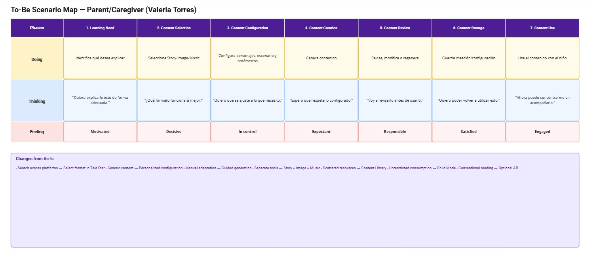

**Comparación con el escenario As-Is**

Frente al escenario As-Is, el cambio principal consiste en disminuir la fragmentación entre diferentes fuentes y herramientas. El usuario deja de depender exclusivamente de encontrar un recurso ya existente que coincida con su necesidad y obtiene la posibilidad de crear uno a partir de parámetros que controla directamente.

La participación del adulto no desaparece con la generación. El usuario continúa evaluando el contenido antes de utilizarlo con el niño y puede modificar la configuración o solicitar nuevas generaciones cuando el resultado no responde a lo que necesita. De esta manera, Tale Star busca reducir el esfuerzo operativo de creación sin trasladar a la inteligencia artificial la responsabilidad de decidir qué material resulta apropiado.

La Biblioteca añade continuidad al recorrido porque permite conservar y recuperar las creaciones. Asimismo, el modo protegido mediante PIN busca separar las capacidades de creación, administradas por el adulto, de la experiencia de consumo que puede ser utilizada por el niño.

### To-Be Scenario Map — Docente

El To-Be Scenario Map del segmento docente representa el proceso futuro desde la identificación de una necesidad de material hasta su utilización dentro de una actividad educativa.

Tale Star funciona en este escenario como una herramienta complementaria de creación. El docente determina el material que necesita, decide si utilizará un cuento, una imagen o un recurso musical, configura sus características, revisa el contenido generado y conserva aquellos recursos que considere útiles.

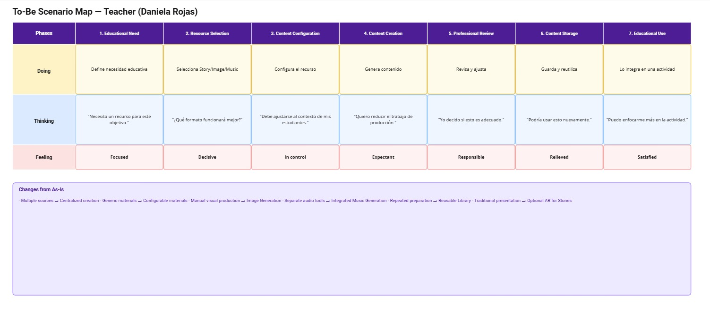

**Comparación con el escenario As-Is**

Frente al escenario As-Is, Tale Star busca disminuir el esfuerzo asociado con recorrer diferentes fuentes cuando el material disponible no responde al contexto de la actividad. El docente puede producir diferentes tipos de contenido desde un mismo entorno, manteniendo control explícito sobre la narración de los cuentos y sobre los parámetros de las generaciones.

En el caso del Story Creator, el docente construye el cuento página por página y escribe directamente el texto de cada página. La inteligencia artificial se utiliza para producir las ilustraciones correspondientes a la configuración suministrada, pero no reemplaza el control del profesional sobre la narración.

Las capacidades de Image Generation y Music Generation permiten resolver necesidades más específicas sin obligar al docente a construir un cuento completo. La Biblioteca facilita posteriormente la recuperación de los contenidos creados.

---

## 3.2. User Stories

Las User Stories representan las capacidades funcionales y técnicas requeridas para Tale Star. La especificación se organiza mediante Epics, pero utiliza un único cuadro para todo el conjunto de Epics, User Stories y Technical Stories.

Los Epics no representan elementos directamente implementables ni reciben Story Points. Su función consiste en agrupar Stories relacionadas y proporcionar trazabilidad dentro de la especificación.

Las User Stories utilizan la estructura:

**Como [rol], deseo [capacidad], para [beneficio].**

Los Acceptance Criteria se expresan mediante escenarios Gherkin utilizando Dado–Cuando–Entonces. Los criterios describen comportamientos observables y comprobables, evitando depender de elementos concretos de interfaz.

### Tabla de Epics, User Stories y Technical Stories

| Epic / User Story ID | Título                                                | Descripción                                                                                                                                                                                                                        | Criterios de Aceptación                                                                                                                                                                                                                                                                                                                                                                                                                                                                                                                                                                                                                               | Relacionado con (Epic ID) |
| -------------------- | ----------------------------------------------------- | ---------------------------------------------------------------------------------------------------------------------------------------------------------------------------------------------------------------------------------- | ----------------------------------------------------------------------------------------------------------------------------------------------------------------------------------------------------------------------------------------------------------------------------------------------------------------------------------------------------------------------------------------------------------------------------------------------------------------------------------------------------------------------------------------------------------------------------------------------------------------------------------------------------- | ------------------------- |
| **EP01**             | **Account & Access**                                  | Agrupa las capacidades para crear una cuenta, autenticarse y recuperar el acceso a Tale Star. Padres, cuidadores y docentes utilizan el mismo tipo de cuenta.                                                                      | No aplica. Epic de agrupación.                                                                                                                                                                                                                                                                                                                                                                                                                                                                                                                                                                                                                        | —                         |
| **US01**             | Crear una cuenta                                      | Como usuario de Tale Star, deseo crear una cuenta proporcionando mi correo electrónico y contraseña, para poder utilizar las funcionalidades de la plataforma.                                                                     | **E01 – Registro válido:** Dado que el usuario proporciona un correo no registrado, una contraseña válida, su confirmación y acepta los términos y condiciones, cuando solicita crear la cuenta, entonces el sistema registra la cuenta.  **E02 – Confirmación diferente:** Dado que la contraseña y su confirmación no coinciden, cuando se intenta crear la cuenta, entonces el sistema no completa el registro.  **E03 – Términos no aceptados:** Dado que el usuario no acepta los términos y condiciones, cuando solicita crear la cuenta, entonces el sistema no completa el registro.                                              | EP01                      |
| **US02**             | Iniciar sesión                                        | Como usuario registrado, deseo iniciar sesión utilizando mi correo electrónico y contraseña para acceder a mi cuenta y mis creaciones.                                                                                             | **E01 – Credenciales válidas:** Dado que existe una cuenta registrada, cuando el usuario proporciona credenciales válidas, entonces el sistema establece una sesión autenticada.  **E02 – Credenciales inválidas:** Dado que las credenciales proporcionadas no corresponden a una cuenta válida, cuando el usuario intenta autenticarse, entonces el sistema no concede acceso.                                                                                                                                                                                                                                                                | EP01                      |
| **US03**             | Recordar mi acceso                                    | Como usuario registrado, deseo indicar que Tale Star recuerde mi acceso para no tener que autenticarme nuevamente cada vez que utilice la aplicación.                                                                              | **E01 – Preferencia activada:** Dado que el usuario inicia sesión y solicita recordar su acceso, cuando finaliza correctamente la autenticación, entonces el sistema conserva la preferencia para futuras sesiones.  **E02 – Preferencia no activada:** Dado que el usuario no solicita recordar su acceso, cuando finaliza su sesión correspondiente, entonces el sistema no conserva la autenticación como acceso recordado.                                                                                                                                                                                                                  | EP01                      |
| **US04**             | Recuperar mi contraseña                               | Como usuario que no recuerda su contraseña, deseo solicitar su recuperación para poder volver a acceder a mi cuenta.                                                                                                               | **E01 – Solicitud válida:** Dado que el usuario proporciona un correo asociado a una cuenta, cuando solicita recuperar su contraseña, entonces el sistema inicia el flujo de recuperación simulado.  **E02 – Nueva contraseña:** Dado que el flujo de recuperación se encuentra habilitado, cuando el usuario establece una nueva contraseña válida, entonces esta reemplaza la contraseña anterior.  **Regla:** En el MVP no se implementa el envío real del correo; se simula el flujo correspondiente.                                                                                                                                 | EP01                      |
| **EP02**             | **Reusable Creative Assets**                          | Agrupa las capacidades relacionadas con la creación y reutilización de Characters y Scenarios compartidos entre Images y Stories.                                                                                                  | No aplica. Epic de agrupación.                                                                                                                                                                                                                                                                                                                                                                                                                                                                                                                                                                                                                        | —                         |
| **US05**             | Crear un personaje reutilizable                       | Como usuario, deseo crear un personaje indicando su nombre, tipo, descripción visual y personalidad para poder reutilizarlo posteriormente en mis generaciones.                                                                    | **E01 – Creación válida:** Dado que el usuario proporciona nombre, tipo, descripción visual y personalidad, cuando guarda el Character, entonces el sistema lo incorpora a su biblioteca reutilizable.  **E02 – Reutilización posterior:** Dado que el Character fue guardado, cuando el usuario configura posteriormente una Image o Story Page, entonces puede utilizar ese Character.  **Regla:** La descripción visual constituye la información principal utilizada para representar la apariencia del Character.                                                                                                                    | EP02                      |
| **US06**             | Reutilizar personajes guardados                       | Como usuario, deseo seleccionar uno o varios personajes previamente guardados para utilizarlos nuevamente en una imagen o página de un cuento sin tener que volver a describirlos.                                                 | **E01 – Selección múltiple:** Dado que existen Characters guardados, cuando el usuario selecciona uno o más para una creación, entonces el sistema asocia los Characters seleccionados con esa configuración.  **E02 – Consistencia de datos:** Dado que un Character reutilizado posee características previamente definidas, cuando participa en otra creación, entonces el sistema utiliza dichas características como parte de la información de generación.                                                                                                                                                                                | EP02                      |
| **US07**             | Crear un escenario reutilizable                       | Como usuario, deseo crear un escenario indicando un nombre y una descripción visual para poder utilizarlo posteriormente en mis imágenes y cuentos.                                                                                | **E01 – Creación válida:** Dado que el usuario proporciona un nombre y una descripción visual, cuando guarda el Scenario, entonces el sistema lo incorpora a su biblioteca reutilizable.  **E02 – Disponibilidad posterior:** Dado que un Scenario está guardado, cuando el usuario configura una Image o Story Page, entonces puede seleccionarlo.                                                                                                                                                                                                                                                                                             | EP02                      |
| **US08**             | Reutilizar un escenario guardado                      | Como usuario, deseo seleccionar un escenario previamente guardado para utilizar su descripción visual en una imagen o página de un cuento.                                                                                         | **E01 – Selección válida:** Dado que existen Scenarios guardados, cuando el usuario selecciona uno para una creación, entonces el sistema asocia su información con la configuración actual.  **E02 – Restricción de escenario:** Dado que una escena admite un Scenario seleccionado, cuando el usuario reemplaza el Scenario actual por otro, entonces la configuración utiliza únicamente el nuevo Scenario seleccionado.                                                                                                                                                                                                                    | EP02                      |
| **EP03**             | **Image Generation**                                  | Agrupa las capacidades para configurar, generar, revisar, guardar, regenerar y descargar Images mediante Prompt Guiado o Prompt Libre.                                                                                             | No aplica. Epic de agrupación.                                                                                                                                                                                                                                                                                                                                                                                                                                                                                                                                                                                                                        | —                         |
| **US09**             | Elegir el tipo de prompt                              | Como usuario, deseo elegir entre Prompt Guiado y Prompt Libre para generar una imagen utilizando el nivel de control que prefiera.                                                                                                 | **E01 – Prompt Guiado:** Dado que el usuario selecciona Prompt Guiado, cuando configura la Image, entonces el sistema permite construir las indicaciones mediante los campos estructurados definidos.  **E02 – Prompt Libre:** Dado que el usuario selecciona Prompt Libre, cuando configura la Image, entonces puede proporcionar directamente una descripción textual.                                                                                                                                                                                                                                                                        | EP03                      |
| **US10**             | Configurar un Prompt Guiado                           | Como usuario, deseo configurar una imagen mediante campos estructurados para describir la escena sin tener que redactar manualmente un prompt técnico.                                                                             | **E01 – Construcción guiada:** Dado que el usuario utiliza Prompt Guiado, cuando proporciona información en Characters, Action, Emotions, Objects, Scenario, Moment, Visual Style e indicaciones adicionales, entonces el sistema construye la configuración de generación con esos valores.  **E02 – Datos disponibles:** Dado que existen elementos reutilizables previamente guardados, cuando el usuario configura el Prompt Guiado, entonces puede incorporarlos sin volver a describirlos.                                                                                                                                                | EP03                      |
| **US11**             | Seleccionar emociones para una imagen                 | Como usuario, deseo asociar una o varias emociones a la escena para orientar las expresiones y el ambiente de los personajes generados.                                                                                            | **E01 – Una emoción:** Dado que el usuario configura una Image, cuando selecciona una emoción, entonces el sistema la incorpora a las indicaciones de generación.  **E02 – Varias emociones:** Dado que ya existe una emoción seleccionada, cuando el usuario añade otra disponible, entonces ambas quedan asociadas a la configuración.                                                                                                                                                                                                                                                                                                        | EP03                      |
| **US12**             | Añadir objetos a una imagen                           | Como usuario, deseo indicar uno o varios objetos visibles dentro de la escena para que sean considerados durante la generación.                                                                                                    | **E01 – Objeto añadido:** Dado que el usuario proporciona un objeto, cuando lo incorpora a la configuración, entonces el sistema lo conserva como elemento de la escena.  **E02 – Varios objetos:** Dado que existen Objects registrados en la configuración, cuando se añaden otros, entonces todos forman parte de las indicaciones utilizadas para la generación.                                                                                                                                                                                                                                                                            | EP03                      |
| **US13**             | Definir el momento de una imagen                      | Como usuario, deseo seleccionar el momento de la escena para influir en las condiciones visuales de la imagen.                                                                                                                     | **E01 – Selección:** Dado que el usuario configura una Image, cuando selecciona un momento disponible, entonces el sistema lo incorpora a las indicaciones visuales.  **Regla:** Los momentos definidos para el alcance son mañana, mediodía y noche.                                                                                                                                                                                                                                                                                                                                                                                           | EP03                      |
| **US14**             | Seleccionar el estilo visual de una imagen            | Como usuario, deseo seleccionar un estilo visual para determinar la apariencia general de la imagen generada.                                                                                                                      | **E01 – Storybook:** Dado que el usuario selecciona Storybook, cuando genera la Image, entonces la configuración utiliza ese estilo visual.  **E02 – 3D Flat:** Dado que el usuario selecciona 3D Flat, cuando genera la Image, entonces la configuración utiliza ese estilo visual.  **Regla:** Tale Star contempla únicamente Storybook y 3D Flat/Flat suave dentro del alcance actual.                                                                                                                                                                                                                                                 | EP03                      |
| **US15**             | Añadir indicaciones adicionales a una imagen          | Como usuario, deseo escribir instrucciones adicionales para especificar condiciones que no puedan expresarse mediante los demás campos del Prompt Guiado.                                                                          | **E01 – Indicación proporcionada:** Dado que el usuario introduce una indicación adicional, cuando se construye la configuración de generación, entonces el sistema la incorpora junto con los demás parámetros.  **E02 – Sin indicaciones adicionales:** Dado que el usuario no proporciona este contenido, cuando genera la Image, entonces el sistema utiliza únicamente la información configurada en los demás campos.                                                                                                                                                                                                                     | EP03                      |
| **US16**             | Escribir un Prompt Libre                              | Como usuario, deseo escribir directamente una descripción libre de la imagen para generar contenido sin utilizar la configuración guiada.                                                                                          | **E01 – Texto válido:** Dado que el usuario utiliza Prompt Libre y proporciona una descripción, cuando solicita la generación, entonces esa descripción forma parte de la solicitud.  **E02 – Edición:** Dado que existe un Prompt Libre previamente escrito, cuando el usuario modifica su contenido antes de generar, entonces el sistema utiliza la versión vigente.                                                                                                                                                                                                                                                                         | EP03                      |
| **US17**             | Aplicar modificadores rápidos al Prompt Libre         | Como usuario, deseo aplicar modificadores rápidos a mi descripción para ajustar características del prompt sin tener que redactarlas manualmente.                                                                                  | **E01 – Modificador aplicado:** Dado que existe una descripción libre, cuando el usuario aplica un modificador disponible, entonces el sistema incorpora su efecto a la configuración del prompt.  **E02 – Varios modificadores:** Dado que un modificador ya fue aplicado, cuando el usuario aplica otro compatible, entonces ambos ajustes se consideran en la configuración.                                                                                                                                                                                                                                                                 | EP03                      |
| **US18**             | Guardar una configuración de imagen sin generarla     | Como usuario, deseo guardar la información de generación de una imagen aunque todavía no haya generado el resultado para poder retomarla posteriormente desde la Biblioteca.                                                       | **E01 – Configuración sin resultado:** Dado que el usuario ha configurado una Image pero todavía no existe un archivo generado, cuando guarda la creación, entonces el sistema conserva sus parámetros.  **E02 – Recuperación:** Dado que existe una configuración guardada sin resultado generado, cuando el usuario vuelve a editarla desde la Biblioteca, entonces recupera los parámetros previamente almacenados.                                                                                                                                                                                                                          | EP03                      |
| **US19**             | Generar una imagen                                    | Como usuario, deseo generar una imagen utilizando el Prompt Guiado o Prompt Libre que he definido para obtener el recurso visual solicitado.                                                                                       | **E01 – Generación válida:** Dado que existe una configuración de generación válida, cuando el usuario solicita generar la Image, entonces el sistema procesa la solicitud de generación.  **E02 – Resultado recibido:** Dado que el servicio generativo completa correctamente la solicitud, cuando Tale Star recibe el resultado, entonces lo asocia con la creación correspondiente.  **E03 – Error externo:** Dado que la generación no puede completarse, cuando el servicio externo informa un fallo, entonces el sistema conserva la configuración para permitir un nuevo intento.                                                 | EP03                      |
| **US20**             | Previsualizar una imagen generada                     | Como usuario, deseo visualizar el resultado de una generación para decidir si deseo conservarlo, regenerarlo o descargarlo.                                                                                                        | **E01 – Resultado disponible:** Dado que una Image fue generada correctamente, cuando el usuario consulta la creación, entonces puede revisar el resultado.  **E02 – Sin resultado:** Dado que todavía no existe una Image generada, cuando el usuario consulta la creación, entonces el sistema no presenta un resultado inexistente y mantiene el estado previo a la generación.                                                                                                                                                                                                                                                              | EP03                      |
| **US21**             | Consultar el prompt construido                        | Como usuario, deseo visualizar el prompt construido por Tale Star para conocer qué descripción se utilizó finalmente durante la generación.                                                                                        | **E01 – Prompt disponible:** Dado que el sistema ha construido la descripción utilizada para una generación, cuando el usuario consulta la información de la creación, entonces puede revisar ese texto.  **E02 – Actualización:** Dado que la configuración fue modificada antes de una nueva generación, cuando se vuelve a construir el prompt, entonces se presenta la versión correspondiente a los parámetros vigentes.                                                                                                                                                                                                                   | EP03                      |
| **US22**             | Copiar el prompt construido                           | Como usuario, deseo copiar el prompt construido para poder reutilizarlo fuera de la generación actual.                                                                                                                             | **E01 – Contenido disponible:** Dado que existe un prompt construido, cuando el usuario solicita copiarlo, entonces el sistema proporciona el texto completo para su reutilización.  **E02 – Correspondencia:** Dado que el prompt fue actualizado, cuando se copia, entonces se utiliza su versión vigente.                                                                                                                                                                                                                                                                                                                                    | EP03                      |
| **US23**             | Regenerar una imagen                                  | Como usuario, deseo volver a generar una imagen utilizando su configuración actual para obtener una nueva alternativa.                                                                                                             | **E01 – Nueva generación:** Dado que existe una creación con configuración válida, cuando el usuario solicita regenerarla, entonces el sistema inicia una nueva generación utilizando los parámetros vigentes.  **E02 – Resultado alternativo:** Dado que la regeneración finaliza correctamente, cuando el sistema recibe el resultado, entonces lo presenta como una nueva alternativa de la creación.                                                                                                                                                                                                                                        | EP03                      |
| **US24**             | Descargar una imagen                                  | Como usuario, deseo descargar una imagen generada para conservarla o utilizarla fuera de Tale Star.                                                                                                                                | **E01 – Archivo disponible:** Dado que existe una Image generada, cuando el usuario solicita descargarla, entonces el sistema proporciona el archivo correspondiente.  **E02 – Sin generación:** Dado que todavía no existe un archivo generado, cuando se intenta realizar una descarga, entonces el sistema no entrega un archivo inexistente.                                                                                                                                                                                                                                                                                                | EP03                      |
| **US25**             | Guardar una imagen generada                           | Como usuario, deseo guardar una imagen generada para acceder a ella posteriormente desde mi Biblioteca.                                                                                                                            | **E01 – Guardado válido:** Dado que existe una Image generada, cuando el usuario decide conservarla, entonces el sistema almacena la creación y su configuración.  **E02 – Recuperación:** Dado que una Image está guardada, cuando el usuario consulta su Biblioteca, entonces puede volver a acceder a ella.                                                                                                                                                                                                                                                                                                                                  | EP03                      |
| **EP04**             | **Story Authoring**                                   | Agrupa las capacidades para construir Stories página por página y generar sus Illustrations manteniendo control directo sobre la narración.                                                                                        | No aplica. Epic de agrupación.                                                                                                                                                                                                                                                                                                                                                                                                                                                                                                                                                                                                                        | —                         |
| **US26**             | Definir el título del cuento                          | Como usuario, deseo asignar un título a mi cuento para identificarlo dentro de Tale Star y durante su lectura.                                                                                                                     | **E01 – Título definido:** Dado que existe un Story en edición, cuando el usuario proporciona un título, entonces el sistema lo asocia al Story.  **E02 – Modificación:** Dado que el Story ya posee un título, cuando el usuario lo modifica, entonces el sistema conserva el nuevo valor.                                                                                                                                                                                                                                                                                                                                                     | EP04                      |
| **US27**             | Configurar una página del cuento                      | Como usuario, deseo configurar individualmente cada página del cuento para mantener control sobre el contenido de la historia.                                                                                                     | **E01 – Configuración individual:** Dado que existe una Story Page seleccionada, cuando el usuario define sus Characters, Story Text, Action, Emotions, Objects, Scenario, Moment, Visual Style e indicaciones adicionales, entonces la información queda asociada exclusivamente a esa Story Page.  **E02 – Independencia:** Dado que el Story contiene varias páginas, cuando se modifica una Story Page, entonces los datos específicos de las demás páginas no se reemplazan.                                                                                                                                                               | EP04                      |
| **US28**             | Escribir el texto de una página                       | Como usuario, deseo escribir manualmente el texto de una página para controlar exactamente la narración del cuento.                                                                                                                | **E01 – Texto guardado:** Dado que existe una Story Page, cuando el usuario escribe su texto, entonces el contenido queda asociado a esa página.  **E02 – Edición:** Dado que la Story Page ya contiene texto, cuando el usuario lo modifica, entonces se utiliza la versión actualizada.  **Regla:** El texto de la Story Page es proporcionado manualmente por el usuario dentro del alcance actual.                                                                                                                                                                                                                                    | EP04                      |
| **US29**             | Definir la acción principal de una página             | Como usuario, deseo describir la acción principal de una página para orientar la escena que debe representarse.                                                                                                                    | **E01 – Acción definida:** Dado que existe una Story Page, cuando el usuario proporciona una Action, entonces el sistema la incorpora a la configuración de esa página.  **E02 – Modificación:** Dado que ya existe una Action, cuando el usuario la cambia, entonces la nueva descripción reemplaza la anterior para futuras generaciones.                                                                                                                                                                                                                                                                                                     | EP04                      |
| **US30**             | Definir las emociones de una página                   | Como usuario, deseo seleccionar las emociones presentes en una página para orientar la expresión y ambiente de su ilustración.                                                                                                     | **E01 – Emoción seleccionada:** Dado que el usuario configura una Story Page, cuando selecciona una emoción, entonces el sistema la asocia a la página.  **E02 – Selección múltiple:** Dado que ya existe una emoción seleccionada, cuando el usuario incorpora otra, entonces ambas se consideran en la configuración.                                                                                                                                                                                                                                                                                                                         | EP04                      |
| **US31**             | Añadir objetos a una página                           | Como usuario, deseo indicar los objetos visibles de una página para que formen parte de la escena generada.                                                                                                                        | **E01 – Objeto añadido:** Dado que existe una Story Page, cuando el usuario añade un Object, entonces el sistema lo conserva como parte de su configuración.  **E02 – Varios objetos:** Dado que existen Objects asociados a la página, cuando se añaden otros, entonces todos se consideran en las indicaciones de la Illustration.                                                                                                                                                                                                                                                                                                            | EP04                      |
| **US32**             | Definir el momento de una página                      | Como usuario, deseo seleccionar el momento correspondiente a una página para determinar las condiciones visuales de la escena.                                                                                                     | **E01 – Momento seleccionado:** Dado que el usuario configura una Story Page, cuando selecciona un momento disponible, entonces el sistema lo asocia a esa página.  **Regla:** Los momentos definidos son mañana, mediodía y noche.                                                                                                                                                                                                                                                                                                                                                                                                             | EP04                      |
| **US33**             | Seleccionar el estilo visual del cuento               | Como usuario, deseo seleccionar el estilo visual utilizado para las ilustraciones de las páginas para mantener una apariencia coherente.                                                                                           | **E01 – Storybook:** Dado que el usuario selecciona Storybook, cuando se genera una Illustration, entonces ese estilo forma parte de la configuración visual.  **E02 – 3D Flat:** Dado que el usuario selecciona 3D Flat, cuando se genera una Illustration, entonces ese estilo forma parte de la configuración visual.  **Regla:** No se contemplan otros estilos visuales en el alcance actual.                                                                                                                                                                                                                                        | EP04                      |
| **US34**             | Añadir indicaciones adicionales a una página          | Como usuario, deseo proporcionar instrucciones adicionales para especificar detalles particulares de la ilustración de una página.                                                                                                 | **E01 – Instrucción adicional:** Dado que el usuario proporciona indicaciones adicionales para una Story Page, cuando se genera su Illustration, entonces estas forman parte de la configuración enviada para la generación.  **E02 – Sin indicación adicional:** Dado que no existe información adicional, cuando se genera la Illustration, entonces se utilizan los demás datos configurados.                                                                                                                                                                                                                                                | EP04                      |
| **US35**             | Agregar una página                                    | Como usuario, deseo agregar una nueva página al cuento para continuar construyendo la historia.                                                                                                                                    | **E01 – Nueva página:** Dado que existe un Story, cuando el usuario agrega una nueva Story Page, entonces esta pasa a formar parte de la secuencia del cuento.  **E02 – Datos independientes:** Dado que la nueva Story Page ha sido creada, cuando se configura su contenido, entonces sus datos se almacenan de manera independiente.                                                                                                                                                                                                                                                                                                         | EP04                      |
| **US36**             | Navegar entre páginas durante la edición              | Como usuario, deseo avanzar o retroceder entre las páginas del cuento para revisar y modificar individualmente su contenido.                                                                                                       | **E01 – Avanzar:** Dado que existe una Story Page posterior, cuando el usuario avanza en la secuencia, entonces el sistema selecciona la siguiente página.  **E02 – Retroceder:** Dado que existe una Story Page anterior, cuando el usuario retrocede, entonces el sistema selecciona la página precedente.  **E03 – Límites:** Dado que se encuentra en el inicio o final de la secuencia, cuando se intenta continuar fuera de sus límites, entonces el sistema no selecciona una página inexistente.                                                                                                                                  | EP04                      |
| **US37**             | Editar la página seleccionada                         | Como usuario, deseo que al cambiar de página se cargue la información correspondiente a esa página para modificar únicamente la página seleccionada.                                                                               | **E01 – Cambio de página:** Dado que el usuario selecciona otra Story Page, cuando inicia su edición, entonces el sistema proporciona la configuración correspondiente a esa página.  **E02 – Persistencia independiente:** Dado que el usuario guarda modificaciones en la página seleccionada, cuando vuelve posteriormente a otra página, entonces cada una conserva sus propios datos.                                                                                                                                                                                                                                                      | EP04                      |
| **US38**             | Duplicar una página                                   | Como usuario, deseo duplicar una página existente para crear una nueva página reutilizando su configuración como punto de partida.                                                                                                 | **E01 – Duplicación:** Dado que existe una Story Page, cuando el usuario la duplica, entonces el sistema crea otra página con una copia de la configuración disponible.  **E02 – Edición posterior:** Dado que se creó una página duplicada, cuando el usuario modifica la nueva página, entonces la página de origen mantiene su propia información.                                                                                                                                                                                                                                                                                           | EP04                      |
| **US39**             | Guardar una página                                    | Como usuario, deseo guardar la configuración y contenido de una página para conservar los cambios realizados durante la edición del cuento.                                                                                        | **E01 – Guardado:** Dado que se realizaron cambios en una Story Page, cuando el usuario guarda la página, entonces el sistema conserva su estado actual.  **E02 – Recuperación:** Dado que la Story Page fue guardada, cuando el usuario vuelve a seleccionarla, entonces recupera la información almacenada.                                                                                                                                                                                                                                                                                                                                   | EP04                      |
| **US40**             | Previsualizar una página                              | Como usuario, deseo visualizar el título del cuento, la ilustración y el texto correspondiente a la página seleccionada para revisar cómo quedará el resultado.                                                                    | **E01 – Illustration disponible:** Dado que una Story Page posee una Illustration generada, cuando se previsualiza, entonces se muestran su contenido visual y Story Text correspondientes.  **E02 – Illustration pendiente:** Dado que todavía no se ha generado una Illustration para la página, cuando se consulta su previsualización, entonces el sistema conserva el estado pendiente sin presentar una imagen inexistente.                                                                                                                                                                                                               | EP04                      |
| **US41**             | Generar un cuento                                     | Como usuario, deseo generar el cuento a partir de las páginas que he configurado para obtener las ilustraciones correspondientes y disponer del cuento completo.                                                                   | **E01 – Generación de páginas:** Dado que el Story contiene Story Pages configuradas, cuando el usuario solicita generar el cuento, entonces el sistema procesa la generación de las Illustrations correspondientes utilizando los datos de cada página.  **E02 – Composición:** Dado que las Illustrations requeridas están disponibles, cuando finaliza el proceso, entonces el Story conserva el orden de sus páginas, sus textos y sus ilustraciones correspondientes.  **E03 – Fallo parcial:** Dado que una generación no puede completarse, cuando ocurre el fallo, entonces la información ya configurada del Story no se pierde. | EP04                      |
| **EP05**             | **Music Generation**                                  | Agrupa las capacidades necesarias para configurar la dirección musical, estructurar una composición, generar audio y reproducir o descargar su resultado.                                                                          | No aplica. Epic de agrupación.                                                                                                                                                                                                                                                                                                                                                                                                                                                                                                                                                                                                                        | —                         |
| **US42**             | Configurar la dirección musical                       | Como usuario, deseo definir las características generales de una pieza musical para orientar el resultado de la generación.                                                                                                        | **E01 – Configuración:** Dado que el usuario crea una pieza musical, cuando define Genre, Mood, Instruments, Output Type, Voice cuando corresponde, Language y Production, entonces el sistema conserva estos valores como dirección musical general.  **E02 – Instrumental:** Dado que el usuario selecciona Instrumental como tipo de salida, cuando configura la pieza, entonces los parámetros vocales no son requeridos para la generación.                                                                                                                                                                                                | EP05                      |
| **US43**             | Seleccionar el tipo de voz                            | Como usuario, deseo seleccionar el tipo de voz cuando estoy generando una canción para adecuar la interpretación vocal al resultado que busco.                                                                                     | **E01 – Canción:** Dado que el tipo de salida es Canción, cuando el usuario selecciona un tipo de voz disponible, entonces el sistema lo incorpora a la configuración musical.  **E02 – Instrumental:** Dado que el tipo de salida es Instrumental, cuando se configura la generación, entonces el tipo de voz no condiciona el resultado.                                                                                                                                                                                                                                                                                                      | EP05                      |
| **US44**             | Seleccionar el idioma de una canción                  | Como usuario, deseo seleccionar español o inglés como idioma de la canción para determinar el idioma utilizado en el contenido vocal.                                                                                              | **E01 – Español:** Dado que la pieza tiene salida de tipo Canción, cuando el usuario selecciona Español, entonces el idioma de generación vocal queda establecido como español.  **E02 – Inglés:** Dado que la pieza tiene salida de tipo Canción, cuando el usuario selecciona Inglés, entonces el idioma de generación vocal queda establecido como inglés.                                                                                                                                                                                                                                                                                   | EP05                      |
| **US45**             | Consultar el caption construido                       | Como usuario, deseo visualizar el caption musical generado automáticamente a partir de mi configuración para comprender la descripción utilizada durante la generación.                                                            | **E01 – Construcción:** Dado que el usuario ha definido la dirección musical, cuando el sistema construye el caption, entonces este representa los parámetros seleccionados.  **E02 – Actualización:** Dado que se modifica la dirección musical, cuando el caption vuelve a construirse, entonces refleja la configuración vigente.                                                                                                                                                                                                                                                                                                            | EP05                      |
| **US46**             | Editar el caption construido                          | Como usuario, deseo modificar manualmente el caption musical construido por Tale Star para realizar ajustes adicionales antes de generar la pieza.                                                                                 | **E01 – Edición:** Dado que existe un caption construido, cuando el usuario modifica su contenido, entonces el sistema conserva la versión editada para la generación.  **E02 – Persistencia:** Dado que el caption fue editado y la configuración se conserva, cuando el usuario continúa preparando la pieza, entonces no se reemplaza automáticamente la edición sin una nueva acción del usuario.                                                                                                                                                                                                                                           | EP05                      |
| **US47**             | Configurar la duración                                | Como usuario, deseo definir la duración de la pieza musical para ajustarla al contenido que necesito.                                                                                                                              | **E01 – Rango válido:** Dado que el usuario selecciona una duración entre 10 segundos y 4 minutos 30 segundos, cuando guarda la configuración, entonces el sistema acepta el valor.  **E02 – Fuera de rango:** Dado que la duración solicitada se encuentra fuera del rango permitido, cuando se intenta utilizarla, entonces el sistema no acepta ese valor como duración válida.                                                                                                                                                                                                                                                              | EP05                      |
| **US48**             | Configurar los BPM                                    | Como usuario, deseo definir los BPM de una pieza para controlar su tempo.                                                                                                                                                          | **E01 – BPM definido:** Dado que el usuario proporciona un valor de BPM válido, cuando conserva la configuración musical, entonces el sistema lo asocia a la pieza.  **E02 – Modificación:** Dado que ya existe un BPM configurado, cuando el usuario proporciona otro valor válido, entonces se utiliza el nuevo valor.                                                                                                                                                                                                                                                                                                                        | EP05                      |
| **US49**             | Crear la estructura de una canción                    | Como usuario, deseo dividir una canción en diferentes secciones para controlar cómo evoluciona a lo largo de la pieza.                                                                                                             | **E01 – Estructura:** Dado que la salida corresponde a una composición estructurable, cuando el usuario define una secuencia de secciones, entonces el sistema conserva su orden.  **E02 – Información independiente:** Dado que existen varias secciones, cuando se modifica una de ellas, entonces sus datos específicos no reemplazan automáticamente la configuración de las demás.                                                                                                                                                                                                                                                         | EP05                      |
| **US50**             | Agregar una sección musical                           | Como usuario, deseo agregar nuevas secciones a la estructura para construir la secuencia completa de la canción.                                                                                                                   | **E01 – Nueva sección:** Dado que existe una estructura musical, cuando el usuario agrega una sección, entonces esta se incorpora a la secuencia.  **E02 – Configuración:** Dado que la nueva sección existe, cuando se le asignan tipo, modificador y contenido, entonces esos valores quedan asociados a la sección correspondiente.                                                                                                                                                                                                                                                                                                          | EP05                      |
| **US51**             | Seleccionar el tipo de una sección                    | Como usuario, deseo determinar qué función cumple cada sección dentro de la canción para estructurar correctamente la composición.                                                                                                 | **E01 – Tipo válido:** Dado que existe una sección musical, cuando el usuario selecciona Intro, Verse, Pre-Chorus, Chorus, Bridge, Outro o Instrumental, entonces el sistema asigna ese tipo a la sección.  **E02 – Cambio:** Dado que una sección ya posee un tipo, cuando el usuario selecciona otro tipo permitido, entonces el nuevo valor reemplaza al anterior.                                                                                                                                                                                                                                                                           | EP05                      |
| **US52**             | Reordenar las secciones                               | Como usuario, deseo mover las secciones de una canción para modificar el orden en el que se reproducen.                                                                                                                            | **E01 – Reordenamiento:** Dado que existen al menos dos secciones, cuando el usuario cambia su posición, entonces el sistema conserva el nuevo orden.  **E02 – Contenido:** Dado que una sección cambia de posición, cuando se completa el reordenamiento, entonces mantiene su contenido y configuración específicos.                                                                                                                                                                                                                                                                                                                          | EP05                      |
| **US53**             | Aplicar un modificador a una sección                  | Como usuario, deseo aplicar una característica musical específica a una sección para que esa parte tenga una intensidad o comportamiento diferente del resto de la canción.                                                        | **E01 – Modificador aplicado:** Dado que existe una sección, cuando el usuario selecciona un modificador musical disponible, entonces el sistema lo asocia exclusivamente a esa sección.  **E02 – Sustitución:** Dado que una sección ya posee un modificador, cuando se selecciona otro, entonces el nuevo valor reemplaza al anterior.                                                                                                                                                                                                                                                                                                        | EP05                      |
| **US54**             | Mantener la dirección musical general en una sección  | Como usuario, deseo dejar una sección sin modificador específico para que mantenga las características generales definidas en Dirección Musical.                                                                                   | **E01 – Sin modificación local:** Dado que una sección se encuentra configurada como Sin modificar, cuando se genera la pieza, entonces esa sección utiliza la dirección musical general.  **E02 – Eliminación de modificador:** Dado que una sección tenía un modificador local, cuando se cambia a Sin modificar, entonces deja de aplicar dicho ajuste local.                                                                                                                                                                                                                                                                                | EP05                      |
| **US55**             | Escribir la letra de una sección                      | Como usuario, deseo escribir la letra correspondiente a una sección para controlar lo que se canta durante esa parte de la canción.                                                                                                | **E01 – Letra definida:** Dado que existe una sección, cuando el usuario proporciona contenido lírico, entonces el sistema lo asocia a esa sección.  **E02 – Edición:** Dado que la sección ya contiene letra, cuando el usuario la modifica, entonces se utiliza la versión vigente en la generación.                                                                                                                                                                                                                                                                                                                                          | EP05                      |
| **US56**             | Crear una sección sin letra                           | Como usuario, deseo dejar una sección sin letra para que esa parte de la canción funcione instrumentalmente.                                                                                                                       | **E01 – Sección vacía:** Dado que una sección no contiene letra, cuando se genera la pieza, entonces el sistema no requiere contenido vocal específico para esa sección.  **E02 – Eliminación de letra:** Dado que una sección contenía letra, cuando el usuario elimina su contenido, entonces la sección queda configurada sin letra.                                                                                                                                                                                                                                                                                                         | EP05                      |
| **US57**             | Visualizar la estructura como texto                   | Como usuario, deseo visualizar la letra y estructura de la canción en una representación textual para revisar su contenido de otra forma.                                                                                          | **E01 – Representación:** Dado que existe una estructura musical, cuando el usuario solicita su representación textual, entonces el sistema presenta las secciones y el contenido disponible en su orden actual.  **E02 – Actualización:** Dado que la estructura fue modificada, cuando se vuelve a consultar la representación textual, entonces refleja los cambios vigentes.                                                                                                                                                                                                                                                                | EP05                      |
| **US58**             | Restablecer la dirección musical                      | Como usuario, deseo restablecer la configuración de Dirección Musical para volver a sus valores iniciales.                                                                                                                         | **E01 – Restablecimiento:** Dado que la dirección musical contiene modificaciones, cuando el usuario solicita restablecerla, entonces los parámetros configurables regresan a sus valores iniciales definidos.  **E02 – Estructura:** Dado que existen secciones musicales, cuando se restablece la dirección general, entonces las secciones permanecen como elementos de la composición salvo que su comportamiento definido indique lo contrario.                                                                                                                                                                                            | EP05                      |
| **US59**             | Consultar el resumen de generación musical            | Como usuario, deseo revisar los principales parámetros de la canción antes de generarla para comprobar su configuración.                                                                                                           | **E01 – Resumen:** Dado que existe una configuración musical, cuando el usuario consulta su resumen, entonces el sistema presenta duración, idioma cuando corresponda, BPM y formato de salida.  **Regla:** El formato de audio definido para el alcance actual es FLAC.                                                                                                                                                                                                                                                                                                                                                                        | EP05                      |
| **US60**             | Generar una canción o pieza instrumental              | Como usuario, deseo generar la pieza musical configurada para obtener el resultado de audio correspondiente.                                                                                                                       | **E01 – Generación válida:** Dado que la configuración contiene la información requerida, cuando el usuario solicita generar la pieza, entonces el sistema procesa la solicitud musical.  **E02 – Resultado:** Dado que el proveedor completa la generación, cuando el sistema recibe el audio, entonces lo asocia con la creación correspondiente.  **E03 – Error:** Dado que el proveedor no completa la generación, cuando se produce el fallo, entonces la configuración se conserva para permitir un nuevo intento.                                                                                                                  | EP05                      |
| **US61**             | Reproducir una canción generada                       | Como usuario, deseo reproducir el audio generado dentro de Tale Star para previsualizar el resultado antes de utilizarlo.                                                                                                          | **E01 – Audio disponible:** Dado que existe una pieza generada, cuando el usuario inicia su reproducción, entonces el sistema proporciona el contenido de audio correspondiente.  **E02 – Sin resultado:** Dado que la pieza todavía no ha sido generada, cuando se intenta reproducirla, entonces el sistema no reproduce un audio inexistente.                                                                                                                                                                                                                                                                                                | EP05                      |
| **US62**             | Descargar una canción                                 | Como usuario, deseo descargar la pieza musical generada en formato FLAC para utilizarla fuera de Tale Star.                                                                                                                        | **E01 – Descarga:** Dado que existe una pieza musical generada, cuando el usuario solicita descargarla, entonces el sistema proporciona el archivo FLAC correspondiente.  **E02 – Sin generación:** Dado que no existe todavía un archivo de audio generado, cuando se intenta descargarlo, entonces el sistema no proporciona un archivo inexistente.                                                                                                                                                                                                                                                                                          | EP05                      |
| **EP06**             | **Content Library**                                   | Agrupa las capacidades para consultar, buscar, organizar, abrir, editar y reutilizar las creaciones del usuario.                                                                                                                   | No aplica. Epic de agrupación.                                                                                                                                                                                                                                                                                                                                                                                                                                                                                                                                                                                                                        | —                         |
| **US63**             | Consultar mis creaciones                              | Como usuario, deseo consultar todas mis creaciones desde la Biblioteca para acceder nuevamente al contenido que he producido.                                                                                                      | **E01 – Creaciones disponibles:** Dado que el usuario posee creaciones, cuando consulta su Biblioteca, entonces el sistema presenta contenido asociado a su cuenta.  **E02 – Organización:** Dado que existen diferentes tipos de creación, cuando se consulta la Biblioteca, entonces se organizan en Favoritos, Música, Cuentos e Imágenes según la estructura definida.                                                                                                                                                                                                                                                                      | EP06                      |
| **US64**             | Buscar una creación                                   | Como usuario, deseo buscar dentro de mi Biblioteca para localizar rápidamente una creación cuando tengo una gran cantidad de contenido guardado.                                                                                   | **E01 – Coincidencia:** Dado que existen creaciones asociadas al usuario, cuando realiza una búsqueda con un término coincidente, entonces el sistema devuelve las creaciones relevantes.  **E02 – Sin coincidencias:** Dado que ninguna creación coincide con la búsqueda, cuando se ejecuta la consulta, entonces el sistema no presenta resultados no relacionados.                                                                                                                                                                                                                                                                          | EP06                      |
| **US65**             | Consultar información resumida de una creación        | Como usuario, deseo ver información básica de cada creación para identificarla sin tener que abrirla.                                                                                                                              | **E01 – Datos resumidos:** Dado que existe una creación en la Biblioteca, cuando se presenta su resumen, entonces el sistema incluye su nombre, tipo y antigüedad relativa de creación.  **E02 – Representación por tipo:** Dado que la creación es Music, cuando se representa visualmente, entonces puede utilizar una representación genérica de contenido musical en ausencia de una portada propia.                                                                                                                                                                                                                                        | EP06                      |
| **US66**             | Reordenar creaciones                                  | Como usuario, deseo reorganizar las cards de mis creaciones para disponerlas en el orden que prefiera.                                                                                                                             | **E01 – Cambio de posición:** Dado que existen varias creaciones dentro de una sección reorganizable, cuando el usuario modifica su posición, entonces el sistema conserva el nuevo orden definido.  **E02 – Contenido:** Dado que una creación cambia de posición, cuando finaliza la reorganización, entonces mantiene su información y asociación con el usuario.                                                                                                                                                                                                                                                                            | EP06                      |
| **US67**             | Marcar una creación como favorita                     | Como usuario, deseo marcar una creación como favorita para tenerla disponible dentro de la sección Favoritos.                                                                                                                      | **E01 – Favorito:** Dado que una creación no se encuentra marcada como favorita, cuando el usuario la marca, entonces el sistema la incorpora a Favoritos.  **E02 – Persistencia:** Dado que una creación está marcada como favorita, cuando el usuario vuelve a consultar la Biblioteca, entonces mantiene ese estado.                                                                                                                                                                                                                                                                                                                         | EP06                      |
| **US68**             | Quitar una creación de favoritos                      | Como usuario, deseo eliminar una creación de Favoritos cuando ya no quiera destacarla.                                                                                                                                             | **E01 – Retiro:** Dado que una creación está marcada como favorita, cuando el usuario elimina esa condición, entonces deja de aparecer dentro de Favoritos.  **E02 – Conservación:** Dado que se retira una creación de Favoritos, cuando finaliza la operación, entonces la creación continúa existiendo dentro de su categoría correspondiente.                                                                                                                                                                                                                                                                                               | EP06                      |
| **US69**             | Abrir una creación                                    | Como usuario, deseo abrir una creación de mi Biblioteca para visualizarla, leerla o reproducirla según su tipo.                                                                                                                    | **E01 – Image:** Dado que la creación corresponde a una Image, cuando se abre, entonces el sistema proporciona su contenido visual disponible.  **E02 – Story:** Dado que corresponde a un Story, cuando se abre, entonces el sistema permite acceder a sus Story Pages.  **E03 – Music:** Dado que corresponde a Music, cuando se abre, entonces el sistema permite acceder a su reproducción.                                                                                                                                                                                                                                           | EP06                      |
| **US70**             | Editar la configuración de una creación               | Como usuario, deseo acceder desde una creación a su configuración original para modificar los parámetros utilizados para generarla.                                                                                                | **E01 – Configuración recuperada:** Dado que una creación posee parámetros almacenados, cuando el usuario inicia su edición, entonces el sistema recupera la configuración correspondiente.  **E02 – Modificación:** Dado que la configuración está disponible para edición, cuando el usuario cambia sus valores, entonces estos quedan preparados como nueva configuración vigente.                                                                                                                                                                                                                                                           | EP06                      |
| **US71**             | Guardar una configuración modificada sin regenerar    | Como usuario, deseo guardar los cambios realizados a la configuración de una creación sin tener que regenerarla inmediatamente para poder continuar el trabajo posteriormente.                                                     | **E01 – Guardado sin generación:** Dado que el usuario modifica una configuración, cuando decide guardarla sin generar un nuevo resultado, entonces el sistema conserva los nuevos parámetros.  **E02 – Resultado previo:** Dado que existía un resultado generado previamente, cuando únicamente se guardan nuevos parámetros, entonces el sistema no afirma que el resultado previo corresponde a una nueva generación no ejecutada.                                                                                                                                                                                                          | EP06                      |
| **US72**             | Regenerar una creación desde Biblioteca               | Como usuario, deseo regenerar una creación utilizando su configuración guardada para obtener una nueva versión después de modificarla.                                                                                             | **E01 – Configuración válida:** Dado que una creación posee parámetros guardados, cuando se solicita regenerarla, entonces el sistema utiliza la configuración vigente.  **E02 – Resultado:** Dado que la regeneración finaliza correctamente, cuando el sistema recibe el resultado, entonces la nueva versión queda disponible para revisión.                                                                                                                                                                                                                                                                                                 | EP06                      |
| **US73**             | Consultar el historial                                | Como usuario, deseo acceder al historial de mi Biblioteca para consultar las creaciones registradas anteriormente.                                                                                                                 | **E01 – Historial disponible:** Dado que existen creaciones registradas para el usuario, cuando consulta el historial, entonces el sistema presenta las creaciones previamente registradas.  **E02 – Aislamiento:** Dado que el usuario consulta su historial, cuando se recuperan los registros, entonces no se presentan creaciones pertenecientes a otras cuentas.                                                                                                                                                                                                                                                                           | EP06                      |
| **EP07**             | **Profile & Subscription**                            | Agrupa las capacidades relacionadas con los datos básicos de la cuenta, preferencias visuales, PIN parental y planes de Tale Star.                                                                                                 | No aplica. Epic de agrupación.                                                                                                                                                                                                                                                                                                                                                                                                                                                                                                                                                                                                                        | —                         |
| **US74**             | Consultar y modificar mi nombre                       | Como usuario, deseo consultar y modificar el nombre asociado a mi cuenta para utilizar el identificador que prefiera dentro de Tale Star.                                                                                          | **E01 – Nombre inicial:** Dado que una cuenta acaba de ser creada y no posee un nombre personalizado, cuando se establece su información inicial, entonces puede utilizarse como referencia la primera parte del correo registrado.  **E02 – Modificación:** Dado que existe una cuenta, cuando el usuario cambia su nombre por un valor válido, entonces el sistema conserva el nuevo nombre.                                                                                                                                                                                                                                                  | EP07                      |
| **US75**             | Consultar mi correo electrónico                       | Como usuario, deseo consultar el correo asociado a mi cuenta para verificar qué cuenta estoy utilizando.                                                                                                                           | **E01 – Correo registrado:** Dado que el usuario está autenticado, cuando consulta su información de cuenta, entonces el sistema presenta el correo asociado a esa cuenta.  **E02 – Correspondencia:** Dado que se consulta la información de cuenta, entonces el correo mostrado corresponde a la cuenta autenticada.                                                                                                                                                                                                                                                                                                                          | EP07                      |
| **US76**             | Cambiar mi contraseña                                 | Como usuario autenticado, deseo cambiar la contraseña de mi cuenta para actualizar mis credenciales de acceso.                                                                                                                     | **E01 – Cambio válido:** Dado que el usuario cumple las condiciones requeridas para cambiar su contraseña, cuando proporciona una nueva contraseña válida, entonces el sistema actualiza la credencial.  **E02 – Uso posterior:** Dado que la contraseña fue modificada, cuando el usuario realiza una nueva autenticación, entonces debe utilizar la contraseña vigente.                                                                                                                                                                                                                                                                       | EP07                      |
| **US77**             | Cambiar la apariencia                                 | Como usuario, deseo cambiar entre apariencia clara y oscura para utilizar el tema visual que prefiera.                                                                                                                             | **E01 – Tema claro:** Dado que el usuario selecciona la apariencia clara, cuando la preferencia queda aplicada, entonces la experiencia utiliza ese tema.  **E02 – Tema oscuro:** Dado que el usuario selecciona la apariencia oscura, cuando la preferencia queda aplicada, entonces la experiencia utiliza ese tema.                                                                                                                                                                                                                                                                                                                          | EP07                      |
| **US78**             | Configurar el PIN de salida                           | Como usuario adulto, deseo establecer un PIN de cuatro dígitos para impedir que un niño salga de las experiencias de consumo protegidas sin autorización.                                                                          | **E01 – PIN válido:** Dado que el usuario proporciona un PIN de cuatro dígitos válido, cuando guarda la configuración, entonces el sistema lo conserva como PIN de salida.  **E02 – Modificación:** Dado que ya existe un PIN configurado, cuando el usuario establece otro valor válido, entonces el nuevo PIN sustituye al anterior.                                                                                                                                                                                                                                                                                                          | EP07                      |
| **US79**             | Consultar mi plan contratado                          | Como usuario, deseo consultar mi plan actual para conocer qué suscripción tengo contratada y su precio.                                                                                                                            | **E01 – Plan disponible:** Dado que la cuenta posee un plan asociado, cuando el usuario consulta su información de suscripción, entonces el sistema presenta el plan vigente y su precio.  **E02 – Correspondencia:** Dado que existe una suscripción vigente, cuando se consulta el estado, entonces la información presentada corresponde al plan actualmente asociado.                                                                                                                                                                                                                                                                       | EP07                      |
| **US80**             | Consultar los planes disponibles                      | Como usuario, deseo revisar los planes disponibles para comparar las alternativas ofrecidas por Tale Star.                                                                                                                         | **E01 – Planes:** Dado que el usuario consulta las opciones de suscripción, cuando el sistema proporciona la información disponible, entonces presenta Go por USD 10, Plus por USD 20 y Pro por USD 100 según el alcance definido.  **E02 – Comparación:** Dado que existen los tres planes definidos, cuando el usuario los consulta, entonces puede distinguir cuál corresponde a cada alternativa.                                                                                                                                                                                                                                           | EP07                      |
| **US81**             | Cambiar de plan                                       | Como usuario, deseo cambiar mi plan contratado para utilizar otra de las opciones disponibles.                                                                                                                                     | **E01 – Plan diferente:** Dado que el usuario selecciona un plan distinto al vigente, cuando confirma el cambio correspondiente, entonces el sistema actualiza el plan asociado a su cuenta.  **E02 – Plan actual:** Dado que el usuario selecciona el mismo plan que ya posee, cuando se evalúa el cambio, entonces el sistema no necesita registrar una modificación de plan.                                                                                                                                                                                                                                                                 | EP07                      |
| **EP08**             | **Child Mode & Parental Control**                     | Agrupa las capacidades necesarias para permitir el consumo protegido de contenido y exigir autorización del adulto para regresar a las áreas de creación.                                                                          | No aplica. Epic de agrupación.                                                                                                                                                                                                                                                                                                                                                                                                                                                                                                                                                                                                                        | —                         |
| **US82**             | Activar el modo niño                                  | Como usuario adulto, deseo activar el bloqueo para niños cuando abro contenido desde la Biblioteca para evitar que el menor acceda a otras áreas de Tale Star.                                                                     | **E01 – Activación:** Dado que el adulto abre una creación compatible, cuando activa el modo protegido, entonces el sistema restringe la salida hacia las funciones de generación.  **E02 – Contenido:** Dado que el modo niño está activo, cuando se consume un Story, Image, Music o experiencia AR compatible, entonces el contenido permanece disponible dentro del contexto protegido.                                                                                                                                                                                                                                                     | EP08                      |
| **US83**             | Consumir contenido dentro del modo niño               | Como usuario, deseo que el contenido abierto en modo niño permanezca en una experiencia enfocada en su visualización, lectura o reproducción para que el menor no pueda regresar accidentalmente a las herramientas de generación. | **E01 – Permanencia:** Dado que el modo niño está activo, cuando se consume contenido, entonces el sistema mantiene restringidas las acciones que permitan volver directamente al área de generación.  **E02 – Solicitud de salida:** Dado que se intenta abandonar el modo protegido, cuando todavía no se ha validado el PIN, entonces el sistema mantiene la restricción.                                                                                                                                                                                                                                                                    | EP08                      |
| **US84**             | Desbloquear el modo niño mediante PIN                 | Como usuario adulto, deseo ingresar mi PIN de salida para cerrar el modo niño y regresar a las demás funciones de Tale Star.                                                                                                       | **E01 – PIN correcto:** Dado que el modo niño está activo, cuando se proporciona el PIN configurado correctamente, entonces el sistema permite abandonar el modo protegido.  **E02 – PIN incorrecto:** Dado que el PIN proporcionado no coincide con el configurado, cuando se intenta salir, entonces el sistema mantiene activo el modo protegido.                                                                                                                                                                                                                                                                                            | EP08                      |
| **EP09**             | **Augmented Reality Story Experience**                | Agrupa las capacidades móviles para visualizar exclusivamente Stories mediante realidad aumentada sobre una superficie plana.                                                                                                      | No aplica. Epic de agrupación.                                                                                                                                                                                                                                                                                                                                                                                                                                                                                                                                                                                                                        | —                         |
| **US85**             | Abrir un cuento en realidad aumentada                 | Como usuario, deseo seleccionar la experiencia de realidad aumentada desde un cuento para visualizar sus páginas dentro del entorno físico.                                                                                        | **E01 – Story:** Dado que el contenido corresponde a un Story y se utiliza un dispositivo compatible, cuando el usuario inicia la experiencia AR, entonces el sistema prepara el cuento para su visualización aumentada.  **E02 – Restricción de contenido:** Dado que el contenido corresponde a una Image o Music, cuando se evalúa la experiencia AR, entonces esta capacidad no se aplica al contenido.                                                                                                                                                                                                                                     | EP09                      |
| **US86**             | Informar que AR requiere un dispositivo móvil         | Como usuario que intenta utilizar AR desde una computadora, deseo recibir una indicación de que debo continuar desde un dispositivo móvil para utilizar esta funcionalidad.                                                        | **E01 – Dispositivo no móvil:** Dado que la experiencia AR se solicita desde un contexto de escritorio, cuando se evalúa el dispositivo, entonces el sistema informa que la funcionalidad requiere un dispositivo móvil compatible.  **E02 – Dispositivo compatible:** Dado que se accede desde un dispositivo móvil compatible, cuando se inicia la experiencia, entonces el sistema puede continuar con el flujo de AR.                                                                                                                                                                                                                       | EP09                      |
| **US87**             | Acceder a la cámara para la experiencia AR            | Como usuario móvil, deseo abrir la cámara al iniciar la realidad aumentada para visualizar el espacio físico donde colocaré el cuento.                                                                                             | **E01 – Acceso disponible:** Dado que el dispositivo móvil proporciona acceso autorizado a la cámara, cuando comienza la experiencia AR, entonces el sistema utiliza la cámara para representar el entorno físico.  **E02 – Acceso no disponible:** Dado que no existe acceso autorizado a la cámara, cuando se intenta iniciar la experiencia, entonces el sistema no puede continuar con la detección del entorno.                                                                                                                                                                                                                            | EP09                      |
| **US88**             | Detectar una superficie plana                         | Como usuario, deseo que la experiencia AR detecte una superficie plana para determinar dónde puede colocarse el cuento.                                                                                                            | **E01 – Superficie detectada:** Dado que la cámara está activa y existe una superficie plana detectable, cuando el sistema analiza el entorno, entonces identifica una ubicación válida para el Story.  **E02 – Sin superficie:** Dado que todavía no se identifica una superficie válida, cuando continúa el análisis del entorno, entonces el sistema no coloca el Story en una ubicación no detectada.                                                                                                                                                                                                                                       | EP09                      |
| **US89**             | Colocar el cuento sobre una superficie                | Como usuario, deseo colocar virtualmente el cuento sobre la superficie detectada para visualizarlo integrado con mi entorno físico.                                                                                                | **E01 – Colocación válida:** Dado que existe una superficie plana detectada, cuando el usuario determina la ubicación, entonces el sistema coloca virtualmente el Story sobre esa superficie.  **E02 – Sin superficie válida:** Dado que todavía no existe una superficie detectada, cuando se intenta colocar el Story, entonces el sistema no confirma una colocación inválida.                                                                                                                                                                                                                                                               | EP09                      |
| **US90**             | Navegar las páginas del cuento en AR                  | Como usuario, deseo avanzar y retroceder entre las páginas del cuento mientras utilizo realidad aumentada para completar su lectura.                                                                                               | **E01 – Avanzar:** Dado que el Story se encuentra colocado en AR y existe una Story Page posterior, cuando el usuario avanza, entonces el sistema presenta la página siguiente.  **E02 – Retroceder:** Dado que existe una Story Page anterior, cuando el usuario retrocede, entonces el sistema presenta la página precedente.  **E03 – Límites:** Dado que se alcanza el inicio o final del Story, cuando se intenta navegar fuera de la secuencia, entonces el sistema mantiene una página válida.                                                                                                                                     | EP09                      |
| **EP10**             | **Landing Page Experience**                           | Agrupa las User Stories obligatorias del sitio web estático utilizado para comunicar la propuesta de Tale Star y vincular visitantes con los productos digitales.                                                                  | No aplica. Epic de agrupación.                                                                                                                                                                                                                                                                                                                                                                                                                                                                                                                                                                                                                        | —                         |
| **US91**             | Comprender la propuesta de valor                      | Como visitante, deseo comprender qué problema aborda Tale Star y qué valor ofrece para determinar si la solución resulta relevante para mí.                                                                                        | **E01 – Propuesta identificable:** Dado que una persona visita el Landing Page, cuando consulta la información principal, entonces puede identificar que Tale Star está orientado a la creación de contenido educativo infantil personalizado.  **E02 – Segmentos:** Dado que el visitante revisa la propuesta, cuando consulta sus destinatarios, entonces puede identificar a padres/cuidadores y docentes como segmentos objetivo.                                                                                                                                                                                                           | EP10                      |
| **US92**             | Conocer la propuesta para padres y cuidadores         | Como visitante del segmento padres o cuidadores, deseo conocer cómo Tale Star puede ayudarme a crear contenido para niños para determinar si responde a mis necesidades.                                                           | **E01 – Contenido del segmento:** Dado que el visitante pertenece al segmento de padres o cuidadores, cuando consulta la información dirigida a su segmento, entonces puede identificar los beneficios relacionados con creación, personalización y supervisión adulta.  **E02 – Alcance:** Dado que el visitante revisa la propuesta, cuando consulta las capacidades descritas, entonces no se presentan funciones ajenas al alcance definido de Tale Star.                                                                                                                                                                                   | EP10                      |
| **US93**             | Conocer la propuesta para docentes                    | Como visitante del segmento docente, deseo conocer cómo Tale Star puede apoyar la creación de materiales para determinar si resulta útil como herramienta complementaria.                                                          | **E01 – Contenido del segmento:** Dado que el visitante pertenece al segmento docente, cuando consulta la información dirigida a docentes, entonces puede identificar que Tale Star permite crear cuentos, imágenes y música manteniendo control sobre el contenido.  **E02 – Posicionamiento:** Dado que el visitante revisa la propuesta, cuando evalúa su finalidad, entonces Tale Star se presenta como herramienta complementaria y no como sustituto del criterio profesional docente.                                                                                                                                                    | EP10                      |
| **US94**             | Conocer las capacidades principales                   | Como visitante, deseo conocer las principales capacidades de Tale Star para comprender qué tipos de experiencias ofrece la solución.                                                                                               | **E01 – Capacidades:** Dado que el visitante consulta las características del producto, cuando revisa la información disponible, entonces puede identificar Image Generation, Story Authoring, Music Generation, Content Library y AR Story Experience.  **E02 – Coherencia:** Dado que se describen las capacidades, cuando el visitante las consulta, entonces corresponden al alcance funcional vigente.                                                                                                                                                                                                                                     | EP10                      |
| **US95**             | Acceder a la Web Application                          | Como visitante interesado, deseo acceder a la aplicación web de Tale Star para comenzar a utilizar sus capacidades de creación.                                                                                                    | **E01 – Destino disponible:** Dado que el visitante decide utilizar la Web Application, cuando activa el acceso correspondiente, entonces es dirigido al punto de entrada de la aplicación web.  **E02 – Segmentos:** Dado que padres/cuidadores y docentes utilizan el mismo tipo de cuenta, cuando cualquiera de ambos segmentos accede a la Web Application, entonces utiliza el mismo producto funcional.                                                                                                                                                                                                                                   | EP10                      |
| **US96**             | Acceder a la Mobile Application                       | Como visitante interesado, deseo acceder al punto correspondiente de la aplicación móvil para utilizar las capacidades móviles de Tale Star.                                                                                       | **E01 – Acceso móvil:** Dado que el visitante desea utilizar la Mobile Application, cuando utiliza el acceso correspondiente, entonces es dirigido al punto de distribución o acceso definido para la aplicación móvil.  **E02 – Propósito móvil:** Dado que el visitante consulta las capacidades móviles, cuando revisa la propuesta, entonces identifica la lectura de Stories y la experiencia AR como capacidades relacionadas con dicho producto.                                                                                                                                                                                         | EP10                      |
| **EP11**             | **Platform Services**                                 | Agrupa las Technical Stories necesarias para que Web Application, Mobile Application y servicios externos utilicen capacidades consistentes mediante la RESTful API propia de Tale Star.                                           | No aplica. Epic técnico de agrupación.                                                                                                                                                                                                                                                                                                                                                                                                                                                                                                                                                                                                                | —                         |
| **TS01**             | API de Account & Access                               | Como Developer, deseo exponer mediante la RESTful API las operaciones necesarias para registro, autenticación y recuperación de acceso para que los clientes de Tale Star utilicen un contrato común.                              | **E01 – Request válido:** Dado que un cliente realiza una solicitud válida para una operación soportada, cuando la API procesa el request, entonces responde con un código HTTP exitoso y los datos correspondientes.  **E02 – Request inválido:** Dado que la solicitud no cumple el contrato requerido, cuando la API la procesa, entonces responde con un código HTTP 4xx y no ejecuta una modificación inválida.  **E03 – No autenticado:** Dado que una operación requiere autenticación y la solicitud no acredita una sesión válida, cuando se procesa, entonces responde con HTTP 401.                                            | EP11                      |
| **TS02**             | API de elementos creativos reutilizables              | Como Developer, deseo exponer mediante la RESTful API operaciones para Characters y Scenarios para que las aplicaciones puedan crear y reutilizar estos elementos consistentemente.                                                | **E01 – Recuperación:** Dado que existen elementos asociados al usuario, cuando el cliente realiza una consulta válida, entonces la API responde con HTTP 200 y los recursos correspondientes.  **E02 – Creación:** Dado que el cliente envía datos válidos para un Character o Scenario, cuando se procesa la solicitud, entonces la API registra el recurso y responde con un resultado exitoso.  **E03 – Recurso ajeno:** Dado que se solicita un recurso no perteneciente al usuario autorizado, cuando se procesa el request, entonces la API no entrega el recurso.                                                                 | EP11                      |
| **TS03**             | API de Image Generation                               | Como Developer, deseo exponer las operaciones de configuración y generación de Images mediante la RESTful API para que los clientes puedan utilizar las mismas capacidades generativas.                                            | **E01 – Generación aceptada:** Dado que el cliente envía una configuración válida, cuando solicita una generación, entonces la API acepta la operación y devuelve una respuesta coherente con su procesamiento.  **E02 – Datos inválidos:** Dado que el request no cumple los datos requeridos, cuando se procesa, entonces la API devuelve HTTP 400.  **E03 – Falla del proveedor:** Dado que el proveedor externo no puede completar la operación, cuando la API procesa el resultado, entonces devuelve una respuesta de error sin eliminar la configuración de la creación.                                                           | EP11                      |
| **TS04**             | API de Story Authoring                                | Como Developer, deseo exponer las operaciones de Stories y Story Pages mediante la RESTful API para mantener sincronizada la edición y lectura entre los productos de Tale Star.                                                   | **E01 – Consulta:** Dado que existe un Story asociado al usuario, cuando un cliente autorizado lo solicita, entonces la API responde con HTTP 200 y la información correspondiente.  **E02 – Modificación:** Dado que el cliente envía una modificación válida de una Story Page, cuando la API la procesa, entonces conserva los nuevos datos de esa página.  **E03 – Recurso inexistente:** Dado que el Story solicitado no existe, cuando se realiza la consulta, entonces la API responde con HTTP 404.                                                                                                                               | EP11                      |
| **TS05**             | API de Music Generation                               | Como Developer, deseo exponer las operaciones necesarias para configurar y generar contenido musical para que las aplicaciones utilicen un contrato común con el servicio musical.                                                 | **E01 – Configuración válida:** Dado que el request contiene una configuración musical válida, cuando la API la procesa, entonces devuelve una respuesta exitosa o el estado de procesamiento correspondiente.  **E02 – Parámetros inválidos:** Dado que el request contiene datos fuera de las reglas establecidas, cuando la API lo procesa, entonces devuelve HTTP 400.  **E03 – Falla externa:** Dado que el proveedor musical falla, cuando la API recibe el error, entonces devuelve una respuesta controlada sin reportar una generación inexistente como exitosa.                                                                 | EP11                      |
| **TS06**             | API de Library, Profile y Subscription                | Como Developer, deseo exponer operaciones para Biblioteca, perfil y plan contratado para que los productos de Tale Star accedan consistentemente a la información del usuario.                                                     | **E01 – Biblioteca:** Dado que el cliente autorizado consulta las creaciones de su usuario, cuando la API procesa la solicitud, entonces responde con HTTP 200 y únicamente los recursos asociados a esa cuenta.  **E02 – Perfil:** Dado que el cliente modifica un dato permitido mediante un request válido, cuando se procesa, entonces la API conserva la modificación.  **E03 – Plan:** Dado que se solicita un cambio válido entre los planes definidos, cuando la operación se procesa correctamente, entonces la API devuelve el estado actualizado correspondiente.                                                              | EP11                      |
| **TS07**             | Servicio de contenido para lectura móvil y AR         | Como Developer, deseo exponer los Stories y Story Pages requeridos por la aplicación móvil para permitir lectura y experiencia AR utilizando la misma información del producto web.                                                | **E01 – Story disponible:** Dado que un cliente móvil autorizado solicita un Story válido, cuando la API procesa el request, entonces responde con HTTP 200 y sus Story Pages en la secuencia correspondiente.  **E02 – Story inexistente:** Dado que el identificador no corresponde a un Story disponible, cuando se realiza la consulta, entonces la API responde con HTTP 404.  **E03 – Tipo no compatible:** Dado que una operación específica de AR se intenta relacionar con un contenido que no es Story, cuando se valida la solicitud, entonces el servicio no lo considera un recurso AR válido.                               | EP11                      |
| **TS08**             | Integración con servicios generativos externos        | Como Developer, deseo encapsular la comunicación con los servicios externos utilizados para generación visual y musical para que Tale Star pueda solicitar contenido sin exponer sus contratos directamente al dominio.            | **E01 – Solicitud externa válida:** Dado que Tale Star dispone de una solicitud de generación válida, cuando el adaptador la envía al proveedor correspondiente, entonces transforma la información al contrato externo requerido.  **E02 – Respuesta exitosa:** Dado que el proveedor entrega un resultado válido, cuando el adaptador lo recibe, entonces lo transforma a una representación utilizable por Tale Star.  **E03 – Proveedor no disponible:** Dado que el servicio externo falla o no responde, cuando la integración procesa el error, entonces informa el fallo al servicio interno sin producir un resultado ficticio.  | EP11                      |
| **TS09**             | Persistencia de configuraciones y recursos multimedia | Como Developer, deseo persistir los datos de las creaciones y las referencias a los recursos multimedia para que las configuraciones y resultados puedan recuperarse entre sesiones.                                               | **E01 – Persistencia de metadatos:** Dado que una creación debe guardarse, cuando se completa correctamente la operación de persistencia, entonces su configuración puede recuperarse posteriormente.  **E02 – Recurso multimedia:** Dado que se genera un archivo visual o de audio válido, cuando se almacena, entonces queda asociado a la creación correspondiente mediante una referencia persistente.  **E03 – Fallo:** Dado que una operación de almacenamiento falla, cuando no puede confirmarse su persistencia, entonces el sistema no reporta el recurso como almacenado exitosamente.                                        | EP11                      |

Esta tabla constituye la fuente de verdad para los IDs y descripciones utilizados posteriormente en Impact Mapping, Product Backlog, Primary Functionality del Capítulo IV y Sprint Backlogs. El Final Project Statement indica expresamente que las Stories y sus Acceptance Criteria deben escribirse dentro del Document Report y no sustituirse por capturas de herramientas.

---

## 3.3. Impact Mapping

El Impact Mapping de Tale Star relaciona los objetivos medibles del negocio con los dos User Personas identificados durante el proceso de Needfinding. Su finalidad es evitar que el conjunto de funcionalidades se convierta en una lista aislada y asegurar que cada capability posea una relación explícita con un comportamiento esperado del usuario y con los resultados que Tale Star busca producir.

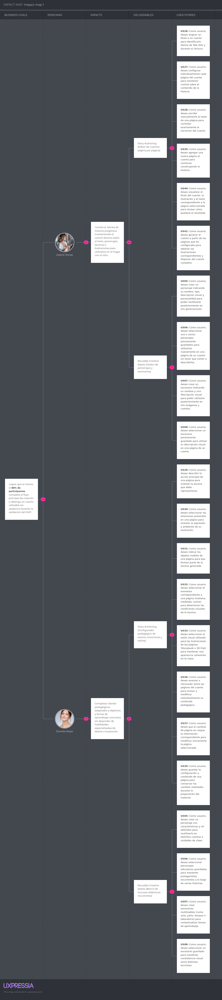

La estructura utilizada es:

**Business Goal → Actor → Impact → Deliverable → User Stories**

Los Business Goals se expresan siguiendo criterios SMART. Debido a que Tale Star todavía se encuentra dentro del proceso académico de diseño y validación, estos objetivos corresponden a criterios de éxito propuestos y no deben interpretarse como resultados ya alcanzados.

### Business Goal 1 — Reducción del esfuerzo de creación

**BG01:** Durante las pruebas de validación del MVP, conseguir que al menos el **70 % de los participantes** considere que Tale Star reduce el esfuerzo necesario para producir contenido educativo infantil personalizado frente al procedimiento que utiliza actualmente.

Este objetivo se deriva directamente del Hypothesis Statement relacionado con reducción del esfuerzo.

### Business Goal 2 — Finalización del Story Creator

**BG02:** Durante las pruebas de validación del MVP, conseguir que al menos el **80 % de los participantes que inicien el flujo principal de creación de un Story** complete la configuración y obtenga un cuento utilizable sin asistencia directa del equipo.

Este Business Goal concentra la medición sobre Story Authoring debido a que el creador de cuentos representa la capability principal de la propuesta de valor.

### Business Goal 3 — Utilización de la propuesta multimodal

**BG03:** Durante las pruebas de validación, conseguir que al menos el **60 % de los participantes** manifieste intención de utilizar **dos o más tipos de contenido** disponibles en Tale Star entre Stories, Images y Music.

El objetivo permite evaluar si la integración de varias modalidades dentro de una misma solución representa realmente un valor adicional para los segmentos.

### Business Goal 4 — Control sobre el contenido generado

**BG04:** Durante las pruebas de validación del MVP, conseguir que al menos el **80 % de los participantes** complete satisfactoriamente una tarea de revisión, modificación o regeneración de contenido sin asistencia.

Este objetivo evalúa la hipótesis de que permitir al adulto conservar control sobre la generación incrementa la utilidad y confianza percibidas.

### Business Goal 5 — Reutilización de contenido

**BG05:** Durante las pruebas de validación, conseguir que al menos el **70 % de los participantes** manifieste intención de volver a utilizar Tale Star y comprenda cómo conservar y recuperar contenido previamente creado.

Este objetivo conecta la generación puntual con el valor de la Biblioteca y los recursos reutilizables.

### Business Goal 6 — Uso satisfactorio de AR

**BG06:** Durante las pruebas de la experiencia móvil, conseguir que al menos el **80 % de los participantes** complete sin asistencia la detección de una superficie, colocación de un Story y navegación entre sus páginas mediante realidad aumentada.

Este objetivo no sitúa AR por encima del Story Creator en prioridad de negocio; evalúa específicamente si la tecnología emergente añade una experiencia utilizable una vez que el usuario ya dispone de un cuento.

### Matriz de trazabilidad del Impact Mapping

| Business Goal | Actor / Persona               | Impact esperado                                                                                                             | Deliverables                                                                  | User Stories relacionadas                               |
| ------------- | ----------------------------- | --------------------------------------------------------------------------------------------------------------------------- | ----------------------------------------------------------------------------- | ------------------------------------------------------- |
| BG01          | Parent/Caregiver User Persona | Reduce la dependencia de búsquedas fragmentadas y crea directamente un recurso cuando necesita explicar o reforzar un tema. | Story Authoring, Image Generation, Music Generation y Landing Page de acceso. | US09–US25, US26–US41, US42–US62, US91, US92, US94, US95 |
| BG01          | Teacher User Persona          | Incorpora Tale Star como herramienta complementaria cuando necesita preparar material específico.                           | Story Authoring, Image Generation, Music Generation y Landing Page de acceso. | US09–US25, US26–US41, US42–US62, US91, US93, US94, US95 |
| BG02          | Parent/Caregiver User Persona | Construye Stories de manera progresiva manteniendo control sobre texto, personajes, escena e ilustraciones.                 | Story Authoring y Reusable Creative Assets.                                   | US05–US08, US26–US41                                    |
| BG02          | Teacher User Persona          | Completa un Story adaptado a una necesidad concreta sin depender de habilidades de ilustración.                             | Story Authoring y Reusable Creative Assets.                                   | US05–US08, US26–US41                                    |
| BG03          | Parent/Caregiver User Persona | Selecciona entre Story, Image o Music según el recurso que considere apropiado para el contexto.                            | Image Generation, Story Authoring, Music Generation.                          | US09–US25, US26–US41, US42–US62                         |
| BG03          | Teacher User Persona          | Utiliza diferentes formatos de contenido según el propósito de la actividad educativa.                                      | Image Generation, Story Authoring, Music Generation.                          | US09–US25, US26–US41, US42–US62                         |
| BG04          | Parent/Caregiver User Persona | Revisa el resultado antes de utilizarlo y modifica o regenera cuando no responde a su intención.                            | Image Preview & Regeneration, Story Page Editing, Library Editing.            | US20, US21, US23, US37–US40, US69–US72                  |
| BG04          | Teacher User Persona          | Mantiene responsabilidad sobre el material final y ajusta la configuración antes de incorporarlo a una actividad.           | Image Preview & Regeneration, Story Page Editing, Library Editing.            | US20, US21, US23, US37–US40, US69–US72                  |
| BG05          | Parent/Caregiver User Persona | Conserva personajes, escenarios y creaciones útiles para utilizarlos nuevamente.                                            | Reusable Creative Assets, Content Library y Profile.                          | US05–US08, US18, US25, US63–US73                        |
| BG05          | Teacher User Persona          | Recupera y reutiliza recursos ya preparados para disminuir trabajo repetitivo.                                              | Reusable Creative Assets y Content Library.                                   | US05–US08, US63–US73                                    |
| BG06          | Parent/Caregiver User Persona | Utiliza AR como experiencia complementaria de lectura del Story con el niño.                                                | Mobile Application, Child Mode y AR Story Experience.                         | US82–US90, US96                                         |
| BG06          | Teacher User Persona          | Utiliza AR cuando resulte apropiado como forma complementaria de presentar un Story.                                        | Mobile Application, Child Mode y AR Story Experience.                         | US82–US90, US96                                         |

El Impact Map debe construirse en UXPressia utilizando los Business Goals anteriores como punto de partida. Para cada objetivo se deben añadir los User Personas relacionados, los Impacts correspondientes, los Deliverables que los provocan y las User Stories asociadas.

La lectura del mapa evidencia que el Story Creator constituye la capability de mayor importancia para Tale Star. Esta decisión es consistente con el Lean UX Canvas, donde la creación de cuentos ilustrados página por página representa el núcleo de la solución. Image Generation y Music Generation complementan esta propuesta y permiten que el adulto seleccione otro formato cuando un Story completo no sea necesario.

Content Library y los elementos reutilizables aportan continuidad al producto. Su valor no se encuentra únicamente en almacenar archivos, sino en disminuir la repetición de trabajo cuando el usuario desea recuperar una creación, un Character o un Scenario.

La realidad aumentada representa un diferenciador tecnológico, pero no constituye el primer eslabón de valor. Para utilizar AR, primero debe existir un Story disponible; por ello se trata como una experiencia complementaria de consumo y no como el capability principal de creación.

### Consideraciones de impacto de la solución

Desde una perspectiva social, Tale Star mantiene al adulto como responsable de configurar, revisar y decidir la utilización del contenido. El producto no plantea que la inteligencia artificial sustituya al padre, cuidador o docente ni garantiza resultados pedagógicos por sí misma.

Desde una perspectiva económica, la propuesta busca reducir esfuerzo de búsqueda, adaptación y producción, aunque su viabilidad también dependerá del costo operativo de los servicios generativos externos y de que los planes comerciales establecidos resulten sostenibles.

Desde una perspectiva global, la problemática de selección y personalización de contenido digital puede presentarse en diferentes contextos culturales y educativos. Sin embargo, la solución debe evitar asumir que un mismo contenido resulta automáticamente apropiado para todos los niños o contextos.

Desde una perspectiva ambiental, Tale Star utiliza procesos de inteligencia artificial generativa que requieren capacidad computacional. Por ello no corresponde afirmar que la solución tiene automáticamente un impacto ambiental positivo por ser digital. La reutilización de creaciones y la reducción de generaciones innecesarias constituyen comportamientos operativos razonables, pero cualquier afirmación cuantitativa sobre impacto ambiental requeriría mediciones adicionales.

---

## 3.4. Product Backlog

El Product Backlog consolida las Stories implementables de Tale Star y establece su orden según valor para el negocio. Los Epics no forman parte de esta tabla porque son agrupadores y no unidades directamente estimables.

La estimación utiliza exclusivamente los valores de Story Points establecidos por el Final Project Statement:

**1, 2, 3, 5 y 8.**

Los Story Points representan esfuerzo y complejidad relativa. No corresponden directamente a horas.

El orden no representa una secuencia obligatoria de commits ni el orden exacto en el que cada componente técnico será programado. Una Story con alta prioridad de negocio puede requerir Technical Stories o Tasks habilitadoras dentro de un Sprint. Esto no altera su posición de prioridad dentro del Product Backlog.

El Story Creator ocupa las primeras posiciones porque constituye el principal mecanismo mediante el cual Tale Star entrega su propuesta de valor. Image Generation y Music Generation continúan la propuesta multimodal. Content Library permite conservar el valor generado. La experiencia AR se mantiene posteriormente por depender conceptualmente de la existencia de Stories ya creados.

Las historias de Account & Access no se colocan automáticamente al inicio. El Statement advierte expresamente que priorizar autenticación o seguridad únicamente por necesidad técnica se considera una organización incorrecta del Product Backlog; el orden debe responder al valor para el negocio. Asimismo, las User Stories del Landing Page deberán considerarse desde Sprint 1.

### Product Backlog de Tale Star

| # Orden | User Story Id | Título                                                | Descripción                                                                                                                                                                                                                        | Story Points |
| ------: | ------------- | ----------------------------------------------------- | ---------------------------------------------------------------------------------------------------------------------------------------------------------------------------------------------------------------------------------- | -----------: |
|       1 | US41          | Generar un cuento                                     | Como usuario, deseo generar el cuento a partir de las páginas que he configurado para obtener las ilustraciones correspondientes y disponer del cuento completo.                                                                   |            8 |
|       2 | US27          | Configurar una página del cuento                      | Como usuario, deseo configurar individualmente cada página del cuento para mantener control sobre el contenido de la historia.                                                                                                     |            5 |
|       3 | US28          | Escribir el texto de una página                       | Como usuario, deseo escribir manualmente el texto de una página para controlar exactamente la narración del cuento.                                                                                                                |            2 |
|       4 | US35          | Agregar una página                                    | Como usuario, deseo agregar una nueva página al cuento para continuar construyendo la historia.                                                                                                                                    |            2 |
|       5 | US05          | Crear un personaje reutilizable                       | Como usuario, deseo crear un personaje indicando su nombre, tipo, descripción visual y personalidad para poder reutilizarlo posteriormente en mis generaciones.                                                                    |            3 |
|       6 | US06          | Reutilizar personajes guardados                       | Como usuario, deseo seleccionar uno o varios personajes previamente guardados para utilizarlos nuevamente en una imagen o página de un cuento sin tener que volver a describirlos.                                                 |            3 |
|       7 | US07          | Crear un escenario reutilizable                       | Como usuario, deseo crear un escenario indicando un nombre y una descripción visual para poder utilizarlo posteriormente en mis imágenes y cuentos.                                                                                |            2 |
|       8 | US08          | Reutilizar un escenario guardado                      | Como usuario, deseo seleccionar un escenario previamente guardado para utilizar su descripción visual en una imagen o página de un cuento.                                                                                         |            2 |
|       9 | US29          | Definir la acción principal de una página             | Como usuario, deseo describir la acción principal de una página para orientar la escena que debe representarse.                                                                                                                    |            2 |
|      10 | US31          | Añadir objetos a una página                           | Como usuario, deseo indicar los objetos visibles de una página para que formen parte de la escena generada.                                                                                                                        |            2 |
|      11 | US30          | Definir las emociones de una página                   | Como usuario, deseo seleccionar las emociones presentes en una página para orientar la expresión y ambiente de su ilustración.                                                                                                     |            2 |
|      12 | US32          | Definir el momento de una página                      | Como usuario, deseo seleccionar el momento correspondiente a una página para determinar las condiciones visuales de la escena.                                                                                                     |            1 |
|      13 | US33          | Seleccionar el estilo visual del cuento               | Como usuario, deseo seleccionar el estilo visual utilizado para las ilustraciones de las páginas para mantener una apariencia coherente.                                                                                           |            1 |
|      14 | US34          | Añadir indicaciones adicionales a una página          | Como usuario, deseo proporcionar instrucciones adicionales para especificar detalles particulares de la ilustración de una página.                                                                                                 |            1 |
|      15 | US36          | Navegar entre páginas durante la edición              | Como usuario, deseo avanzar o retroceder entre las páginas del cuento para revisar y modificar individualmente su contenido.                                                                                                       |            3 |
|      16 | US37          | Editar la página seleccionada                         | Como usuario, deseo que al cambiar de página se cargue la información correspondiente a esa página para modificar únicamente la página seleccionada.                                                                               |            3 |
|      17 | US40          | Previsualizar una página                              | Como usuario, deseo visualizar el título del cuento, la ilustración y el texto correspondiente a la página seleccionada para revisar cómo quedará el resultado.                                                                    |            3 |
|      18 | US39          | Guardar una página                                    | Como usuario, deseo guardar la configuración y contenido de una página para conservar los cambios realizados durante la edición del cuento.                                                                                        |            2 |
|      19 | US38          | Duplicar una página                                   | Como usuario, deseo duplicar una página existente para crear una nueva página reutilizando su configuración como punto de partida.                                                                                                 |            2 |
|      20 | US26          | Definir el título del cuento                          | Como usuario, deseo asignar un título a mi cuento para identificarlo dentro de Tale Star y durante su lectura.                                                                                                                     |            1 |
|      21 | US91          | Comprender la propuesta de valor                      | Como visitante, deseo comprender qué problema aborda Tale Star y qué valor ofrece para determinar si la solución resulta relevante para mí.                                                                                        |            2 |
|      22 | US92          | Conocer la propuesta para padres y cuidadores         | Como visitante del segmento padres o cuidadores, deseo conocer cómo Tale Star puede ayudarme a crear contenido para niños para determinar si responde a mis necesidades.                                                           |            2 |
|      23 | US93          | Conocer la propuesta para docentes                    | Como visitante del segmento docente, deseo conocer cómo Tale Star puede apoyar la creación de materiales para determinar si resulta útil como herramienta complementaria.                                                          |            2 |
|      24 | US94          | Conocer las capacidades principales                   | Como visitante, deseo conocer las principales capacidades de Tale Star para comprender qué tipos de experiencias ofrece la solución.                                                                                               |            2 |
|      25 | US95          | Acceder a la Web Application                          | Como visitante interesado, deseo acceder a la aplicación web de Tale Star para comenzar a utilizar sus capacidades de creación.                                                                                                    |            1 |
|      26 | US19          | Generar una imagen                                    | Como usuario, deseo generar una imagen utilizando el Prompt Guiado o Prompt Libre que he definido para obtener el recurso visual solicitado.                                                                                       |            8 |
|      27 | US09          | Elegir el tipo de prompt                              | Como usuario, deseo elegir entre Prompt Guiado y Prompt Libre para generar una imagen utilizando el nivel de control que prefiera.                                                                                                 |            2 |
|      28 | US10          | Configurar un Prompt Guiado                           | Como usuario, deseo configurar una imagen mediante campos estructurados para describir la escena sin tener que redactar manualmente un prompt técnico.                                                                             |            5 |
|      29 | US16          | Escribir un Prompt Libre                              | Como usuario, deseo escribir directamente una descripción libre de la imagen para generar contenido sin utilizar la configuración guiada.                                                                                          |            2 |
|      30 | US11          | Seleccionar emociones para una imagen                 | Como usuario, deseo asociar una o varias emociones a la escena para orientar las expresiones y el ambiente de los personajes generados.                                                                                            |            1 |
|      31 | US12          | Añadir objetos a una imagen                           | Como usuario, deseo indicar uno o varios objetos visibles dentro de la escena para que sean considerados durante la generación.                                                                                                    |            1 |
|      32 | US13          | Definir el momento de una imagen                      | Como usuario, deseo seleccionar el momento de la escena para influir en las condiciones visuales de la imagen.                                                                                                                     |            1 |
|      33 | US14          | Seleccionar el estilo visual de una imagen            | Como usuario, deseo seleccionar un estilo visual para determinar la apariencia general de la imagen generada.                                                                                                                      |            1 |
|      34 | US15          | Añadir indicaciones adicionales a una imagen          | Como usuario, deseo escribir instrucciones adicionales para especificar condiciones que no puedan expresarse mediante los demás campos del Prompt Guiado.                                                                          |            1 |
|      35 | US17          | Aplicar modificadores rápidos al Prompt Libre         | Como usuario, deseo aplicar modificadores rápidos a mi descripción para ajustar características del prompt sin tener que redactarlas manualmente.                                                                                  |            2 |
|      36 | US20          | Previsualizar una imagen generada                     | Como usuario, deseo visualizar el resultado de una generación para decidir si deseo conservarlo, regenerarlo o descargarlo.                                                                                                        |            2 |
|      37 | US23          | Regenerar una imagen                                  | Como usuario, deseo volver a generar una imagen utilizando su configuración actual para obtener una nueva alternativa.                                                                                                             |            5 |
|      38 | US25          | Guardar una imagen generada                           | Como usuario, deseo guardar una imagen generada para acceder a ella posteriormente desde mi Biblioteca.                                                                                                                            |            2 |
|      39 | US18          | Guardar una configuración de imagen sin generarla     | Como usuario, deseo guardar la información de generación de una imagen aunque todavía no haya generado el resultado para poder retomarla posteriormente desde la Biblioteca.                                                       |            3 |
|      40 | US21          | Consultar el prompt construido                        | Como usuario, deseo visualizar el prompt construido por Tale Star para conocer qué descripción se utilizó finalmente durante la generación.                                                                                        |            2 |
|      41 | US22          | Copiar el prompt construido                           | Como usuario, deseo copiar el prompt construido para poder reutilizarlo fuera de la generación actual.                                                                                                                             |            1 |
|      42 | US24          | Descargar una imagen                                  | Como usuario, deseo descargar una imagen generada para conservarla o utilizarla fuera de Tale Star.                                                                                                                                |            2 |
|      43 | US60          | Generar una canción o pieza instrumental              | Como usuario, deseo generar la pieza musical configurada para obtener el resultado de audio correspondiente.                                                                                                                       |            8 |
|      44 | US42          | Configurar la dirección musical                       | Como usuario, deseo definir las características generales de una pieza musical para orientar el resultado de la generación.                                                                                                        |            5 |
|      45 | US49          | Crear la estructura de una canción                    | Como usuario, deseo dividir una canción en diferentes secciones para controlar cómo evoluciona a lo largo de la pieza.                                                                                                             |            5 |
|      46 | US50          | Agregar una sección musical                           | Como usuario, deseo agregar nuevas secciones a la estructura para construir la secuencia completa de la canción.                                                                                                                   |            2 |
|      47 | US51          | Seleccionar el tipo de una sección                    | Como usuario, deseo determinar qué función cumple cada sección dentro de la canción para estructurar correctamente la composición.                                                                                                 |            2 |
|      48 | US55          | Escribir la letra de una sección                      | Como usuario, deseo escribir la letra correspondiente a una sección para controlar lo que se canta durante esa parte de la canción.                                                                                                |            2 |
|      49 | US53          | Aplicar un modificador a una sección                  | Como usuario, deseo aplicar una característica musical específica a una sección para que esa parte tenga una intensidad o comportamiento diferente del resto de la canción.                                                        |            2 |
|      50 | US54          | Mantener la dirección musical general en una sección  | Como usuario, deseo dejar una sección sin modificador específico para que mantenga las características generales definidas en Dirección Musical.                                                                                   |            1 |
|      51 | US52          | Reordenar las secciones                               | Como usuario, deseo mover las secciones de una canción para modificar el orden en el que se reproducen.                                                                                                                            |            3 |
|      52 | US56          | Crear una sección sin letra                           | Como usuario, deseo dejar una sección sin letra para que esa parte de la canción funcione instrumentalmente.                                                                                                                       |            1 |
|      53 | US43          | Seleccionar el tipo de voz                            | Como usuario, deseo seleccionar el tipo de voz cuando estoy generando una canción para adecuar la interpretación vocal al resultado que busco.                                                                                     |            1 |
|      54 | US44          | Seleccionar el idioma de una canción                  | Como usuario, deseo seleccionar español o inglés como idioma de la canción para determinar el idioma utilizado en el contenido vocal.                                                                                              |            1 |
|      55 | US45          | Consultar el caption construido                       | Como usuario, deseo visualizar el caption musical generado automáticamente a partir de mi configuración para comprender la descripción utilizada durante la generación.                                                            |            2 |
|      56 | US46          | Editar el caption construido                          | Como usuario, deseo modificar manualmente el caption musical construido por Tale Star para realizar ajustes adicionales antes de generar la pieza.                                                                                 |            2 |
|      57 | US47          | Configurar la duración                                | Como usuario, deseo definir la duración de la pieza musical para ajustarla al contenido que necesito.                                                                                                                              |            1 |
|      58 | US48          | Configurar los BPM                                    | Como usuario, deseo definir los BPM de una pieza para controlar su tempo.                                                                                                                                                          |            1 |
|      59 | US57          | Visualizar la estructura como texto                   | Como usuario, deseo visualizar la letra y estructura de la canción en una representación textual para revisar su contenido de otra forma.                                                                                          |            2 |
|      60 | US59          | Consultar el resumen de generación musical            | Como usuario, deseo revisar los principales parámetros de la canción antes de generarla para comprobar su configuración.                                                                                                           |            2 |
|      61 | US61          | Reproducir una canción generada                       | Como usuario, deseo reproducir el audio generado dentro de Tale Star para previsualizar el resultado antes de utilizarlo.                                                                                                          |            3 |
|      62 | US62          | Descargar una canción                                 | Como usuario, deseo descargar la pieza musical generada en formato FLAC para utilizarla fuera de Tale Star.                                                                                                                        |            2 |
|      63 | US58          | Restablecer la dirección musical                      | Como usuario, deseo restablecer la configuración de Dirección Musical para volver a sus valores iniciales.                                                                                                                         |            1 |
|      64 | US63          | Consultar mis creaciones                              | Como usuario, deseo consultar todas mis creaciones desde la Biblioteca para acceder nuevamente al contenido que he producido.                                                                                                      |            5 |
|      65 | US69          | Abrir una creación                                    | Como usuario, deseo abrir una creación de mi Biblioteca para visualizarla, leerla o reproducirla según su tipo.                                                                                                                    |            3 |
|      66 | US70          | Editar la configuración de una creación               | Como usuario, deseo acceder desde una creación a su configuración original para modificar los parámetros utilizados para generarla.                                                                                                |            5 |
|      67 | US71          | Guardar una configuración modificada sin regenerar    | Como usuario, deseo guardar los cambios realizados a la configuración de una creación sin tener que regenerarla inmediatamente para poder continuar el trabajo posteriormente.                                                     |            3 |
|      68 | US72          | Regenerar una creación desde Biblioteca               | Como usuario, deseo regenerar una creación utilizando su configuración guardada para obtener una nueva versión después de modificarla.                                                                                             |            5 |
|      69 | US64          | Buscar una creación                                   | Como usuario, deseo buscar dentro de mi Biblioteca para localizar rápidamente una creación cuando tengo una gran cantidad de contenido guardado.                                                                                   |            3 |
|      70 | US67          | Marcar una creación como favorita                     | Como usuario, deseo marcar una creación como favorita para tenerla disponible dentro de la sección Favoritos.                                                                                                                      |            2 |
|      71 | US68          | Quitar una creación de favoritos                      | Como usuario, deseo eliminar una creación de Favoritos cuando ya no quiera destacarla.                                                                                                                                             |            1 |
|      72 | US65          | Consultar información resumida de una creación        | Como usuario, deseo ver información básica de cada creación para identificarla sin tener que abrirla.                                                                                                                              |            2 |
|      73 | US66          | Reordenar creaciones                                  | Como usuario, deseo reorganizar las cards de mis creaciones para disponerlas en el orden que prefiera.                                                                                                                             |            3 |
|      74 | US73          | Consultar el historial                                | Como usuario, deseo acceder al historial de mi Biblioteca para consultar las creaciones registradas anteriormente.                                                                                                                 |            3 |
|      75 | US82          | Activar el modo niño                                  | Como usuario adulto, deseo activar el bloqueo para niños cuando abro contenido desde la Biblioteca para evitar que el menor acceda a otras áreas de Tale Star.                                                                     |            3 |
|      76 | US83          | Consumir contenido dentro del modo niño               | Como usuario, deseo que el contenido abierto en modo niño permanezca en una experiencia enfocada en su visualización, lectura o reproducción para que el menor no pueda regresar accidentalmente a las herramientas de generación. |            3 |
|      77 | US84          | Desbloquear el modo niño mediante PIN                 | Como usuario adulto, deseo ingresar mi PIN de salida para cerrar el modo niño y regresar a las demás funciones de Tale Star.                                                                                                       |            3 |
|      78 | US78          | Configurar el PIN de salida                           | Como usuario adulto, deseo establecer un PIN de cuatro dígitos para impedir que un niño salga de las experiencias de consumo protegidas sin autorización.                                                                          |            2 |
|      79 | US85          | Abrir un cuento en realidad aumentada                 | Como usuario, deseo seleccionar la experiencia de realidad aumentada desde un cuento para visualizar sus páginas dentro del entorno físico.                                                                                        |            5 |
|      80 | US88          | Detectar una superficie plana                         | Como usuario, deseo que la experiencia AR detecte una superficie plana para determinar dónde puede colocarse el cuento.                                                                                                            |            8 |
|      81 | US89          | Colocar el cuento sobre una superficie                | Como usuario, deseo colocar virtualmente el cuento sobre la superficie detectada para visualizarlo integrado con mi entorno físico.                                                                                                |            5 |
|      82 | US90          | Navegar las páginas del cuento en AR                  | Como usuario, deseo avanzar y retroceder entre las páginas del cuento mientras utilizo realidad aumentada para completar su lectura.                                                                                               |            3 |
|      83 | US87          | Acceder a la cámara para la experiencia AR            | Como usuario móvil, deseo abrir la cámara al iniciar la realidad aumentada para visualizar el espacio físico donde colocaré el cuento.                                                                                             |            3 |
|      84 | US86          | Informar que AR requiere un dispositivo móvil         | Como usuario que intenta utilizar AR desde una computadora, deseo recibir una indicación de que debo continuar desde un dispositivo móvil para utilizar esta funcionalidad.                                                        |            2 |
|      85 | US96          | Acceder a la Mobile Application                       | Como visitante interesado, deseo acceder al punto correspondiente de la aplicación móvil para utilizar las capacidades móviles de Tale Star.                                                                                       |            1 |
|      86 | US74          | Consultar y modificar mi nombre                       | Como usuario, deseo consultar y modificar el nombre asociado a mi cuenta para utilizar el identificador que prefiera dentro de Tale Star.                                                                                          |            2 |
|      87 | US75          | Consultar mi correo electrónico                       | Como usuario, deseo consultar el correo asociado a mi cuenta para verificar qué cuenta estoy utilizando.                                                                                                                           |            1 |
|      88 | US77          | Cambiar la apariencia                                 | Como usuario, deseo cambiar entre apariencia clara y oscura para utilizar el tema visual que prefiera.                                                                                                                             |            2 |
|      89 | US79          | Consultar mi plan contratado                          | Como usuario, deseo consultar mi plan actual para conocer qué suscripción tengo contratada y su precio.                                                                                                                            |            2 |
|      90 | US80          | Consultar los planes disponibles                      | Como usuario, deseo revisar los planes disponibles para comparar las alternativas ofrecidas por Tale Star.                                                                                                                         |            2 |
|      91 | US81          | Cambiar de plan                                       | Como usuario, deseo cambiar mi plan contratado para utilizar otra de las opciones disponibles.                                                                                                                                     |            3 |
|      92 | US01          | Crear una cuenta                                      | Como usuario de Tale Star, deseo crear una cuenta proporcionando mi correo electrónico y contraseña, para poder utilizar las funcionalidades de la plataforma.                                                                     |            3 |
|      93 | US02          | Iniciar sesión                                        | Como usuario registrado, deseo iniciar sesión utilizando mi correo electrónico y contraseña para acceder a mi cuenta y mis creaciones.                                                                                             |            3 |
|      94 | US03          | Recordar mi acceso                                    | Como usuario registrado, deseo indicar que Tale Star recuerde mi acceso para no tener que autenticarme nuevamente cada vez que utilice la aplicación.                                                                              |            2 |
|      95 | US04          | Recuperar mi contraseña                               | Como usuario que no recuerda su contraseña, deseo solicitar su recuperación para poder volver a acceder a mi cuenta.                                                                                                               |            3 |
|      96 | US76          | Cambiar mi contraseña                                 | Como usuario autenticado, deseo cambiar la contraseña de mi cuenta para actualizar mis credenciales de acceso.                                                                                                                     |            2 |
|      97 | TS04          | API de Story Authoring                                | Como Developer, deseo exponer las operaciones de Stories y Story Pages mediante la RESTful API para mantener sincronizada la edición y lectura entre los productos de Tale Star.                                                   |            8 |
|      98 | TS03          | API de Image Generation                               | Como Developer, deseo exponer las operaciones de configuración y generación de Images mediante la RESTful API para que los clientes puedan utilizar las mismas capacidades generativas.                                            |            8 |
|      99 | TS05          | API de Music Generation                               | Como Developer, deseo exponer las operaciones necesarias para configurar y generar contenido musical para que las aplicaciones utilicen un contrato común con el servicio musical.                                                 |            8 |
|     100 | TS02          | API de elementos creativos reutilizables              | Como Developer, deseo exponer mediante la RESTful API operaciones para Characters y Scenarios para que las aplicaciones puedan crear y reutilizar estos elementos consistentemente.                                                |            5 |
|     101 | TS06          | API de Library, Profile y Subscription                | Como Developer, deseo exponer operaciones para Biblioteca, perfil y plan contratado para que los productos de Tale Star accedan consistentemente a la información del usuario.                                                     |            8 |
|     102 | TS07          | Servicio de contenido para lectura móvil y AR         | Como Developer, deseo exponer los Stories y Story Pages requeridos por la aplicación móvil para permitir lectura y experiencia AR utilizando la misma información del producto web.                                                |            5 |
|     103 | TS08          | Integración con servicios generativos externos        | Como Developer, deseo encapsular la comunicación con los servicios externos utilizados para generación visual y musical para que Tale Star pueda solicitar contenido sin exponer sus contratos directamente al dominio.            |            8 |
|     104 | TS09          | Persistencia de configuraciones y recursos multimedia | Como Developer, deseo persistir los datos de las creaciones y las referencias a los recursos multimedia para que las configuraciones y resultados puedan recuperarse entre sesiones.                                               |            8 |
|     105 | TS01          | API de Account & Access                               | Como Developer, deseo exponer mediante la RESTful API las operaciones necesarias para registro, autenticación y recuperación de acceso para que los clientes de Tale Star utilicen un contrato común.                              |            5 |

La tabla deberá replicarse posteriormente en la herramienta de gestión seleccionada por el equipo. La herramienta no sustituye esta especificación textual.

**URL público del Product Backlog:** https://upc-team-t57kfmwu.atlassian.net/jira/software/projects/SCRUM/boards/1?filter=&groupBy=none&atlOrigin=eyJpIjoiOWNlZGJjZWIyNTk5NGRhYzhmODk3ZTdmODJiMTVhZDkiLCJwIjoiaiJ9

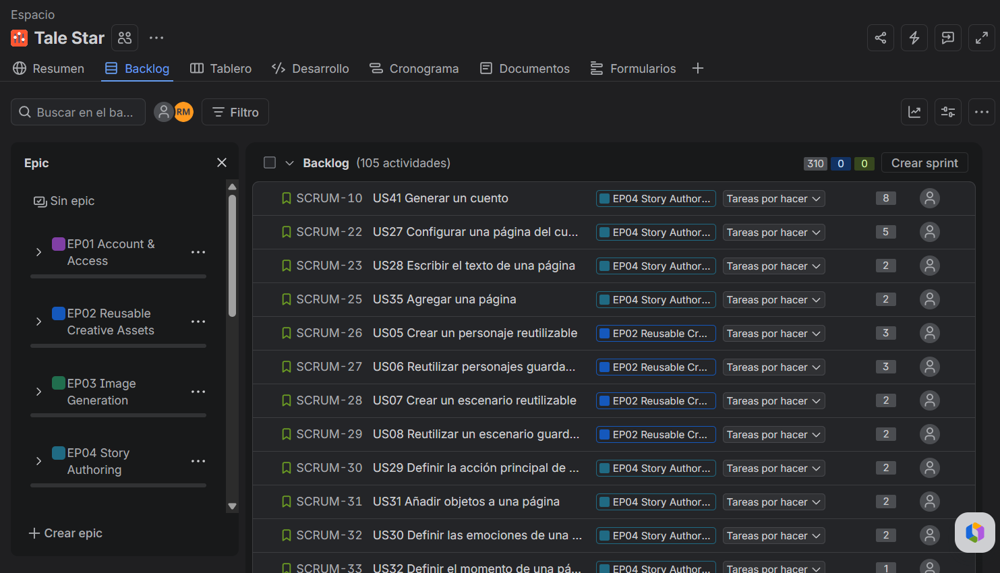

El orden refleja la prioridad relativa de negocio. En Sprint Planning podrán coexistir Stories de distinta posición cuando una dependencia, el Sprint Goal o la capacidad del equipo lo justifique. Sin embargo, esas decisiones no deben utilizarse para alterar artificialmente el valor de negocio reflejado en este Product Backlog.

---

# Capítulo IV: Strategic-Level Software Design

## 4.1. Strategic-Level Attribute-Driven Design

### 4.1.1. Design Purpose

### 4.1.2. Attribute-Driven Design Inputs

#### 4.1.2.1. Primary Functionality (Primary User Stories)

#### 4.1.2.2. Quality Attribute Scenarios

#### 4.1.2.3. Constraints

### 4.1.3. Architectural Drivers Backlog

### 4.1.4. Architectural Design Decisions

### 4.1.5. Quality Attribute Scenario Refinements

## 4.2. Strategic-Level Domain-Driven Design

### 4.2.1. EventStorming

### 4.2.2. Candidate Context Discovery

### 4.2.3. Domain Message Flows Modeling

### 4.2.4. Bounded Context Canvases

### 4.2.5. Context Mapping

## 4.3. Software Architecture

### 4.3.1. Software Architecture System Landscape Diagram

### 4.3.2. Software Architecture Context Level Diagram

### 4.3.3. Software Architecture Container Level Diagram

### 4.3.4. Software Architecture Deployment Diagram

# Capítulo V: Tactical-Level Software Design

## 5.1. Bounded Context: Story Authoring

### 5.1.1. Domain Layer

### 5.1.2. Interface Layer

### 5.1.3. Application Layer

### 5.1.4. Infrastructure Layer

### 5.1.5. Bounded Context Software Architecture Component Level Diagrams

### 5.1.6. Bounded Context Software Architecture Code Level Diagrams

#### 5.1.6.1. Bounded Context Domain Layer Class Diagrams

#### 5.1.6.2. Bounded Context Database Design Diagram

## 5.2. Bounded Context: Generative Media

### 5.2.1. Domain Layer

### 5.2.2. Interface Layer

### 5.2.3. Application Layer

### 5.2.4. Infrastructure Layer

### 5.2.5. Bounded Context Software Architecture Component Level Diagrams

### 5.2.6. Bounded Context Software Architecture Code Level Diagrams

#### 5.2.6.1. Bounded Context Domain Layer Class Diagrams

#### 5.2.6.2. Bounded Context Database Design Diagram

## 5.3. Bounded Context: Identity & Access

### 5.3.1. Domain Layer

### 5.3.2. Interface Layer

### 5.3.3. Application Layer

### 5.3.4. Infrastructure Layer

### 5.3.5. Bounded Context Software Architecture Component Level Diagrams

### 5.3.6. Bounded Context Software Architecture Code Level Diagrams

#### 5.3.6.1. Bounded Context Domain Layer Class Diagrams

#### 5.3.6.2. Bounded Context Database Design Diagram

## 5.4. Bounded Context: Content Library

### 5.4.1. Domain Layer

### 5.4.2. Interface Layer

### 5.4.3. Application Layer

### 5.4.4. Infrastructure Layer

### 5.4.5. Bounded Context Software Architecture Component Level Diagrams

### 5.4.6. Bounded Context Software Architecture Code Level Diagrams

#### 5.4.6.1. Bounded Context Domain Layer Class Diagrams

#### 5.4.6.2. Bounded Context Database Design Diagram

# Capítulo VI: Solution UX Design

## 6.1. Style Guidelines

### 6.1.1. General Style Guidelines

### 6.1.2. Web, Mobile & Devices Style Guidelines

## 6.2. Information Architecture

### 6.2.1. Organization Systems

### 6.2.2. Labeling Systems

### 6.2.3. Searching Systems

### 6.2.4. SEO Tags and Meta Tags

### 6.2.5. Navigation Systems

## 6.3. Landing Page UI Design

### 6.3.1. Landing Page Wireframe

### 6.3.2. Landing Page Mock-up

## 6.4. Applications UX/UI Design

### 6.4.1. Applications Wireframes

### 6.4.2. Applications Wireflow Diagrams

### 6.4.3. Applications Mock-ups

### 6.4.4. Applications User Flow Diagrams

## 6.5. Applications Prototyping

# Capítulo VII: Product Implementation, Validation & Deployment

## 7.1. Software Configuration Management

### 7.1.1. Software Development Environment Configuration

### 7.1.2. Source Code Management

### 7.1.3. Source Code Style Guide & Conventions

### 7.1.4. Software Deployment Configuration

## 7.2. Solution Implementation

### 7.2.1. Sprint 1

#### 7.2.1.1. Sprint Planning 1

#### 7.2.1.2. Sprint Backlog 1

#### 7.2.1.3. Development Evidence for Sprint Review

#### 7.2.1.4. Testing Suite Evidence for Sprint Review

#### 7.2.1.5. Execution Evidence for Sprint Review

#### 7.2.1.6. Services Documentation Evidence for Sprint Review

#### 7.2.1.7. Software Deployment Evidence for Sprint Review

#### 7.2.1.8. Team Collaboration Insights during Sprint

### 7.2.2. Sprint 2

#### 7.2.2.1. Sprint Planning 2

#### 7.2.2.2. Sprint Backlog 2

#### 7.2.2.3. Development Evidence for Sprint Review

#### 7.2.2.4. Testing Suite Evidence for Sprint Review

#### 7.2.2.5. Execution Evidence for Sprint Review

#### 7.2.2.6. Services Documentation Evidence for Sprint Review

#### 7.2.2.7. Software Deployment Evidence for Sprint Review

#### 7.2.2.8. Team Collaboration Insights during Sprint

## 7.3. Validation Interviews

### 7.3.1. Diseño de Entrevistas

### 7.3.2. Registro de Entrevistas

### 7.3.3. Evaluaciones según heurísticas

## 7.4. Video About-the-Product

# Conclusiones

## Conclusiones y recomendaciones

## Video About-the-Team

# Bibliografía

Government Digital Service. (n.d.). *Learning about users and their needs*. GOV.UK Service Manual. Recuperado el 2 de septiembre de 2026, de [https://www.gov.uk/service-manual/user-research/start-by-learning-user-needs](https://www.gov.uk/service-manual/user-research/start-by-learning-user-needs)

Government Digital Service. (n.d.). *Using in-depth interviews*. GOV.UK Service Manual. Recuperado el 2 de septiembre de 2026, de [https://www.gov.uk/service-manual/user-research/using-in-depth-interviews](https://www.gov.uk/service-manual/user-research/using-in-depth-interviews)

HeyQQ GmbH. (n.d.). *Oscar Stories: AI-powered personalized bedtime stories for children*. Recuperado el 2 de septiembre de 2026, de [https://oscarstories.com/presskit/oscar-stories/](https://oscarstories.com/presskit/oscar-stories/)

HeyQQ GmbH. (n.d.). *Oscar Stories pricing*. Recuperado el 2 de septiembre de 2026, de [https://app.oscarstories.com/pricing](https://app.oscarstories.com/pricing)

Instituto Nacional de Estadística e Informática. (2025). *Estado de la niñez y adolescencia: Segundo trimestre 2025*. INEI. ([INEI][3])

Mallawaarachchi, S., Burley, J., Mavilidi, M., Howard, S. J., Straker, L., Kervin, L., Staton, S., Hayes, N., Machell, A., Torjinski, M., Brady, B., Thomas, G., Horwood, S., White, S. L. J., Zabatiero, J., Rivera, C., & Cliff, D. (2024). Early childhood screen use contexts and cognitive and psychosocial outcomes: A systematic review and meta-analysis. *JAMA Pediatrics, 178*(10), 1017–1026. https://doi.org/10.1001/jamapediatrics.2024.2620. ([JAMA Network][1])

Mann, S., Calvin, A., Lenhart, A., & Robb, M. B. (2025). *The Common Sense Census: Media use by kids zero to eight, 2025*. Common Sense Media.

OECD. (2025). *Results from TALIS 2024*. OECD Publishing. ([OECD][5])

OECD. (2026). *Education and skills in Peru*. OECD Publishing. https://doi.org/10.1787/7d430d1b-en. ([OECD][6])

Ofcom. (2026). *Exploring the relationship between persuasive design on online platforms, and the time that children spend on them*. Office of Communications. ([www.ofcom.org.uk][2])

Radesky, J. S., Schaller, A., Yeo, S. L., Weeks, H. M., & Robb, M. B. (2020). *Young kids and YouTube: How ads, toys, and games dominate viewing*. Common Sense Media.

StoryJumper, Inc. (n.d.). *Price list*. Recuperado el 2 de septiembre de 2026, de [https://www.storyjumper.com/prices](https://www.storyjumper.com/prices)

StoryJumper, Inc. (n.d.). *Teacher's guide*. Recuperado el 2 de septiembre de 2026, de [https://www.storyjumper.com/main/classroom](https://www.storyjumper.com/main/classroom)

StoryJumper, Inc. (n.d.). *Why teachers love StoryJumper*. Recuperado el 2 de septiembre de 2026, de [https://www.storyjumper.com/school](https://www.storyjumper.com/school)

Storywizard.ai. (n.d.). *Create incredible learning experiences using AI*. Recuperado el 2 de septiembre de 2026, de [https://www.storywizard.ai/](https://www.storywizard.ai/)

Storywizard.ai. (n.d.). *Education reimagined with Storywizard.ai*. Recuperado el 2 de septiembre de 2026, de [https://www.storywizard.ai/education](https://www.storywizard.ai/education)

[1]: https://jamanetwork.com/journals/jamapediatrics/fullarticle/2821940 "Early Childhood Screen Use Contexts and Cognitive and Psychosocial Outcomes: A Systematic Review and Meta-analysis | JAMA Pediatrics"
[2]: https://www.ofcom.org.uk/media-use-and-attitudes/media-literacy/exploring-the-relationship-between-persuasive-design-on-online-platforms-and-the-time-that-children-spend-on-them "Exploring the relationship between persuasive design on online platforms, and the time that children spend on them"
[3]: https://www.inei.gob.pe/media/MenuRecursivo/boletines/boletin_ninez_iit2025.pdf "Estado de la Niñez y Adolescencia"
[4]: https://www.oecd.org/en/publications/education-and-skills-in-peru_7d430d1b-en/full-report/school-education-raising-quality-standards-and-enabling-informed-choice_113355a5.html "School education: Raising quality standards and enabling informed choice"
[5]: https://www.oecd.org/en/publications/results-from-talis-2024_90df6235-en/full-report/the-demands-of-teaching_0e941e2f.html "The demands of teaching: Results from TALIS 2024"
[6]: https://www.oecd.org/en/publications/education-and-skills-in-peru_7d430d1b-en.html "Education and Skills in Peru"
[7]: https://www.gov.uk/service-manual/user-research/start-by-learning-user-needs "Learning about users and their needs"
[8]: https://www.gov.uk/service-manual/user-research/using-in-depth-interviews "Using in-depth interviews"
[9]: https://oscarstories.com/presskit/oscar-stories/ "Oscar Stories"
[10]: https://app.oscarstories.com/pricing "Oscar Stories pricing"
[11]: https://www.storyjumper.com/prices "StoryJumper Price List"
[12]: https://www.storyjumper.com/main/classroom "StoryJumper Teacher's Guide"
[13]: https://www.storyjumper.com/school "Why teachers love StoryJumper"
[14]: https://www.storywizard.ai/ "Storywizard.ai"
[15]: https://www.storywizard.ai/education "Storywizard.ai Education"

# Anexos

## Anexo A. Repositorios del proyecto

Tale Star. (n.d.). *Design* [Repositorio de diseño]. GitHub. https://github.com/Tale-Star/design

Tale Star. (n.d.). *Documentation* [Repositorio de documentación]. GitHub. https://github.com/Tale-Star/docs

Tale Star. (n.d.). *Frontend mobile* [Repositorio de código fuente]. GitHub. https://github.com/Tale-Star/frontend-mobile

Tale Star. (n.d.). *Frontend web* [Repositorio de código fuente]. GitHub. https://github.com/Tale-Star/frontend-web

Tale Star. (n.d.). *Landing page* [Repositorio de código fuente]. GitHub. https://github.com/Tale-Star/landing-page

## Anexo B. Entrevistas

Tale Star. (n.d.). *Entrevista 1: Sara Davila, segmento docentes* [Video]. YouTube. https://youtu.be/cABX9cd1hTY

Tale Star. (n.d.). *Entrevista 2: Roxana Alvarado, segmento docentes* [Video]. YouTube. https://youtu.be/qM7wqQPLy8w

Tale Star. (n.d.). *Entrevista 3: Diandra Valle, segmento docentes* [Video]. YouTube. https://youtu.be/VIJUaUCygm4

## Anexo C. Desplegables

### Aplicación web

Enlace de despliegue pendiente de publicación.

### Aplicación móvil descargable

Enlace de descarga pendiente de publicación.

### Landing page

Enlace de despliegue pendiente de publicación.

## Anexo D. Documentación de servicios

## Anexo E. Videos de exposiciones
